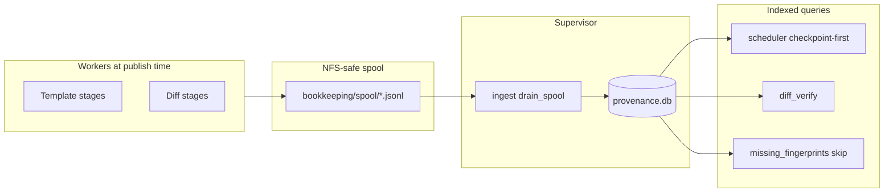

# Content-addressed bookkeeping

SynDiff bookkeeping tracks **what was built, from what inputs, under which recipe** across template creation and difference imaging. It powers fast skip/resume (indexed SQLite queries instead of NFS directory walks), cross-sector PS1 sharing, and cross-event diff sharing.

**Audience:** operators running campaigns, and developers wiring or debugging stages.

**Related docs:** [storage_layout.md](storage_layout.md#provenance-bookkeeping-data_rootbookkeeping) (paths), [template_pipeline.md](template_pipeline.md) (scheduler/verify), [stages/diff_pipeline.md](stages/diff_pipeline.md) (diff stages).

---

## 1. How it works (overview)

```text
  Workers (Condor / foreground)          Supervisor (daemon)
  ───────────────────────────          ─────────────────────
  1. Compute bytes                      4. Drain spool → provenance.db
  2. Atomic publish to disk                 (sole DB writer)
  3. Append JSON line to spool
     bookkeeping/spool/{host}.{pid}.jsonl

  Consumers (hot path — indexed SELECT only)
  ──────────────────────────────────────────
  • Scheduler verify (checkpoint-first skip)
  • Diff per-FFI resume (missing_fingerprints)
  • diff_verify indexed completeness
  • syndiff bookkeeping query (manual lineage)
```



**Invariants:**

- Bytes on disk are authoritative. `provenance.db` is a **derived, rebuildable index**.
- Workers never write the DB directly — only the supervisor drains the spool.
- Publish/checkpoint emit is **non-fatal** (warnings only; compute continues).

---

## 2. Core concepts

### 2.1 Artifact

| Field | Meaning |
|-------|---------|
| `kind` | Type (`mapping`, `diff_image`, `photometry`, …) |
| `spatial_key` | Sky / SCC / event address (see [§3](#3-spatial-scopes)) |
| `recipe` | Full parameter set that defines how bytes were produced |
| `inputs` | Fingerprints of upstream artifacts (graph edges) |
| `fingerprint` | Merkle name: `H(kind, spatial_key, recipe_id, sorted(inputs))` |
| `location` | Path on disk |
| `state` | `building`, `complete`, or `failed` |

Same fingerprint = same work. A recipe change produces a new fingerprint and invalidates only the downstream cone.

### 2.2 Recipe ID vs artifact fingerprint

| Name | Formula | Length |
|------|---------|--------|
| Recipe ID | `H(kind, params, code_version)` | 16 hex chars |
| Artifact fingerprint | `H(kind, spatial_key, recipe_id, sorted(input_fps))` | 24 hex chars |

Code: `syndiff_pipeline/common/provenance/fingerprint.py`.

`RECIPE_SCHEMA_VERSION` is currently **2**. Bump it when producer algorithms change in ways that alter bytes for the same YAML params; then re-run affected stages or `syndiff bookkeeping reindex`.

### 2.3 Provenance graph

```text
ffi(s,c,k,pid)
  └─▶ ffi_set(s,c,k)
        └─▶ mapping(s,c,k,os) ──▶ scc_assembly(s,c,k,os) ──▶ downsample(s,c,k,os)
              │                                                      │
              └─▶ shared_mask(s,c,k)                                 │
                                                                     ▼
ffi ──▶ diff_background(s,c,k,pid,label) ──┐              template FITS (by dx/dy)
                                            ├──▶ diff_image ──▶ epsf
shared_mask ──────────────────────────────┘
                                            │
                                            ▼
                              photometry(event,s,c,k,method)
```

| Scope | Examples | Shared across |
|-------|----------|---------------|
| Skycell | `combined_skycell`, `convolved_skycell` | Sectors |
| SCC | `mapping`, `downsample`, `shared_mask` | Events on same SCC |
| SCC + FFI | `diff_image`, `epsf` | Events on same SCC (same product_id + recipe) |
| Event | `photometry` | One event |

---

## 3. Spatial scopes

### Skycell — `{projection, skycell}`

PS1 sky-addressed products (no sector/camera/ccd): `raw_skycell`, `source_catalog`, `combined_skycell`, `convolved_skycell`.

### SCC — `{s, c, k[, os][, store_name]}`

One TESS camera/CCD. `os` = oversampling factor; `store_name` = named store lane.

Kinds: `ffi_set`, `mapping`, `remap_store`, `scc_assembly`, `downsample`, `shared_mask`.

### SCC + FFI — `{s, c, k, product_id[, label]}`

Per-FFI diff products. `label` = workspace stage label (`hp_d`, `ks_d`, `epsf_r1`, …).

Kinds: `ffi`, `diff_background`, `diff_image`, `epsf`.

### Event — `{event, s, c, k[, method][, label]}`

Event-scoped: `photometry` only (inputs point at SCC-scoped diff/ePSF nodes).

---

## 4. Artifact kind registry

Registered in `syndiff_pipeline/common/provenance/model.py`:

| Kind | Spatial key | Recipe source | Typical inputs |
|------|-------------|---------------|----------------|
| `ffi` | scc_ffi | ffi_list row (basename, size, mtime) | — |
| `ffi_set` | scc | (empty — identity from N×`ffi`) | N × `ffi` |
| `raw_skycell` | skycell | version token in `input_files` | — |
| `source_catalog` | skycell | Gaia version, mag threshold | — |
| `mapping` | scc | mapping stage + mapping grid | `ffi_set` |
| `remap_store` | scc | remap stage + mapping grid | `ffi_set`, `mapping` |
| `combined_skycell` | skycell | star removal, band combine | `raw_skycell`, `source_catalog` |
| `convolved_skycell` | skycell | psf_sigma, padding policy | `combined_skycell` |
| `scc_assembly` | scc | ps1_process + mapping grid | `mapping`, N × `convolved_skycell` |
| `downsample` | scc | downsample + mapping grid | `scc_assembly`, `remap_store` |
| `shared_mask` | scc | SharedMaskParams + **mask_settings contents** | `ffi_set` |
| `diff_background` | scc_ffi | BackgroundParams or hotpants bg | `ffi` |
| `diff_image` | scc_ffi | HotpantsParams or KernelFit+Subtract | `ffi`, `downsample`, `shared_mask`, [`diff_background`] |
| `epsf` | scc_ffi | EpsfParams | `diff_image` |
| `photometry` | event | photometry method params | N × `diff_image`, N × `epsf`, … |

Template recipes use the same field lists as `verify.config_fingerprint`. Diff recipes come from dataclasses in `difference_imaging/orchestration/stage_params.py`.

Reuse of an existing `convolved_skycell` payload is decided **per cell**, not per projection/SCC: `ps1_process` resolves each cell's `combined_fingerprint` → `convolved_fingerprint` chain before convolving anything and skips cells that already resolve to a published payload under the caller's exact recipe. Cells that do need (re)convolution are done via local `±radius` windows, falling back to a whole-row convolution only when ≥20% of a row's cells are missing. See `docs/markdown/stages/ps1_process_technical.md` §"Step 3b" for details.

`shared_mask` hashes **mask_settings contents**, not the path string.

---

## 5. On-disk layout

### Bookkeeping index

```text
{data_root}/bookkeeping/
  provenance.db
  spool/{hostname}.{pid}.jsonl
```

Helpers: `provenance_db_path()`, `provenance_spool_dir()` in `syndiff_pipeline/common/scc_paths.py`.

### Shared PS1 stores (cross-sector)

```text
{data_root}/ps1_skycells_zarr/
  ps1_skycells.zarr/
  ps1_combined.zarr/{proj}/{skycell}/{recipe_fp}/...
  ps1_convolved.zarr/{proj}/{skycell}/{recipe_fp}/...
```

Directory artifacts include `_provenance.json` for offline `reindex`.

### Per-SCC tree

```text
{data_root}/s{SSSS}/c{C}/k{K}/
  ffi_list.parquet
  mapping/oversampling_{N}/
  remap/... or remap_{lane}/...
  templates/... or templates_{lane}/...
  convolved.zarr              # read-only fallback when shared store is enabled
  diff/ or diff_{lane}/
    hp_d/tess{digits}-s{SSSS}-{C}-{K}_{label}.fits.fz
    epsf_r1/gridded_epsf_index.json
  bookkeeping/diff/oversampling_{N}/
    frames.csv
    diff_job.json
```

### Event workspace

```text
{workspace_root}/events/{event}/s{SSSS}_c{C}_k{K}/
  phot_{photometry_run_id}/
    astrometry_result.json
    {lc_label}/lightcurve_*.csv
```

Photometry outputs live under `phot_{run_id}/`. SCC-primary diff FITS are on `data_root/.../diff_{lane}/`; recipe fingerprints are in `provenance.db` only (not directory names).

---

## 6. Publish → spool → ingest

### Workers: atomic publish (`publish.py`)

| API | Use |
|-----|-----|
| `publish_dir` | Multi-file directories (combined/convolved cells, remap stores) |
| `publish_record` | Single files (per-FFI diff FITS) |

Steps: write under `_tmp_*` → `os.replace` to final path → append one JSON line to `bookkeeping/spool/{host}.{pid}.jsonl`.

`try_publish_*` never raises into the compute path.

### Supervisor: spool drain (`ingest.py`)

Every ~5 s (throttled), the supervisor:

1. Renames `*.jsonl` → `*.jsonl.draining`
2. Upserts all records into `provenance.db` (one transaction per file)
3. Deletes the drained file

Ingest is idempotent. Interrupted drains resume from `.draining` files.

### Queries (`store.py`)

```python
store.scc_stage_complete(required_fingerprints)
store.missing_fingerprints(required_fingerprints)
store.artifact(fingerprint)
store.inputs_of(fingerprint)
```

`missing_fingerprints` uses an optional per-key `fallback_stat` when the index lags behind a fresh publish.

---

## 7. Template pipeline

### Checkpoint emit (`run_stage.py`)

On stage success, each checkpoint stage emits a provenance record (and, by default, a JSON manifest):

| Stage | Kind | Module helper |
|-------|------|---------------|
| `tess_ffi_download` | `ffi_set` | `emit_ffi_set_checkpoint` |
| `mapping` | `mapping` | `emit_mapping_checkpoint` |
| `remap` | `remap_store` | `emit_remap_store_checkpoint` |
| `downsample` | `downsample` | `emit_downsample_checkpoint` |
| `ps1_process` | `scc_assembly` | `emit_scc_assembly_checkpoint` |

`provenance_checkpoint.py` provides matching `expected_*_fingerprint(resolved)` helpers. They recompute the fingerprint from the **current** resolved config (no I/O). Config drift → miss.

Emit and expected share the same input-edge resolution (`ffi_list`, mapping CSV, convolved sidecars).

### Scheduler verify (`scheduler.py`)

Before a background verify-worker NFS scan:

1. Recompute `expected_*_fingerprint`
2. One indexed query against `provenance.db`
3. **Hit** → `cache_external_check` → stage promotes (~ms)
4. **Miss** → with default settings, fall open to manifest check / verify-worker scan

With `bookkeeping.trust_index: true`, checkpoint stages **fail closed** on miss (no NFS scan). Remediation: `syndiff bookkeeping reindex`, re-run the stage, or set `trust_index` back to `false`.

### `ps1_process` skip

When `scc_assembly` is indexed complete, the scheduler does not run per-skycell `convolved.zarr` stat walks. With `trust_index: true`, those walks are disabled entirely for checkpoint-covered stages.

---

## 8. Difference imaging

### Emit at save time (`provenance_glue.py`)

Emit runs **after** bytes are written. It only appends a spool line.

| Helper | Kind |
|--------|------|
| `emit_diff_artifact` | `diff_background`, `diff_image`, `epsf` |
| `emit_shared_mask_artifact` | `shared_mask` |
| `emit_photometry_artifact` | `photometry` |

Input edges (must match between emit and verify):

- `diff_image` ← `ffi` + `downsample` + `shared_mask` + optional `diff_background`
- `epsf` ← `diff_image`
- `photometry` ← per-frame `diff_image` + `epsf` for that event

`diff_verify.diff_stage_complete_indexed()` and `diff_image_input_fingerprints()` must use the same input vector as emit.

### Per-FFI resume

`hotpants.py` / `kernel_subtract.py` call `diff_image_complete_in_store()` per frame. Index hit → skip. Store unavailable → fail open to file existence check.

### Indexed diff verify

Required frames = product IDs from SCC `bookkeeping/diff/frames.csv` (preferred) or event `frames.csv`. Completeness = all expected fingerprints indexed for that stage label + recipe. Cold index → falls back to last-stage marker check.

### SCC diff store (field mode)

```text
{data_root}/s{SSSS}/c{C}/k{K}/diff_{lane}/{label}/tess{digits}-s{SSSS}-{C}-{K}_{label}.fits.fz
```

Flat label directories per lane. Recipe identity is tracked in `provenance.db`; multiple recipes for the same label coexist as separate indexed fingerprints, not as nested `{recipe_fp}/` directories.

---

## 9. Reindex and recovery

```bash
mamba activate syndiff
syndiff bookkeeping reindex --data-root /path/to/data        # clears DB, rebuilds
syndiff bookkeeping reindex --data-root /path/to/data --incremental
```

| Source | Reindex behavior |
|--------|-------------------|
| `ps1_combined.zarr` / `ps1_convolved.zarr` | From `_provenance.json` sidecars |
| Per-SCC mapping, remap, templates, `convolved.zarr` | Rows under `{kind}_legacy_unverified` if no sidecar |
| `diff_{lane}/` trees | Presence only; recipe not recoverable from FITS |

**Per-FFI diff rows are spool-ingested only** — not rebuilt from on-disk FITS. Before a full reindex, drain `bookkeeping/spool/` (run the supervisor) or re-run diff afterward.

`{kind}_legacy_unverified` rows appear in queries but do not satisfy a freshly computed `scc_stage_complete` fingerprint.

---

## 10. CLI

Pass `--data-root` or derive from `--config` / `--site`.

| Command | Purpose |
|---------|---------|
| `stats` | Row counts by kind/state |
| `query --fingerprint FP` | Artifact + input edges |
| `query --kind K --spatial-key '{...}'` | List at spatial key |
| `verify --config CFG --targets T.csv --scc 20/1/1 --stage mapping` | Recompute fingerprint; check store |
| `reindex [--incremental]` | Offline DB rebuild |
| `gc` | Report-only orphan/missing scan |
| `pilot` | Go/no-go checklist for index-trust cutover |
| `convolved-gate --sector 20 --camera 1 --ccd 1` | Numeric check before `use_shared_convolved_store` |

**Lineage example:**

```bash
syndiff bookkeeping query \
  --data-root /astro/.../data \
  --kind diff_image \
  --spatial-key '{"s":20,"c":1,"k":1,"product_id":"1234567890","label":"hp_d"}'

syndiff bookkeeping query --data-root /astro/.../data --fingerprint <fp>
```

**Template checkpoint check:**

```bash
syndiff bookkeeping verify \
  --config config/pipeline.yaml \
  --targets config/targets.csv \
  --scc s0020_c1_k1 \
  --stage ps1_process
```

**Shared convolved store gate** (before `use_shared_convolved_store: true` in `pipeline.yaml`):

```bash
syndiff bookkeeping convolved-gate \
  --data-root /astro/.../data \
  --sector 20 --camera 1 --ccd 1 \
  --sample-cells 10
```

Require `"pass": true` in the JSON output.

---

## 11. `bookkeeping.trust_index`

In `config/pipeline.yaml`:

```yaml
bookkeeping:
  trust_index: false   # default
```

| `trust_index` | Manifest JSON | Scheduler on checkpoint miss | `run_stage` after success |
|---------------|---------------|------------------------------|---------------------------|
| `false` | Written | Manifest / verify-worker scan | Manifest + checkpoint |
| `true` | Not written | Fail closed (index only) | Checkpoint only |

Enable `true` only with a warm `provenance.db` (successful campaign ingest, or `syndiff bookkeeping reindex` on a tree that already has ingested checkpoints).

---

## 12. Two SQLite databases

| Database | Location | Purpose |
|----------|----------|---------|
| `pipeline_state.sqlite` | `workspace_root/control/` | Scheduling: Condor, retries, status grid |
| `provenance.db` | `data_root/bookkeeping/` | Artifact completeness and lineage |

Stage promotion still uses `external_check` / `cache_external_check`; bookkeeping changes how completeness is determined.

---

## 13. Failure modes

| Event | Result |
|-------|--------|
| Worker crash mid-write | `_tmp_*` orphan; index unchanged |
| Duplicate publish of same fingerprint | Idempotent; same bytes at same key |
| Spool not yet drained | `missing_fingerprints` may stat missing keys only |
| `provenance.db` deleted | `reindex` for template/shared rows; drain spool or re-run diff for per-FFI rows |
| Config change | New fingerprints; old artifacts remain on disk |
| FFI re-download | `ffi_list` change → diff cone re-fingerprints |
| `RECIPE_SCHEMA_VERSION` bump | Re-run stages or full reindex |

---

## 14. Code map

```text
syndiff_pipeline/common/provenance/
  fingerprint.py, model.py, store.py, publish.py, ingest.py
  reindex.py, gc.py, cli.py, convolved_gate.py, pilot.py

syndiff_pipeline/template_creation/orchestration/provenance_checkpoint.py
syndiff_pipeline/difference_imaging/orchestration/provenance_glue.py
syndiff_pipeline/difference_imaging/orchestration/diff_verify.py
syndiff_pipeline/common/orchestration/scheduler.py
syndiff_pipeline/common/orchestration/run_stage.py
```

---

## 15. Operator scenarios

**`ps1_process` re-runs despite `convolved.zarr` on disk**

1. `syndiff bookkeeping verify --stage ps1_process ...` — is `in_store` true?
2. `syndiff bookkeeping stats` — any `scc_assembly` / `complete` rows?
3. Stage log — provenance emit warnings?
4. Spool not drained? Ensure supervisor is running.

**Diff re-processes every FFI**

1. `syndiff bookkeeping stats` — `diff_image` rows present?
2. Frozen `ws/diff_config.yaml` matches emit/verify recipe params?
3. Worker had `data_root` set?

**Deleted `provenance.db`**

1. `syndiff bookkeeping reindex` for template + shared stores.
2. Re-run diff (or drain spool first) for per-FFI index rows.

**After code upgrade / schema bump**

1. Check `RECIPE_SCHEMA_VERSION` in `fingerprint.py`.
2. Full reindex or re-run affected stages; re-run diff if diff recipes changed.

---

## 16. Tests

```bash
mamba activate syndiff
pytest tests/test_provenance_fingerprint.py tests/test_provenance_model.py \
       tests/test_scheduler_all_template_checkpoints.py \
       tests/test_diff_provenance_glue.py tests/test_provenance_reindex_v2_tree.py -q
```
