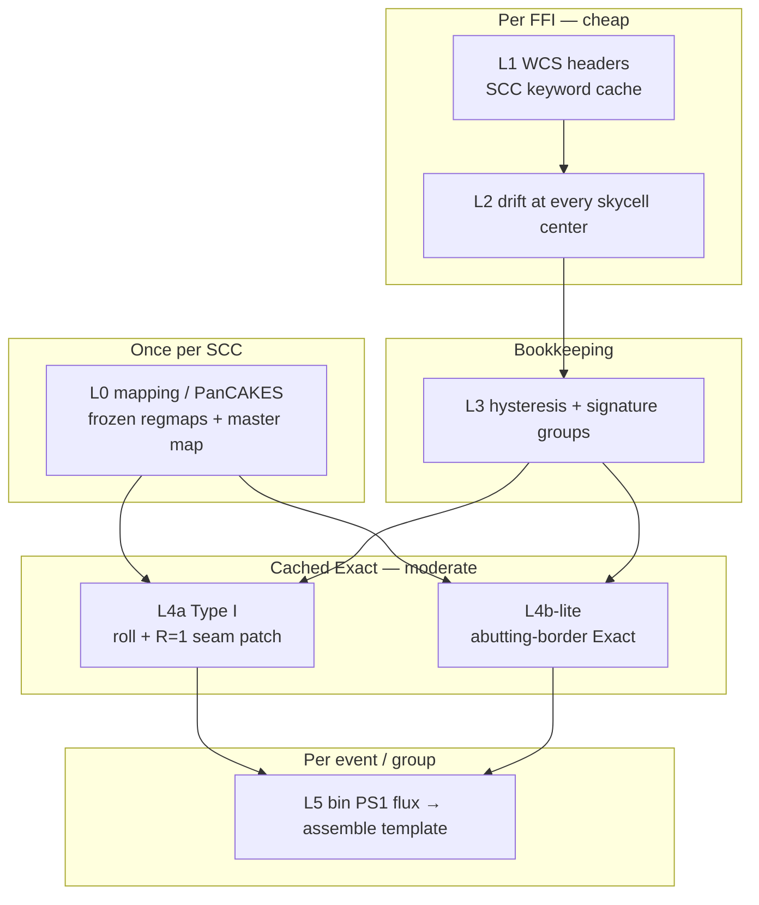

# Field (distortion-aware) templates — `geometry_mode: field`

> **Linear mode** (default): single-point drift, per-event template FITS — see
> [WCS grouping](stages/wcs_grouping.md) and
> [Multi-offset downsample](stages/downsample_technical.md).
>
> **Field mode** (this document): per-skycell drift, SCC-scoped sparse contrib store,
> hybrid Exact patches.

## Table of contents

1. [What it is](#what-it-is)
2. [Linear vs field](#linear-vs-field)
3. [Why field mode exists](#why-field-mode-exists)
4. [Architecture (L0–L5)](#architecture-l0l5)
5. [Drift measurement and smoothing](#drift-measurement-and-smoothing)
6. [Hybrid recomputation (L4)](#hybrid-recomputation-l4)
7. [Cache keys and reuse](#cache-keys-and-reuse)
8. [WCS in Exact remapping](#wcs-in-exact-remapping)
9. [Package modules](#package-modules)
10. [Config knobs](#config-knobs)
11. [Storage](#storage)
12. [Engine support](#engine-support)
13. [Performance caveats](#performance-caveats)
14. [Not yet done](#not-yet-done)
15. [Glossary](#glossary)

Also see [oversampled templates](oversampled_templates.md) when combining field
mode with `oversampling_factor F>1` (HR store ROI units vs native diff crops).

---

## What it is

**Linear templates** measure velocity-aberration drift at **one** point (the science
target) and apply it as a single global PS1-pixel roll, so templates degrade away
from the target. **Field mode** instead:

1. Measures drift at **every skycell center** (not only the target).
2. Savitzky–Golay-smooths each skycell's drift time series per orbit segment.
3. Integer-quantizes each skycell's PS1 shift with hysteresis.
4. Groups frames by their full-chip shift **signature** (`group_id`).
5. Rolls each skycell's frozen L0 regmap independently.
6. **Exact-patches** the R=1 seam/rim band (hybrid **L4a**) and abutting neighbor
   borders (**L4b-lite**).

Instead of per-target `dx/dy` template FITS, field mode keeps an **SCC-scoped sparse
contrib store** and **assembles a template per `group_id` on demand**.

`geometry_mode: linear` remains the default and is unaffected.

---

## Linear vs field

| Aspect | Linear (`geometry_mode: linear`) | Field (`geometry_mode: field`) |
|--------|----------------------------------|--------------------------------|
| Drift measured at | Science target only | Every skycell center (~1000) |
| Drift smoothing | SG on target `(dx, dy)` per frame | SG on each skycell's `(dx, dy)` time series |
| Template groups | ~19 per sector (target-anchored) | ~10²–10³ (full-chip signature) |
| Regmap geometry | Integer roll of frozen L0 map | Roll + hybrid Exact patch (L4a/L4b-lite) |
| Output | Per-event `syndiff_template_*_dx*_dy*.fits.gz` | SCC `contribs/` + on-demand assembly |
| Event dependency | Requires `event_job.json` (crop, offsets) | SCC-wide; no event ROI at build time |
| Deep dive | [wcs_grouping.md](stages/wcs_grouping.md), [downsample_technical.md](stages/downsample_technical.md) | This document |

---

## Why field mode exists

### Spatial error (large)

Linear mode applies one `(group_dx, group_dy)` everywhere. True drift is a smooth
field `d(x, y, t)` from velocity aberration. Measuring only at the target leaves up
to **~6 PS1 px** differential across the FOV — templates are good near the target
and wrong far away.

### Sub-pixel floor (small)

Even with a correct local integer roll, a pure roll of the frozen footprint disagrees
with Exact geometry on **TESS-ownership seams** and the **footprint rim** (~0.3–0.8%
of PS1 pixels; ~0.37 PS1 px mean centroid residual). Hybrid R=1 Exact patches fix
this without a full remap.

### Compute trap

Full PanCAKES remapping every FFI ≈ **12 CPU-days** per SCC. Field mode maps once
(L0), then rolls and patches only the ~9% of pixels where rolls are wrong.

---

## Architecture (L0–L5)



| Layer | What | When | Module |
|-------|------|------|--------|
| **L0** | Frozen `TESS_PIXEL_MAP` per skycell + master `pixels2skycells` | Once per SCC (`mapping` stage) | `pancakes.py` |
| **L1** | Per-FFI celestial WCS (SIP) via shared keyword cache | Every frame; ~9 ms/frame on cache hit | `wcs_header_cache.py` |
| **L2** | TESS-pixel drift at each skycell center; convert to PS1 shift | Built into `shift_schedule.npz` | `shift_schedule.py` |
| **L3** | Hysteresis round → integer `(sx, sy)`; frame signature → `group_id` | Same schedule build | `shift_schedule.py` |
| **L4a** | Roll frozen map + Exact-patch R=1 seam/rim mask | Per `(skycell, sx, sy)` cache key | `hybrid_regmaps.py`, `field_hybrid_exact.py` |
| **L4b-lite** | Exact-refresh abutting TESS border when neighbors differ | Expanded into L4a TESS-id set | `field_hybrid_exact.py` |
| **L5** | Bin PS1 flux through hybrid assignment; sum contribs per `group_id` | `templates` stage + diff assembly | `field_downsample.py`, `field_templates.py` |

**Measured scale (s0020/c3/k3):** ~1036 skycells, ~1183 valid frames, ~16.6k Type I
keys `(skycell, sx, sy)`, ~951 distinct `group_id`s.

---

## Drift measurement and smoothing

### L2 — per-skycell-center drift

For every frame `f` and skycell `c` with catalog center `(RA, DEC)`:

1. Map the sky position through the **reference WCS** → `(x_ref, y_ref)`.
2. Map the same sky point through **frame f's WCS** → `(fx, fy)`.
3. TESS drift: `dx = fx - x_ref`, `dy = fy - y_ref`.

Implemented in `build_skycell_shift_schedule()` (`shift_schedule.py`): vectorized over
all skycells per frame via `wcs_f.world_to_pixel_values(ra, dec)`.

### TESS drift → PS1 integer shift

Smoothed `(dx, dy)` at each skycell center is converted to a PS1-pixel shift by the
same WCS round-trip used in linear downsample (`compute_ps1_shift_for_skycell`):

- sky → TESS pixel at skycell center
- perturb by `(dx, dy)` in TESS pixel space
- both positions → sky → PS1 pixels
- PS1 shift = difference

Then **hysteresis rounding** (default margin 0.1) prevents flapping at bin edges.
Frames with identical per-skycell `(sx_int, sy_int)` vectors share a `group_id`.

### Savitzky–Golay smoothing — what is and is not smoothed

**Smoothed:** the per-skycell **drift time series** `(dx, dy)` before integer
quantization. Within each orbit segment (split where `btjd` gaps exceed 0.5 days),
each component is SG-filtered (default window=11, polyorder=2). This reduces
frame-to-frame noise so single-frame WCS jitter does not spawn spurious shift bins.

**Not smoothed:**

- WCS FITS headers or SIP coefficients.
- The WCS used during Exact remapping (see below).

Smoothing affects **which integer bin** each skycell lands in and **which realizing
frame** is picked for a cache key — not the geometry math inside `process_skycell_pixel_mapping`.
At test epochs, SG schedule vs raw WCS differ by ≲0.003 px.

Linear mode applies the same SG filter, but only to the **target** drift — see
[§4 of wcs_grouping.md](stages/wcs_grouping.md#4-savitzkygolay-smoothing).

---

## Hybrid recomputation (L4)

Recomputing is **not** a full PanCAKES remap. It is **roll + small Exact patch**.

### Baseline: integer roll

The L0 frozen assignment map (PS1 pixel → TESS flat id) is rolled by
`(sx_int, sy_int)` (`hybrid_regmaps.roll_assignment`). A roll is correct almost
everywhere — wrong only on ownership seams and footprint edges.

### Type I (L4a) — intra-skycell

**Trigger:** new cache key `(skycell, sx_int, sy_int)`. Neighbor motion does
**not** create a Type I key for an unchanged skycell.

**Algorithm:**

1. `linear = roll(frozen_map, sx, sy)`
2. `mask = dilate(ownership_seams ∪ footprint_edge, R=1)` → ~9% of footprint
3. Collect TESS ids covering `mask`; run Exact mapping for those ids only
4. Replace `linear` values on `mask` with Exact values (`apply_hybrid_patch`)

`(sx, sy) = (0, 0)` skips hybrid Exact (mapping-epoch geometry is used as-is).

### Type II (L4b-lite) — inter-skycell neighbor rim

**Trigger:** a neighbor's integer shift changes while this skycell's shift does not
(~88% of pair-state changes on s0020/c3/k3).

**What happens:**

- **Do not** redo this skycell's internal Type I seams.
- **Do** Exact-refresh PS1 pixels on the **shared abutting TESS border** with the
  neighbor.

**As-built policy (`include_abutting_border_exact: true`):** expand the Exact TESS-id
set with `abutting_border_tess_ids()` under the same realizing WCS used for L4a.
Full F2 pair-state shared-WCS rim cache is designed but not yet shipped.

Type I and Type II use the **same** Exact primitive — they differ only in **when**
and **which pixels** are scheduled.

### Decision table

| Question | Answer |
|----------|--------|
| Re-run PanCAKES for a drifted FFI? | **No** (L0 only). |
| Exact-remap every FFI × skycell? | **No**. |
| Exact-remap every `(skycell, sx, sy)` fully? | **No** — hybrid R=1 (~9%). |
| Recompute A's Type I when neighbor B moves? | **No** for internal seams. |
| Refresh PS1 on the A\|B rim when B moves? | **Yes** (L4b-lite). |
| Margin R? | **R=1** for Type I; abutting border for Type II. |

---

## Cache keys and reuse

Two independent quanta appear in the shift-schedule / group handoff
(`shift_schedule.assign_groups_from_schedule`, written into
`template_groups.json`):

| Knob | Controls | Typical value |
|------|----------|---------------|
| `grouping_quantum_ps1_px` | Full-chip signature → how many `group_id`s | `1.0` (config under `stages.wcs_grouping`) |
| `cache_quantum_ps1_px` | Per-skycell quantized `(qx, qy)` recorded on group rows | Production field build currently passes `1.0` with `keying="absolute"` |

**Grouping** decides template count. **Cache quantum** is the geometric-accuracy
knob for per-skycell reuse of Exact patches: finer bins share less work but
keep ownership closer when two frames land in the same integer roll bin from
opposite fractional corners.

### Why integer-only reuse is approximate

Within one integer `(sx, sy)` bin, frames can sit at opposite rounding corners
(`frac_dist` up to ~√2). Nearest-pixel TESS ownership then differs by roughly
**~0.4% typical / ~1–2% worst** of PS1 pixels on measured s0020/c3/k2 GT sites
(corr ≈ 0.97 with fractional separation). Integer-align rolling one Exact map
toward another cuts raw disagree a lot, but a frac-dependent residual remains
(~0.75% median after roll).

A finer reuse key of the form

```text
(skycell, quantize(sx_f, q), quantize(sy_f, q))   with q ≈ 0.25 PS1 px
```

dropped worst-pair disagree to **median ~0.3%, max ~0.6%** on the same probe.
`shift_schedule` still supports `keying="phase"` (quantize only the fractional
part) vs `"absolute"`, and a non-1.0 `cache_quantum_ps1_px`, but the live
`field_downsample` path currently keys Exact work at integer absolute shifts
(`cache_quantum_ps1_px=1.0`, `keying="absolute"`) — i.e. the cheaper tier with
the known ~1% worst-case ownership noise inside a bin. Treat that as an
accuracy budget, not “exact” geometry reuse.

As-built L4 Type I triggers still use the cache key
`(skycell, sx_int, sy_int)` described above.

---

## WCS in Exact remapping

Exact patches call `process_skycell_pixel_mapping()` (`pancakes.py`):

1. TESS pixel corners (sub-pixel footprint)
2. `tess_wcs.all_pix2world(...)` — full SIP distortion
3. `world_ra_dec_to_pixel(ps1_wcs, ...)` — project to PS1
4. Find PS1 pixels inside each TESS pixel rectangle

**Which frame's WCS?** The first valid frame whose schedule matches
`(skycell, sx_int, sy_int)` — the **realizing frame**
(`field_downsample._frame_index_for_shift`). That frame's unsmoothed per-FFI WCS
(with SIP) drives the Exact geometry.

**Summary:** SG smoothing shapes the **schedule**; Exact remapping uses **real frame
WCS headers**.

---

## Package modules

| Module | Role |
|--------|------|
| `template_creation/processing/shift_schedule.py` | `build_skycell_shift_schedule`, hysteresis, group assignment |
| `template_creation/processing/compute_ps1_skycell_shifts.py` | TESS drift → PS1 shift WCS round-trip |
| `template_creation/processing/hybrid_regmaps.py` | Roll, recompute mask, hybrid patch merge |
| `template_creation/processing/field_hybrid_exact.py` | Exact regmap for TESS-id subsets; L4a/L4b-lite orchestration |
| `template_creation/processing/field_downsample.py` | SCC field store build (`run_field_downsample_scc`) |
| `template_creation/processing/field_templates.py` | Contrib cache, per-group assembly |
| `template_creation/processing/pancakes.py` | `process_skycell_pixel_mapping` (shared with L0 mapping) |
| `common/wcs_header_cache.py` | Per-FFI WCS keyword cache (zero file I/O on hit) |
| `difference_imaging/support/template_resolution.py` | Resolve field store, assemble per `group_id` at diff time |

---

## Config knobs

```yaml
stages:
  wcs_grouping:                   # consumed by the `bind` stage (diff DAG); config key name unchanged
    geometry_mode: field          # opt in (default: linear)
    grouping_quantum_ps1_px: 1.0  # signature quantum for group_id assignment
    wcs_drift_savgol_window: 11   # also used by field shift schedule (via defaults)
    wcs_drift_savgol_polyorder: 2
    crop_mode: target_box         # diff crop; field store is full-chip, crop filters at assembly
    crop_box_size: 1024
  templates:                      # `templates` stage (legacy config key: `downsample`)
    geometry_mode: field
    apply_hybrid_exact: true      # L4a R=1 seam/rim Exact (else roll-only fallback)
    hybrid_R: 1
    include_abutting_border_exact: true   # L4b-lite
    rebuild_field_store: false    # true overwrites existing contribs + exact cache
    n_jobs: 32                    # hybrid workers cap at min(n_jobs, 24, CPUs)
```

`grouping_quantum_ps1_px` is the supported config knob for template count. Finer
Exact-reuse quanta (`cache_quantum_ps1_px`, phase vs absolute keying) exist on
the `shift_schedule` API and are recorded in `template_groups.json`, but the
production field build currently hardcodes `cache_quantum_ps1_px=1.0` /
`keying="absolute"` — see [Cache keys and reuse](#cache-keys-and-reuse).

`mapping_dir` / `convolved_dir` can point the `templates` stage at a shared read-only
mapping + convolved tree while writing its SCC template store to an isolated `data_root`.

---

## Storage

```
{data_root}/s{SSSS}/c{C}/k{K}/templates/oversampling_{N}/
  template_manifest.json          # completeness marker for the SCC store
  shift_schedule.npz              # per-skycell drift schedule (L2/L3)
  template_group_shifts.parquet   # (group_id, skycell, sx_int, sy_int, ...)
  field_mode_assembly.json        # roi_bounds, base_tess_shape, zarr, ignore_mask
  contribs/skycell.{proj}.{cell}_sx{±N}_sy{±N}.npz
  exact_cache/…_exact.npz
{workspace_root}/events/{event_name}/s{SSSS}_c{C}_k{K}/field_contrib_keys.json
```

Resolved at diff time by `template_resolution.resolve_template_dir()` — first via
`data_root`+SCC (`scc_templates_dir()`), falling back to sector/camera/ccd from
`event_job.json`. `is_field_template_store()` recognizes the store by
`template_manifest.json`.

The store is **shared across events** on an SCC; force-rerun never deletes it.
Each event records exactly the keys it required (crop-aware verify). Legacy
pre-cutover stores at `{data_root}/field_templates/sector_*` are obsolete and
are **not** read by current code. See [storage_layout.md](storage_layout.md).

Diff resolves `group_id` from `syndiff_ffi_frames.csv` → assembles from SCC
`contribs/`. Do not parse field products with the linear `dx/dy` filename regex.

---

## Engine support

Every template-consuming stage is field-aware; templates are assembled per
`group_id` from the store.

| Stage | Field-aware |
|-------|-------------|
| `hotpants` | yes (on-demand loader, cached per group); also OS-aware — see [oversampled templates](oversampled_templates.md) |
| `shared_mask` | yes (`ps1_min_hit_count>0` uses the assembled COUNT plane; HR COUNT is block-summed to native) |
| `kernel_fit` / `convolved_templates` / `kernel_subtract` | yes (convolved products keyed by `group_id`; OS crop + reconvolve when `F>1`) |
| `epsf` / `centroids` / `sat_template` / `subtract` / `background` / `forced_photometry` | agnostic (consume diff/ePSF products) |
| star (host-star LCs) | yes (per-skycell field shifts per `group_id`, deduped to local signatures; same `oversampling_factor` as templates) |

**Field store units when `oversampling_factor F>1`:** sidecar `base_tess_shape` and
`roi_bounds` are in **oversampled** pixels; diff crop bounds stay native and
are converted as `native * F - roi_hr_origin` at assemble time. Event-crop
template builds scale the native cluster ROI by `F` before writing the store.

Assemble a full-FFI ("big") template for any FFI:
`template_resolution.assemble_field_template_for_ffi(ctx, manifest, ffi_name)`.

---

## Performance caveats

- Field mode has **~10²–10³ groups** (vs ~19 linear), so `convolved_templates`
  convolves one template per distinct `group_id` **serially** — slow on a full
  frame set. Use a coarser `grouping_quantum_ps1_px` for the kernel engine, or
  parallelize `run_convolved_templates`. (The star path deduplicates to the few
  **local** signatures over its ROI.)
- Hybrid Exact does one `process_skycell_pixel_mapping` per `(skycell, sx, sy)` key;
  workers cap at `min(n_jobs, SYNDIFF_HYBRID_MAX_JOBS=24, available CPUs)` at
  ~2 GB each.
- Shift schedule build: ~255 s per SCC (measured); L4a-only CPU sketch ~0.6 h
  serial per SCC.

---

## Not yet done

- `materialize_fits: true` (optional pre-materialized FITS) is a no-op flag.
- Parallel `convolved_templates`.
- F2 pair-state strip cache for L4b (full shared-WCS rim under pair key).

---

## Glossary

| Term | Meaning |
|------|---------|
| Frozen regmap | L0 PS1→TESS assignment at mapping-epoch WCS |
| Linear / roll | Integer PS1 roll of frozen regmap |
| Exact | `process_skycell_pixel_mapping` under a chosen frame WCS |
| Hybrid | Linear everywhere + Exact on the R=1 mask |
| Type I | Intra-skycell seam/rim Exact (L4a) |
| Type II | Inter-skycell abutting-rim consistency (L4b / L4b-lite) |
| Abutting border | Master 4-neighbour TESS pixels where skycell A meets B |
| Signature / group | Full-chip vector of per-skycell integer shifts → `group_id` |
| Grouping quantum | PS1-px quantum for signature / `group_id` count (`grouping_quantum_ps1_px`) |
| Cache quantum | PS1-px quantum for per-skycell Exact-reuse `(qx, qy)` (`cache_quantum_ps1_px`) |
| Realizing frame | First valid frame whose schedule matches `(skycell, sx, sy)` |
