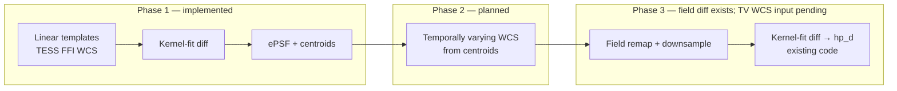

# Linear bootstrap → centroids → field diff (campaign flow)

This document describes the **multi-phase SCC campaign** for distortion-aware
difference imaging: start with simple linear templates tied to native TESS FFI
WCS, measure star positions on difference images, then rebuild field-mode
templates (using a temporally varying WCS from those centroids — phase 2) and
run the **existing** field kernel-fit diff to `hp_d`.

Configs for the implemented phase live under
[`config/archive/linear_centroids/`](../../config/archive/linear_centroids/).

---

## End-to-end picture



| Phase | Status | Goal | Config |
|-------|--------|------|--------|
| **1a** Templates | Implemented | Point-drift linear templates from TESS FFI headers | `config/archive/linear_centroids/pipeline_templates.yaml` |
| **1b** Diff + centroids | Implemented | Kernel-fit subtraction; star positions on `hp_d` | `config/archive/linear_centroids/pipeline.yaml` + `diff_config.yaml` (schema v1) |
| **2** TV WCS | **Not implemented** | Per-epoch WCS field derived from phase-1 centroids | — (next development task) |
| **3** Field templates + diff | **Diff implemented**; TV-aware remap TBD | Full field remap/downsample, then kernel diff → `hp_d` (no ePSF) | `config/archive/pipeline_field_c3_k3_os1.yaml` + `config/archive/diff_config_scc_c3_k3_multi_hp_epsf_os1.yaml` |

---

## Phase 1a — Linear templates (TESS FFI WCS)

**Idea:** Before modeling distortion, build templates where each epoch’s PS1 roll
is set from **smoothed WCS drift measured at the reference FFI center** (not a
science target). Every frame in an offset group shares one `(dx, dy)` in PS1
pixels — typically ~10–20 groups per SCC.

**Template stages** (after standard `tess_ffi_download` → `wcs_grouping` →
`mapping` → `ps1_process`):

1. **`remap`** with `drift_source: point`, `store_name: linear` — writes
   `remap_linear/` and `point_drift_table.csv`.
2. **`downsample`** with `geometry_mode: linear`, `remap_store_name: linear`,
   `output_store_name: linear` — writes `templates_linear/` including
   `linear_mode_assembly.json` and per-group FITS.

**Storage** (per SCC under `data_root`):

```
s{SSSS}/c{C}/k{K}/
  remap_linear/…
  templates_linear/
    linear_mode_assembly.json
    syndiff_template_s{S}_{C}_{K}_dx±….fits.gz   # one file per offset group
```

**Submit:**

```bash
syndiff template submit \
  --config config/archive/linear_centroids/pipeline_templates.yaml \
  --scc config/scc_my_lanes.csv \
  --stages remap,downsample \
  --run-id my_linear_templates \
  --force-rerun --skip-artifact-verify
```

See also [field_geometry.md](field_geometry.md) § “Round-1 WCS bootstrap” for
the relationship between point-drift remap and the `linear` store lane.

---

## Phase 1b — Diff through centroids (current production config)

**Idea:** Run the **kernel-fit** diff path on the linear template lane, then
fit ePSF and extract centroids on full-chip `hp_d` difference images. Centroids
are the input to phase 2 (TV WCS).

**Diff sub-pipeline** (`config/archive/linear_centroids/diff_config.yaml`, schema v1):

| Step | Purpose |
|------|---------|
| `shared_mask` | SCC-wide mask |
| `kernel_fit` | Hotpants kernel at best Earth/Moon angle FFI |
| `convolved_templates` | Per-epoch templates convolved with fitted kernel |
| `kernel_subtract` | `ffi − convolved` + photutils background → `ks_d`, `ks_b` |
| `hotpants` | Second-pass subtraction → `hp_d`, `hp_b` |
| `epsf` | Gridded ePSF on `hp_d` (stage defaults) |
| `centroids` | PSF photometry positions on `hp_d` (stage defaults) |

**Lane paths** (all under `diff_linear/` on the SCC):

| Label | Contents |
|-------|----------|
| `kernel_fit/`, `tmpl_conv/` | Kernel solution + convolved templates |
| `ks_d/`, `ks_b/` | Kernel-subtracted diffs + background |
| `hp_d/`, `hp_b/`, `hp_m/` | Hotpants products + meta |
| `epsf_r1/` | Per-FFI gridded ePSF NPZ |
| `centroids_r1/` | Per-FFI `_photresults.ecsv` |

**Submit** (any SCC CSV):

```bash
syndiff diff submit \
  --config config/archive/linear_centroids/pipeline.yaml \
  --scc config/scc_my_lanes.csv \
  --stages diff \
  --run-id my_linear_centroids
```

**Foreground debug** (one SCC):

```bash
syndiff diff run \
  --config config/archive/linear_centroids/pipeline.yaml \
  --scc config/scc_my_lanes.csv
```

**Progress sidecars** (beside `per_target/<label>/diff.log`):

- `diff.hotpants.progress.json`, `diff.epsf.progress.json`,
  `diff.centroids.progress.json`

ePSF and centroids are **excluded from the workspace config fingerprint lock**,
so you can append those stages to an existing hotpants workspace without a new
`workspace_run_id`.

**Validated example:** s0020/c3/k3 smoke (64 FFIs) — kernel_fit through
centroids, exit code 0.

---

## Phase 2 — Temporally varying WCS (planned)

**Goal:** Use phase-1 **centroids** (and underlying Gaia/TESS astrometry) to
build a **time-dependent WCS correction field** per SCC — replacing the single
point-drift model with something that tracks velocity aberration and residual
distortion across the chip and across epochs.

**Status:** Not implemented. This is the next development task. Expected
outputs will likely live under a new bookkeeping/remap store (e.g. TV-aware
`remap_*` artifacts) consumable by field-mode downsample.

**Inputs:** `centroids_r1/*_photresults.ecsv`, `epsf_r1/`, FFI WCS table,
`point_drift_table.csv` from phase 1a.

---

## Phase 3 — Field-mode templates and diff (implemented; awaits TV WCS)

**Goal:** After phase 2 supplies a temporally varying WCS, **re-run field remap and
downsample**, then produce science-grade difference images with the **same
kernel-fit diff path as phase 1b**, stopping at **hotpants** (no ePSF or
centroids — astrometry lives in the field templates).

**What already exists:** The field template DAG and kernel-fit diff pipeline are
implemented and in production configs:

| Piece | Config |
|-------|--------|
| Field remap + downsample + diff (full L4a/L4b) | [`config/archive/pipeline_field_c3_k3_os1.yaml`](../../config/archive/pipeline_field_c3_k3_os1.yaml) |
| Diff recipe (kernel_fit → hotpants only) | [`config/archive/diff_config_scc_c3_k3_multi_hp_epsf_os1.yaml`](../../config/archive/diff_config_scc_c3_k3_multi_hp_epsf_os1.yaml) |
| Point-drift field lane (no L4a/L4b; bootstrap) | [`config/archive/pipeline_linear_bootstrap_os1.yaml`](../../config/archive/pipeline_linear_bootstrap_os1.yaml) + [`config/archive/diff_config_scc_field_nc_multi_hp_centroids_os1.yaml`](../../config/archive/diff_config_scc_field_nc_multi_hp_centroids_os1.yaml) |

**Diff sub-pipeline** (already wired — no `epsf` / `centroids` stages):

```
shared_mask → kernel_fit → convolved_templates → kernel_subtract → hotpants
```

Outputs land on the default SCC lane (`templates/`, `diff/`) or a named store
when `paths.template_store_name` / `output_store_name` are set.

**Example** (field templates + diff today, default lane):

```bash
syndiff diff submit \
  --config config/archive/pipeline_field_c3_k3_os1.yaml \
  --scc config/scc_my_lanes.csv \
  --stages mapping,remap,downsample,diff \
  --run-id my_field_diff
```

**What phase 2 still unlocks:** Today’s field remap measures drift from native
TESS FFI WCS (or point-drift bootstrap). Phase 2 replaces that drift input with
the **TV WCS derived from phase-1 centroids** before calling the same
remap/downsample/diff stages above. No new diff stages are required — only the
remap drift source / bookkeeping path feeding field downsample.

---

## How this relates to other docs

| Topic | Document |
|-------|----------|
| Linear vs field geometry | [field_geometry.md](field_geometry.md) |
| Diff stage algorithms | [stages/diff_pipeline.md](stages/diff_pipeline.md) |
| SCC storage layout | [storage_layout.md](storage_layout.md) |
| Orchestration / Condor | [template_pipeline.md](template_pipeline.md) |
| Field geometry + padded SCC | [field_geometry.md](field_geometry.md), [`doc/padded_scc_v2_implementation.md`](../../doc/padded_scc_v2_implementation.md) |
| Centroids stage | [stages/centroids.md](stages/centroids.md) |

---

## Quick reference — config files

```
config/archive/linear_centroids/
  README.md                 ← short ops pointer
  pipeline_templates.yaml   ← phase 1a: remap + linear downsample
  diff_config.yaml          ← phase 1b: diff recipe (schema v1)
  pipeline.yaml             ← phase 1b: Condor diff submit wrapper
```

This whole folder has since moved to `config/archive/linear_centroids/` (kept
for reference; not the active campaign). New sites should author the diff
recipe inline under `pipeline.yaml`'s `diff:` block — schema v2, see
[config_schema_v2.md](config_schema_v2.md) — rather than a standalone
`diff_config.yaml`.

SCC target lists stay as top-level CSVs (e.g. `config/scc_s20_c3_k3.csv`) and
are passed with `--scc`; they are not duplicated inside this folder.
