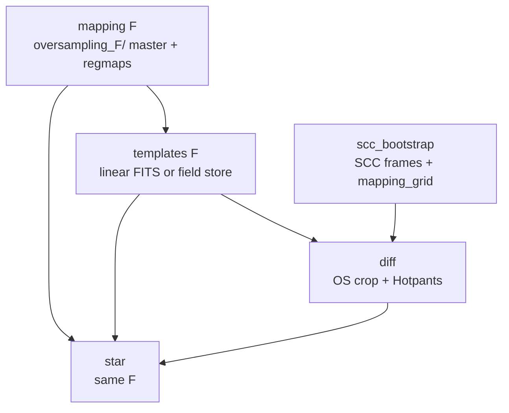

# Oversampled templates (`F`) and Hotpants stamp modes

> **Audience:** operators and maintainers enabling `oversampling_factor > 1`
> and/or Hotpants `stamp_mode: connected_regions`.
>
> **Defaults stay F=1 + `stamp_mode: grid` + C extension.** Everything below is
> additive; an unchanged site config behaves exactly as before.
>
> **Related:** [template pipeline](template_pipeline.md) ·
> [diff internals](stages/diff_pipeline.md) ·
> [downsample technical](stages/downsample_technical.md) ·
> [field geometry](field_geometry.md) ·
> [star config](stages/star_config.md) ·
> [storage layout](storage_layout.md)

## Table of contents

1. [Concepts](#1-concepts)
2. [Coordinate systems (read this first)](#2-coordinate-systems-read-this-first)
3. [End-to-end data flow](#3-end-to-end-data-flow)
4. [Template pipeline: build `F`](#4-template-pipeline-build-f)
5. [Diff pipeline: use `F` + stamp modes](#5-diff-pipeline-use-f--stamp-modes)
6. [Hotpants parameter reference](#6-hotpants-parameter-reference)
7. [Kernel reuse path (`kernel_fit` / `convolved_templates`)](#7-kernel-reuse-path-kernel_fit--convolved_templates)
8. [Shared mask and PS1 COUNT](#8-shared-mask-and-ps1-count)
9. [Field mode + oversampling](#9-field-mode--oversampling)
10. [Star branch](#10-star-branch)
11. [Config recipes](#11-config-recipes)
12. [Invariants and failure modes](#12-invariants-and-failure-modes)
13. [Code map](#13-code-map)

---

## 1. Concepts

Three knobs that look similar and are **not** interchangeable:

| Knob | Where | Meaning |
|------|-------|---------|
| **`oversampling_factor` (`F`)** | `pipeline.yaml` → `stages.mapping` / `stages.downsample`; `star_config.yaml` → `defaults.oversampling_factor` | Build / consume templates and mapping on an `F×F` finer TESS grid under `oversampling_{F}/` |
| **`hotpants.oversample`** | diff `pipeline:` → `[{kind: hotpants, oversample: …}]` (`pipeline.yaml`'s `diff.pipeline`, or a legacy standalone `diff_config.yaml`'s `pipeline:`) | Tell pyhotpants the template is HR relative to science. Usually **omit** — syndiff infers `F` from array shapes |
| **`epsf_oversample`** | ePSF / photometry stages | Unrelated ePSF model oversampling (photutils). Do not set this to match template `F` |

**Hotpants stamp modes** (diff only; star never runs Hotpants):

| `stamp_mode` | Backend | What it does |
|--------------|---------|--------------|
| `grid` (default) | C extension when `F=1`; pure Python when `F>1` | Classical Hotpants substamp grid (`hp_nstampx` × `hp_nstampy`) |
| `connected_regions` | Pure Python only | Build irregular stamps from connected components of the star catalog; uses `region_*` knobs |

pyhotpants (≥ 0.2) implements `oversample=` and `stamp_mode=` in-process. Syndiff
wires them through `HotpantsParams` → `build_hotpants_config` →
`run_hotpants_frame`.

---

## 2. Coordinate systems (read this first)

Mixing these silently misplaces crops, stars, and Hotpants stamps.

| Space | Units | Examples |
|-------|-------|----------|
| **Native FFI** | Base TESS pixels (`F=1` grid) | Diff `crop_bounds`, science FFI crops, Hotpants **outputs**, star stamp windows, template header `XMIN`/`XMAX`/`YMIN`/`YMAX` |
| **Oversampled (HR)** | Native × `F` | Mapping master FITS under `oversampling_{F}/`, linear template `FLUX_SUM`/`COUNT` arrays when `OVERSAMP=F`, field store `base_tess_shape` / `roi_bounds`, mini-star template planes when star `oversampling_factor=F` |

**Rules of thumb**

1. **Crop bounds are always native.** Diff never stores HR crop boxes.
2. **Science and Hotpants products are always native (LR).** Diffs, noise, mask,
   convolved science-space maps, and photometry windows stay at native resolution.
3. **Templates may be HR.** When `OVERSAMP=F` (or field store OS), syndiff scales
   native crop → HR slices as `native * F` (minus ROI origin when applicable).
4. **Do not scale `hp_sigma_gauss` by `F` in YAML.** pyhotpants scales Gaussian
   *coefficients* as `σ / F²` internally so the physical kernel width grows with
   `F`. Syndiff kernel reconvolve matches that (`s / F²`), not `s * F`.


---

## 3. End-to-end data flow



**Matching `F` across stages is mandatory.** Mapping, templates, and star must
all use the same `oversampling_factor`. Diff does not have its own `F` in
`pipeline.yaml`; it consumes whatever templates are on disk and either infers
`oversample` from shapes or takes an explicit `hotpants.oversample`.

Typical operator sequence for `F=2`:

```bash
# 1) Template DAG at F=2 (mapping + templates must both say 2)
syndiff template submit --site config/ --sccs config/scc_example.csv --run-id tmpl_os2

# 2) Diff (Hotpants infers oversample=2 from HR templates vs LR science)
syndiff diff submit --site config/ --targets config/targets_example.csv --run-id diff_os2

# 3) Star must use the same F
#    star_config.yaml: defaults.oversampling_factor: 2
syndiff star submit --site config/ --star-targets config/star_targets_example.csv
```

---

## 4. Template pipeline: build `F`

### 4.1 Config knobs

In [`config/pipeline.yaml`](../../config/pipeline.yaml):

```yaml
stages:
  mapping:
    oversampling_factor: 1   # ← set F here
  downsample:
    oversampling_factor: 1   # ← must match mapping
    geometry_mode: field      # or linear
```

| Key | Stage | Default | Notes |
|-----|-------|---------|-------|
| `oversampling_factor` | `mapping` | `1` | Writes under `{data_root}/s{SSSS}/c{C}/k{K}/mapping/oversampling_{F}/` |
| `oversampling_factor` | `downsample` | `1` | Must equal mapping `F`. Writes under `…/templates/oversampling_{F}/` |
| `geometry_mode` | `downsample` | `field` | `field` or `linear`; independent of `F` |

`N` is **always** nested as `oversampling_{N}/`, including `N=1`
([storage layout](storage_layout.md)).

### 4.2 What each stage does at `F>1`

| Stage | Behavior at `F>1` |
|-------|-------------------|
| **`mapping`** | PanCAKES builds an HR master `pixels2skycells` of shape `(ny_native·F, nx_native·F)` and HR regmaps. Filenames gain `_os{F}` where applicable. |
| **`ps1_download` / `ps1_process`** | Unchanged — convolved Zarr is shared across `F`. |
| **`templates` (linear)** | Sparse binning lands flux into HR pixels. Output FITS `FLUX_SUM`/`COUNT`/`MASK` are shape `(roi_h·F, roi_w·F)`. Header keeps **native** `XMIN`/`XMAX`/`YMIN`/`YMAX` and sets `OVERSAMP=F`. WCS CD/CDELT divided by `F`. Filename may include `_os{F}`. |
| **`templates` (field)** | Sparse contrib store + sidecar use **HR** `base_tess_shape` and **HR** `roi_bounds`. Event-crop builds scale native cluster ROI by `F` before `run_field_downsample_scc`. Full-chip SCC builds use the full HR master shape. |

Deep algorithms: [downsample_technical.md §8](stages/downsample_technical.md#8-roi-and-oversampling),
[mapping_pancakes.md](stages/mapping_pancakes.md),
[field_geometry.md](field_geometry.md).

### 4.3 Template FITS headers (linear)

| Keyword | Meaning |
|---------|---------|
| `XMIN` `XMAX` `YMIN` `YMAX` | Coverage in **native** FFI pixels (`[min,max)`) |
| `OVERSAMP` | `F` when `F>1`; absent ⇒ treat as 1 |
| Array shape | `( (YMAX-YMIN)·F , (XMAX-XMIN)·F )` |

Diff crop helpers live in `common/template_coverage.py`:

- `template_coverage_ffi_bounds()` — native coverage + `oversampling_factor`
- `template_crop_slices()` — native crop → HR slices
- `load_template_count_cropped()` — HR COUNT block-**summed** to native for
  PS1 coverage masking (see [§8](#8-shared-mask-and-ps1-count))

---

## 5. Diff pipeline: use `F` + stamp modes

Diff does **not** take `oversampling_factor` in `pipeline.yaml`. It:

1. Resolves templates from
   `{data_root}/s{SSSS}/c{C}/k{K}/templates/oversampling_{N}/`
   (or `paths.template_dir` / field store).
2. Crops science at **native** `crop_bounds`.
3. Crops / assembles templates at **HR** when `OVERSAMP` / field OS says so.
4. Runs Hotpants with `oversample=F` (inferred or explicit).

### 5.1 Sub-stage behavior

| Sub-stage | What changes at `F>1` |
|-----------|------------------------|
| **`shared_mask`** | COUNT plane is reduced to native before `COUNT < ps1_min_hit_count` (see §8). Science / Gaia coords stay native. |
| **`hotpants`** | Loads HR template crop; science stays LR. Passes `oversample`, `stamp_mode`, `region_*`, optional `use_c_extension` into pyhotpants. Forces pure Python when `F>1` or `connected_regions`. Requires `hp_force_convolve: "t"`. Writes **LR** diffs / noise / mask / bkg. |
| **`kernel_fit`** | Same Hotpants wiring; field assemble crop scaled by `F`. |
| **`convolved_templates`** | `convolve_template_with_kernel_solution(..., oversample=F, science_shape=native)` so reconvolve matches the Hotpants fit basis (`σ/F²`). |
| **`kernel_subtract` / photometry / …** | Consume LR products; no special `F` logic. |

### 5.2 Inferring `oversample`

`resolve_hotpants_oversample(sci_shape, tmpl_shape, configured)`:

1. If `hotpants.oversample` is set → use it and validate
   `tmpl_shape == sci_shape * F`.
2. Else if shapes equal → `F=1`.
3. Else if template is an isotropic integer multiple of science → that multiple.
4. Else → raise.

You normally leave `oversample` unset so a mismatched template store fails loudly
instead of silently using the wrong `F`.

---

## 6. Hotpants parameter reference

All keys below go on a `pipeline:` entry with `kind: hotpants` (also used by
`kernel_fit` via the same `HotpantsParams` parser).

### 6.1 Classical Hotpants (unchanged defaults)

| Key | Default | Purpose |
|-----|---------|---------|
| `hp_sigma_gauss` | derived from `sci_fwhm` | Gaussian widths (px) for kernel basis; **do not ×F** |
| `hp_ko` | `2` | Spatial polynomial order for kernel variation |
| `hp_bgo` | `3` | Background polynomial order |
| `hp_nstampx` / `hp_nstampy` | `10` / `10` | Substamp grid (used when `stamp_mode: grid`) |
| `hp_nss` | `100` | Max substamps |
| `hp_ngauss` | `3` | Number of Gaussians |
| `hp_deg_fixe` | `[6,4,2]` | Basis degree per Gaussian |
| `hp_fitthresh` | `5.0` | Fit threshold |
| `hp_stat_sig` | `3.0` | Statistic sigma |
| `hp_kf_spread_mask1` | `0.0` | Kernel-fit spread mask |
| `hp_ks` | `3.0` | Kernel significance |
| `hp_kfm` | `0.75` | Kernel fraction mask |
| `hp_force_convolve` | `"t"` | **Must stay `"t"` for `F>1`** (convolve template) |
| `hp_normalize` | `"t"` | Normalize convolution direction |
| `hotpants_n_jobs` | `null` | Worker count override |
| `write_convolved` / `write_bkg` / `write_stamps` | site YAML | Output products |
| `write_kernel_solutions` | `false` | Persist per-frame `{diffs}_kernels/*.npz` (required by star) |

### 6.2 Oversample / backend

| Key | Default | Purpose |
|-----|---------|---------|
| `oversample` | `null` (infer) | Explicit `F`; usually omit |
| `use_c_extension` | `null` (auto) | `null` → C when `F=1` and `grid`; forced `False` when `F>1` or `connected_regions`. Set `false` to force pure Python at `F=1`. |

### 6.3 Stamp modes

| Key | Default | Purpose |
|-----|---------|---------|
| `stamp_mode` | `"grid"` | `"grid"` or `"connected_regions"` |

#### `stamp_mode: grid`

Classical rectangular substamp lattice. Works with the C extension at `F=1`.
At `F>1` syndiff forces pure Python; substamp coordinates remain in **science
(native) pixel space** — pyhotpants maps them onto the HR template internally.

#### `stamp_mode: connected_regions`

Pure-Python only. Requires a non-empty Hotpants star catalog
(`hotpants_substamp_stars.csv` from `shared_mask`). Builds irregular connected
regions around catalog stars.

| Key | Default | Purpose |
|-----|---------|---------|
| `region_weight` | `"npix"` | Region weight scheme (`npix`, … — see pyhotpants) |
| `region_max_diameter` | `40.0` | Max region diameter (native px) |
| `region_bisect_on_reject` | `false` | Bisect rejected regions |
| `region_min_npix` | `null` | Minimum pixels per region |
| `region_max_area` | `0` | Max area (`0` = unlimited) |
| `region_connectivity` | `8` | Pixel connectivity (4 or 8) |
| `region_rss` | `null` | Optional RSS override |
| `region_max_bisects` | `100` | Cap on bisection attempts |
| `region_weight_cap` | `null` | Optional `(lo, hi)` weight clamp |

### 6.4 Example YAML snippets

**Default (F=1, grid, C) — production:**

```yaml
- kind: hotpants
  science: ffi
  hp_sigma_gauss: [0.752, 1.88, 3.76]
  hp_force_convolve: "t"
  stamp_mode: grid          # optional; this is the default
  write_kernel_solutions: true
  output:
    diffs: hp_d
    convolved: hp_c
    bkg: hp_b
```

**HR templates with inferred oversample:**

```yaml
- kind: hotpants
  science: ffi
  hp_sigma_gauss: [0.752, 1.88, 3.76]
  hp_force_convolve: "t"
  # oversample: omitted → inferred from HR template vs LR science
  stamp_mode: grid
  write_kernel_solutions: true
  output: { diffs: hp_d, convolved: hp_c, bkg: hp_b }
```

**Connected regions (pure Python):**

```yaml
- kind: hotpants
  science: ffi
  hp_force_convolve: "t"
  stamp_mode: connected_regions
  region_weight: npix
  region_max_diameter: 40.0
  region_min_npix: 20
  region_connectivity: 8
  write_kernel_solutions: true
  output: { diffs: hp_d, convolved: hp_c, bkg: hp_b }
```

---

## 7. Kernel reuse path (`kernel_fit` / `convolved_templates`)

Used by configs such as `config/pipeline.yaml`'s `diff:` block (schema v2 reference) or the legacy standalone `diff_config_single_kernel.yaml` (schema v1).

1. **`kernel_fit`** runs Hotpants twice on the min-background FFI and writes
   `kernel_r2.npz` (native-indexed kernel solution + metadata).
2. **`convolved_templates`** loads each unique group template (linear dx/dy FITS
   or field assemble), optionally HR, and calls
   `convolve_template_with_kernel_solution(..., oversample=F, science_shape=native)`.
3. Output convolved maps are **native** and consumed by `kernel_subtract`.

When `F>1`, reconvolve builds HR bases with `σ_config / F²` and `rkernel * F`,
matching pyhotpants’ Hotpants fit — not `σ * F`.

Field `kernel_fit` scales the native crop by `F` before
`assemble_field_template_for_ffi` (sidecar ROI is HR).

---

## 8. Shared mask and PS1 COUNT

`shared_mask` can flag pixels with insufficient PS1 coverage when
`ps1_min_hit_count > 0` (default 5000 in many configs):

```text
bit 16  ←  COUNT < ps1_min_hit_count
```

At `F>1`, COUNT arrays are HR. Syndiff **block-sums** each `F×F` block to one
native pixel before the threshold:

- Linear: `load_template_count_cropped()`
- Field: `build_field_mode_count_loader()` after HR assemble/crop

**Why sum:** native `COUNT` ≈ sum of the `F×F` HR hit counts for the same PS1
mapping density, so a threshold calibrated at `F=1` remains approximately
meaningful. If you change `F` and see unexpected coverage masks, re-check
`ps1_min_hit_count` on a known chip.

---

## 9. Field mode + oversampling

Field geometry (`geometry_mode: field`) is orthogonal to `F`, but units must
agree:

| Sidecar / store field | Units when `F>1` |
|-----------------------|------------------|
| `base_tess_shape` | HR `(ny·F, nx·F)` from the OS mapping master |
| `roi_bounds` | HR `(x0,y0,x1,y1)` |
| `oversampling_factor` | Stored on the field context / assembly JSON |
| Diff `crop_bounds` | Still **native** |
| Assemble crop into store | `native * F - roi_hr_origin` |

Event-crop field builds (`dispatch.py`) multiply the native cluster-job ROI by
`F` before calling `run_field_downsample_scc`. Full-chip SCC builds already use
the HR master shape as both shape and full ROI.

Consumer loaders (`build_field_mode_template_loader`,
`build_field_mode_count_loader`) apply the same native→HR crop math and
block-sum COUNT to native for masking.

---

## 10. Star branch

Star **does not** run Hotpants and has **no** `stamp_mode`. It reuses baseline
kernels / convolved templates / photutils backgrounds and builds mini star-only
templates from PS1.

### 10.1 Config

[`config/star_config.yaml`](../../config/star_config.yaml):

```yaml
defaults:
  oversampling_factor: 1   # must match mapping/templates F
```

| Key | Default | Purpose |
|-----|---------|---------|
| `defaults.oversampling_factor` | `1` | Select `mapping/oversampling_{F}/` and `templates/oversampling_{F}/`; drive mini-template HR binning |

Merge precedence unchanged: **star_targets row > overrides > defaults**.

### 10.2 What each step does at `F>1`

| Step | Behavior |
|------|----------|
| Context resolve | Prefers SCC OS leaves via `scc_mapping_dir` / `scc_templates_dir`; warns if baseline `template_dir` disagrees |
| Host skycell lookup | Native host `(x,y)` → HR master index `(x·F + F//2, y·F + F//2)` |
| Mapping shape for binning | Master HR shape ÷ `F` → native `base_tess_shape` for downsample APIs |
| Mini downsample | Same `F` into HR mini planes |
| Write mini FITS | `OVERSAMP=F`; `XMIN`/`XMAX`/`YMIN`/`YMAX` stay **native** crop-local |
| Place + convolve stamp | Embed mini into HR canvas (`native_window * F`); `convolve_template_with_kernel_solution(oversample=F)` → native stamp |
| Field star | Mini lookup by `group_id`; metadata uses `group_dx/dy = nan` |

Star still requires baseline `write_kernel_solutions: true` and convolved /
phot_bkg products from an earlier diff (see [star_lightcurves.md](star_lightcurves.md)).

---

## 11. Config recipes

### 11.1 Enable `F=2` end-to-end

**`pipeline.yaml`:**

```yaml
stages:
  mapping:
    oversampling_factor: 2
  downsample:
    oversampling_factor: 2
```

**Diff policy:** leave Hotpants `oversample` unset; keep
`hp_force_convolve: "t"`. Prefer Condor memory high enough for HR templates.

**`star_config.yaml`:**

```yaml
defaults:
  oversampling_factor: 2
```

Rebuild mapping + templates for that SCC before diff/star. Stale `F=1`
artifacts under `oversampling_1/` are ignored when config asks for `2`.

### 11.2 Connected-regions Hotpants only (`F=1`)

Keep template `oversampling_factor: 1`. On the hotpants stage set
`stamp_mode: connected_regions` and tune `region_*`. Ensure `shared_mask` ran
so `hotpants_substamp_stars.csv` exists.

### 11.3 Combine `F>1` + connected regions

Supported: both force pure Python. Cost is high (HR convolution + irregular
stamps). Start with a small `max_ffis` smoke before production (the diff-side
`crop_box_size` knob is removed — see [config_schema_v2.md](config_schema_v2.md)).

---

## 12. Invariants and failure modes

| Symptom | Likely cause |
|---------|--------------|
| `Template shape != science * oversample` | Diff pointing at wrong `oversampling_{N}/`, or explicit `oversample` disagrees with files |
| `oversample>1 requires hp_force_convolve='t'` | YAML set `hp_force_convolve` to `"i"` / `"b"` |
| `stamp_mode='connected_regions' requires a non-empty star_catalog` | Missing / empty `hotpants_substamp_stars.csv` |
| `COUNT crop shape != ref_image` | Pre-fix code path; current loaders block-sum HR COUNT — update syndiff |
| Star looks up wrong skycell / empty owner | Star `oversampling_factor` ≠ mapping `F` |
| Field assemble mis-cropped | Sidecar ROI not HR (rebuild field store after OS dispatch fix) |
| Kernel reconvolve rings / wrong flux | Old syndiff used `σ*F`; current code uses `σ/F²` — rebuild convolved products |
| `pip install -e .` hangs for hours | Repo-root `data`/`workspace` NFS symlinks; see `MANIFEST.in` / `pyproject.toml` excludes |

**Verify gates remain thin.** After changing `F`, delete or `--force-rerun`
upstream mapping/templates; otherwise verify can skip and leave stale `F=1`
products in place.

---

## 13. Code map

| Concern | Module |
|---------|--------|
| SCC `oversampling_{N}/` paths | `common/scc_paths.py` |
| Native coverage + HR slices + COUNT reduce | `common/template_coverage.py` |
| Hotpants params parse | `difference_imaging/orchestration/stage_params.py` (`HotpantsParams`) |
| Run Hotpants / infer `F` / crop load | `difference_imaging/stages/hotpants.py` |
| HR kernel reconvolve | `difference_imaging/stages/kernel.py` |
| Kernel fit OS wiring | `difference_imaging/stages/kernel_fit.py` |
| Convolved templates OS wiring | `difference_imaging/stages/convolved_templates.py` |
| Field loaders + OS crop | `difference_imaging/support/template_resolution.py` |
| Event-crop ROI × `F` | `template_creation/orchestration/dispatch.py` |
| Star config / context / mini / stamp | `star/site_config.py`, `star/context.py`, `star/star_segments.py`, `star/mini_downsample.py`, `star/diff_runner.py` |

Unit coverage: `tests/test_template_coverage.py`,
`tests/test_field_mode_template_loader.py`,
`tests/test_ps1_coverage_mask.py`,
`tests/test_star_oversampling_config.py`,
`tests/test_star_diff_runner.py`,
`tests/test_star_segments.py`.
