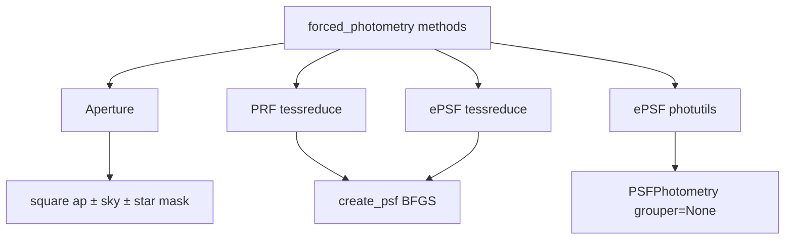

# Forced photometry (`forced_photometry`)

This document describes the production `forced_photometry` differencing stage:
aperture photometry and three PSF modes (PRF, ePSF via photutils, ePSF via
TESSreduce `create_psf`) at the primary target and
`additional_forced_targets`.

**Module:** [`syndiff_pipeline/difference_imaging/stages/photometry.py`](../../../syndiff_pipeline/difference_imaging/stages/photometry.py)

**Params:** [`stage_params.py`](../../../syndiff_pipeline/difference_imaging/orchestration/stage_params.py) (`ForcedPhotometryParams`, `AperturePhotometryMethodParams`, `PsfPhotometryMethodParams`)

**Config sketch:** [`config/README.md`](../../../config/README.md#forced_photometry-methods)

**Pipeline overview:** [Diff pipeline internals](diff_pipeline.md)

---

## Table of contents

1. [Modes overview](#modes-overview)
2. [Stage wiring](#stage-wiring)
3. [Aperture](#1-aperture-type-aperture)
4. [PRF](#2-prf-psf_type-prf)
5. [ePSF photutils](#3-epsf-photutils-default-epsf)
6. [ePSF tessreduce](#4-epsf-tessreduce-epsf_bkg)
7. [Dual ePSF example](#dual-epsf-example)
8. [Outputs](#outputs)
9. [Zero-point calibration](#zero-point-calibration)
10. [What this stage does *not* do](#what-this-stage-does-not-do)

---

## Modes overview



| Mode | YAML sketch | Fitter |
|------|-------------|--------|
| **Aperture** | `type: aperture` | Square sum ± sky annulus |
| **PRF** | `type: psf`, `psf_type: prf` | Official TESS PRF + TESSreduce `create_psf` |
| **ePSF photutils** | `type: psf`, `psf_type: epsf` (default / `fitter: photutils`) | Per-frame `GriddedPSFModel` + photutils |
| **ePSF tessreduce** | `type: psf`, `psf_type: epsf`, `fitter: tessreduce` | Same BFGS as PRF; stamp from that frame’s gridded ePSF |

YAML `fitter` values for `psf_type: epsf`: `photutils` (default) | `tessreduce`.
Internally, `tessreduce` still calls the vendored TESSreduce `create_psf` class.
`fitter` is **forbidden** on `psf_type: prf`.

**Removed:** legacy tile / `epsf_r1_smooth` forced-photometry fallback. Modern
`kind: epsf` always writes `gridded_epsf_index.json`. If `psf_type: epsf` and no
gridded catalog → clear `ValueError` (rebuild the ePSF stage). Flat tile stacks
remain for `sat_template` only.

Recommended method names: `ap3`, `prf`, `epsf`, `epsf_bkg`.

---

## Stage wiring

```yaml
- kind: forced_photometry
  inputs:
    diffs: hp_d
    epsf: epsf_r1          # required if any method is psf_type: epsf
  output: lc_epsf          # write lightcurve_*.csv here
  methods: [...]
```

| Key | Role |
|-----|------|
| `inputs.diffs` | Read workspace label for difference FITS (`ws*/{label}/`) |
| `inputs.epsf` | Read workspace label for gridded ePSF (`gridded_epsf_index.json`) |
| `output` | Write label for CSVs / diagnostic plots |
| `methods` | List of aperture / PSF method entries (unique `name` slugs `[a-z0-9_]+`) |

Notes:

- Per-method `inputs.epsf` is allowed only when methods need **different** ePSF trees.
- Gaia is **not** loaded for aperture star-masking. Use existing
  `shared_mask.fits.fz` (built with `gaia_mag_bright`, default 13).
- Top-level `psf_type` (outside `methods`) is rejected; migrate to a `methods`
  entry with `type: psf`.

Targets: primary (`target_ra` / `target_dec`) plus optional
`additional_forced_targets` (sky / offset / fixed-xy modes). Each method writes
one CSV per target.

---

## 1. Aperture (`type: aperture`)

Square target aperture with optional sky annulus (TESSreduce `diff_lc` style).

| Key | Default | Meaning |
|-----|---------|---------|
| `name` | — | CSV stem (`lightcurve_{name}.csv`) |
| `type` | `aperture` | |
| `tar_ap` | `3` | Square target side (px) |
| `sky_in` / `sky_out` | `5` / `9` | Sky annulus edges |
| `aperture_cutout_size` | `sky_out+2` | Cutout size |
| `subtract_sky` | `true` | If `false`, primary calibrated/plot column uses raw `flux` (annulus still written for diagnostics) |
| `mask_sky_with_shared_mask` | `false` | If `true`, exclude shared_mask-flagged pixels from the **sky annulus** (not the target aperture) |
| `csv_basename` | — | optional override of the CSV basename |

### Why shared_mask, not a mag cut

`shared_mask` encodes Gaia catalog stars in three tiers: bit 1 (all BSC +
`tess_mag` &lt; `epsf_mag_lim`, default 7.5), bit 2 (`epsf_mag_lim` ≤
`tess_mag` &lt; `bright_maglim`, default 13), bit 32 (`bright_maglim` ≤
`tess_mag` &lt; `faint_maglim`), plus straps (bit 4) and edges/PS1 bits.
Re-deriving a mag cut in photometry would duplicate that and need Gaia I/O.
Changing brightness thresholds remains a `mask_settings.yaml` concern
(`epsf_mag_lim`, `bright_maglim`), not an aperture knob.

### I/O cost

Field-scale `shared_mask.fits.fz` is small (~39 KB for 1024² int16). The stage
loads it **once** when any method sets `mask_sky_with_shared_mask: true`, then
takes an in-memory cutout aligned with each science cutout. No per-epoch FITS
re-read of the mask.

### Which bits

Default: catalog star tiers (`mask & 3 != 0`, i.e. bits 1|2).
Straps/edges are not applied on this path.

### Fitting steps

1. Cutout around forced (x, y).
2. Build square target + sky annulus masks.
3. Optional: NaN sky pixels where the shared_mask cutout has catalog/cross bits.
4. Optional: existing ref-epoch σ-clip of sky annulus pixels.
5. `flux` = Σ(target); `sky` = clipped_median(annulus)×n_tar; `flux_wo_sky` = flux−sky.
6. If `subtract_sky: true` (default) → ZP/plots use `flux_wo_sky`; if `false` → use `flux`.

```yaml
- name: ap3
  type: aperture
  tar_ap: 3
  sky_in: 5
  sky_out: 9
  subtract_sky: true
  mask_sky_with_shared_mask: true   # omit or false to disable
```

**CSV columns:** `btjd`, `flux`, `flux_wo_sky`, `sky`, `eflux`, `filename`,
`group_id` (plus ZP columns when calibration is available).

---

## 2. PRF (`psf_type: prf`)

**Fitter:** TESSreduce `create_psf` + BFGS. Model \(D \approx f\cdot\mathrm{PRF} + S(x,y)\).

| Key | Default | Meaning |
|-----|---------|---------|
| `name` | — | CSV stem |
| `type` | `psf` | |
| `psf_type` | `prf` | |
| `phot_cutout_size` | `15` | Stamp size |
| `phot_bkg_poly_order` | `3` | Poly order; **`null` = no surface** (flux-only); `0` = constant background |
| `phot_snap` | `brightest` | `brightest` \| `ref` \| `fixed` — stamp-center offset before flux |
| `psf_size` | `11` | PRF locator size |
| `inputs.epsf` | — | **forbidden** |
| `fitter` | — | **forbidden** (PRF always uses `create_psf`) |
| `csv_basename` | — | optional |

`phot_snap`:

- `brightest` / `ref` — run `psf_position` once (brightest epoch or ref frame) and reuse `(dx, dy)`
- `fixed` — source at stamp centre

Photutils ePSF ignores `phot_snap`.

```yaml
- name: prf
  type: psf
  psf_type: prf
  phot_cutout_size: 15
  phot_bkg_poly_order: 3   # or null for flux-only
  phot_snap: brightest
```

---

## 3. ePSF photutils (default `epsf`)

**Trigger:** `psf_type: epsf`, `fitter` omitted or `fitter: photutils`, gridded
catalog present under `inputs.epsf`.

| Key | Default | Meaning |
|-----|---------|---------|
| `name` | — | CSV stem (recommended: `epsf`) |
| `type` | `psf` | |
| `psf_type` | `epsf` | |
| `fitter` | `photutils` | omit or set explicitly |
| `fit_shape` | `11` | Photutils fit window |
| `aperture_radius` | `2.0` | Initial aperture guess |
| `psf_grouper_min_separation` | `null` | If `null` → **`grouper=None`**. Numeric kept for rare multi-init use; the `centroids` stage still uses `SourceGrouper` |
| `inputs.epsf` | stage-level | optional per-method override |
| `csv_basename` | — | optional |

**Fitting:** load per-epoch `GriddedPSFModel` →
`PSFPhotometry(..., grouper=None, local_bkg_estimator=None)` → fit flux
(+ slight x, y) at the forced init. **No local background** on this path
(photutils `LocalBackground` is out of scope).

**Why drop grouping:** forced photometry usually fits **one** init position.
`SourceGrouper` is for multi-source tables (centroids). photutils’ own default
is `grouper=None`.

**Ignored on this path:** `phot_cutout_size`, `phot_bkg_poly_order`, `phot_snap`.

```yaml
- name: epsf
  type: psf
  psf_type: epsf
  fit_shape: 11
  aperture_radius: 2.0
```

**CSV columns:** `btjd`, `flux`, `eflux`, `filename`, `group_id`, `x_fit`, `y_fit`.

---

## 4. ePSF tessreduce (`epsf_bkg`)

**Trigger:** `psf_type: epsf`, `fitter: tessreduce`, gridded catalog present.

| Key | Default | Meaning |
|-----|---------|---------|
| `name` | — | CSV stem (recommended: `epsf_bkg`) |
| `type` | `psf` | |
| `psf_type` | `epsf` | |
| `fitter` | — | must be `tessreduce` |
| `phot_cutout_size` | `15` | Stamp size |
| `phot_bkg_poly_order` | `3` | `null` = flux-only; `0` = constant; `n` = order-n surface |
| `phot_snap` | `brightest` | Same as PRF |
| `inputs.epsf` | stage-level | optional per-method override |
| `csv_basename` | — | optional |

**Fitting:** nearest grid ePSF from that frame’s `GriddedPSFModel` →
`EpsfLocator` → same BFGS `create_psf` as PRF.

This path **must not** fall through to a tile-smooth stack; missing
`gridded_epsf_index.json` raises `ValueError`.

```yaml
- name: epsf_bkg
  type: psf
  psf_type: epsf
  fitter: tessreduce
  phot_bkg_poly_order: 0
  phot_cutout_size: 15
  phot_snap: brightest
```

### `phot_bkg_poly_order` on create_psf paths

Applies to **PRF** and **ePSF tessreduce**:

| Value | Meaning |
|-------|---------|
| `null` | `surface=False` (flux-only) |
| `0` | constant local background |
| `n` (≥1) | order-n polynomial surface |

---

## Dual ePSF example

Run photutils (no local bkg) and tessreduce (constant bkg) side by side:

```yaml
- kind: forced_photometry
  inputs:
    diffs: hp_d
    epsf: epsf_r1
  output: lc_epsf
  methods:
    - name: epsf
      type: psf
      psf_type: epsf
      fit_shape: 11
      aperture_radius: 2.0

    - name: epsf_bkg
      type: psf
      psf_type: epsf
      fitter: tessreduce
      phot_bkg_poly_order: 0
      phot_cutout_size: 15
```

Writes `ws/{output}/lightcurve_epsf.csv` and `lightcurve_epsf_bkg.csv` (plus
PNGs when `pipeline_plots: true`).

---

## Outputs

Under `ws/{output}/` (or `ws_{run_id}/{output}/`):

| Artifact | When |
|----------|------|
| `lightcurve_{name}.csv` | Primary target |
| `lightcurve_{name}_{extra}.csv` | Each `additional_forced_targets` entry |
| Diagnostic PNGs | When `pipeline_plots: true` (under pipeline plots root / `debug_plots`) |

Progress files may also appear for CLI / workspace monitoring when the stage is
run under the orchestrator.

---

## Zero-point calibration

If `ws/{diffs}/phot_calib.csv` exists, kernel-sum zero-point calibration columns
(`kernel_ref`, calibrated `flux`, `tmag`, `flux_jy`, …) are added via
`apply_zp_calibration_if_available`.

- Aperture with `subtract_sky: true` → calibrate on `flux_wo_sky`
- Aperture with `subtract_sky: false` → calibrate on raw `flux`
- PSF methods → calibrate on `flux`

Cross-method ZP reconciliation (e.g. aligning `epsf` vs `epsf_bkg` scales) is
**out of scope**.

---

## What this stage does *not* do

- photutils `LocalBackground` on the ePSF photutils path (use `fitter: tessreduce` + `phot_bkg_poly_order` instead)
- Star-host tessreduce ePSF parity (host-star pipeline has its own photometry path; see [star_pipeline.md](star_pipeline.md))
- Migrating `sat_template` off tile ePSF stacks
- Falling back to legacy `epsf_r*_smooth.npz` for `psf_type: epsf`
