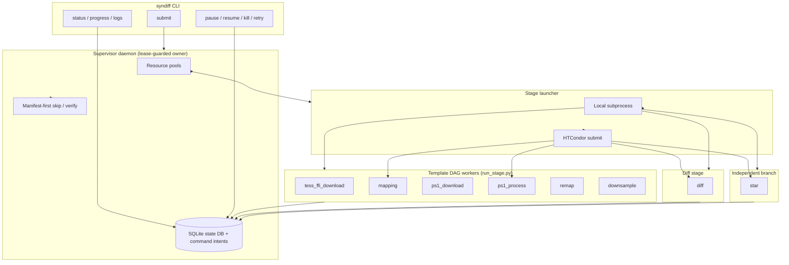

# SynDiff unified pipeline (`syndiff`)

This document describes the **orchestrated SynDiff pipeline** behind the
`syndiff` CLI. One supervisor daemon and one SQLite state DB know about **eight**
registered stages: a six-stage **template** DAG (`tess_ffi_download → mapping
→ ps1_download → ps1_process → remap → downsample`), a single **`diff`** stage
(with in-process `scc_bootstrap` when `data_root` is set), plus the independent
`star` branch for host-star light curves from an existing event. There is **no**
`syndiff all` preset — template and diff are separate CLI nouns with their own
SCC/targets inputs. CLI presets select stage subsets:

```text
syndiff template submit --site SITE --scc sccs.csv               # template DAG only
syndiff diff submit --site SITE --scc sccs.csv                   # SCC field subtract (default --stages diff)
syndiff diff submit --site SITE --targets targets.csv            # event photometry at transient RA/Dec
syndiff star submit --site SITE --star-targets star_targets.csv  # host-star light curves only; prerequisites verified in stage
```

`syndiff template` takes an **SCC-only** input (`--scc sccs.csv`, or
`--sector/--camera/--ccd` for one SCC) — no event coordinates. `syndiff diff`
takes **either** `--scc` (SCC-only field subtraction; mutually exclusive with
`--targets`) **or** `--targets` (event catalog with transient RA/Dec/name for
forced photometry). The default `diff` preset selects **`["diff"]` only**;
`diff` depends on `downsample` in the DAG and, on launch, verifies
`tess_ffi_download` + `downsample` on disk via `DIFF_VERIFY_UPSTREAM` in
`common/orchestration/spec.py`. Inside `diff` execute, `scc_bootstrap` loads
`field_mode_assembly.json` (schema v3 + `mapping_grid`) and writes
`bookkeeping/diff/{frames.csv,diff_job.json}` before Hotpants runs. See
[Runs and stages](#runs-and-stages) below.

Invoking the removed `syndiff all` preset prints a guiding error pointing at
`template submit` + `diff submit`.

Host-star configuration and outputs: [star_lightcurves.md](star_lightcurves.md), [stages/star_pipeline.md](stages/star_pipeline.md).

Monitoring verbs (`progress`, `status`, `retry`, …) are workspace-wide and work identically regardless of which preset started the run.

For difference imaging stage lists and example YAMLs, see [`config/diff_config.yaml`](../../config/diff_config.yaml) and [`config/example/`](../../config/example/). Forked **pyhotpants** and **MOCPy** requirements are summarized in the [main README](../../README.md#forked-dependencies).

**Documentation index**: [`docs/README.md`](README.md)

**See also**: [`syndiff_cli.md`](syndiff_cli.md) (command index), [`cluster_smoke_checklist.md`](cluster_smoke_checklist.md) (cluster validation), [`template_runner_architecture.md`](template_runner_architecture.md) (maintainer internals).

---

## Table of Contents

- [Overview](#overview)
- [Documentation layers and code lineage](#documentation-layers-and-code-lineage)
- [Architecture](#architecture)
- [Installation](#installation)
- [Quick Start](#quick-start)
- [Concepts](#concepts)
  - [Targets](#targets)
  - [Runs and stages](#runs-and-stages)
  - [Resource pools](#resource-pools)
  - [Local vs HTCondor execution](#local-vs-htcondor-execution)
- [Pipeline Stages](#pipeline-stages)
- [Configuration Reference](#configuration-reference)
- [Targets CSV Formats](#targets-csv-formats)
- [CLI Reference](#cli-reference)
  - [How commands find your run](#how-commands-find-your-run)
  - [Command index](#command-index)
  - [Submit and run](#submit-and-run)
  - [Monitor a run](#monitor-a-run)
  - [Workspace commands](#workspace-commands)
  - [Run control](#run-control)
  - [Verification and manifests](#verification-and-manifests)
  - [Daemon and Discord](#daemon-and-discord)
  - [Common flags cheat sheet](#common-flags-cheat-sheet)
- [Run Lifecycle](#run-lifecycle)
- [Logging and Artifacts](#logging-and-artifacts)
- [Verification](#verification)
- [HTCondor Integration](#htcondor-integration)
- [Force Rerun Behavior](#force-rerun-behavior)
- [Per-SCC Overrides](#per-scc-overrides)
- [Troubleshooting](#troubleshooting)
- [Relationship to SynDiff Diff Imaging](#relationship-to-syndiff-diff-imaging)
- [Stage algorithm deep-dives](#stage-algorithm-deep-dives)
- [Module Map](#module-map)

---

## Overview

The template pipeline produces **PS1-based templates on the TESS pixel grid**, one SCC (sector / camera / CCD) at a time — shared across every event that lands on that SCC. A typical end-to-end flow:

**Template DAG** (`syndiff template submit --scc sccs.csv`; SCC-only input, no event coordinates):

1. **`tess_ffi_download`** — download TESS FFIs for the SCC (optional if already on disk).
2. **`mapping`** (“pancakes”) — choose the SCC's mapping-epoch reference FFI via an SCC-scoped chooser (median-CRVAL anchor + Earth/Moon-angle cuts + smoothed-residual; see [`scc_reference_ffi.py`](../../syndiff_pipeline/template_creation/processing/scc_reference_ffi.py)), then map TESS pixels to PS1 skycells and download the Gaia catalog for that reference FFI.
3. **`ps1_download`** — fetch PS1 skycell cutouts into a shared Zarr store.
4. **`ps1_process`** — convolve PS1 data onto the TESS grid (CPU-heavy; optionally on HTCondor).
5. **`remap`** (short `remap`; alias `skycell_remap`) — field-mode L2–L4 only: per-skycell shift schedule, signature groups, hybrid Exact cache under `{data_root}/s{SSSS}/c{C}/k{K}/remap/oversampling_{N}/`. Scheduler pre-skips this stage when `geometry_mode: linear` is requested (v2 rejects non-field at dispatch). Does **not** write flux `contribs/`.
6. **`downsample`** (short `down`) — L5 flux binning into the SCC template product store `{data_root}/s{SSSS}/c{C}/k{K}/templates/oversampling_{N}/` (field `contribs/` after reading remap artifacts; writes `field_mode_assembly.json`). Stage names `templates` / `tmpl` are **rejected** (hard cut; not aliases).

**Diff** (`syndiff diff submit`; `--scc` for SCC field subtract or `--targets` for event photometry):

7. **`diff`** — run the config-driven difference-imaging pipeline. Depends on `downsample` in the DAG. When `data_root` is set, `scc_bootstrap` runs in-process: loads `field_mode_assembly.json` (schema v3 + `MappingGrid`; `MAPGRID=2` required) from the SCC template store, writes `bookkeeping/diff/{frames.csv,diff_job.json}`, then runs Hotpants → photometry. Diff products are SCC-primary under `{data_root}/s{SSSS}/c{C}/k{K}/diff_{lane}/`; event photometry workspaces remain under `{workspace_root}/events/{event_name}/s{SSSS}_c{C}_k{K}/ws/` when using `--targets`.

The separately submitted **star** branch verifies those completed artifacts,
then writes host-star products under `{baseline_ws}/host_star/`; it does not
re-run Hotpants.

The runner is designed for **batch operation across many SCCs and events**:

- A host-level **supervisor daemon** (single owner per workspace via `control/daemon.lease` on NFS) dequeues work for all active runs subject to resource-pool limits.
- Progress is tracked in **SQLite (WAL)** and on disk (logs, summaries, per-stage status/manifest files).
- Stages can be run **subset-by-subset** (e.g. only `ps1_process,downsample`) when upstream artifacts already exist.
- **`mapping`**, **`ps1_process`**, **`remap`**, **`diff`**, and **`star`** can run on a
  shared **HTCondor** pool; other stages run as local subprocesses on the
  submit host.

---

## Documentation layers and code lineage

This guide covers **orchestration** — how to configure and run `syndiff`
across many targets. The stage **algorithms** are documented separately under
`docs/markdown/stages/`; those references were vendored from the earlier
standalone research workflow.

| Layer | Location | What it covers |
|-------|----------|----------------|
| Orchestration | This file (`docs/template_pipeline.md`) | YAML config, scheduler, SQLite, Condor, CLI, logs |
| Stage algorithms | [`docs/stages/`](stages/README.md) | PanCAKES mapping, PS1 convolution, downsampling internals |
| Legacy standalone workflow | [`docs/stages/standalone_pipeline_overview.md`](stages/standalone_pipeline_overview.md) | Original `pipeline.py` + per-script CLI |
| Diff imaging | [`config/example/`](../../config/example/), [`config/diff_config.yaml`](../../config/diff_config.yaml) | Hotpants → photometry after templates exist |

### Script → module → stage mapping

| Legacy script (`syndiff/`) | Package module | `syndiff` stage |
|----------------------------|----------------|--------------------------|
| — | `download.py` | `tess_ffi_download` |
| `pancakes_v2.py` | `template_creation/processing/pancakes.py` + `processing/scc_reference_ffi.py` | `mapping` (SCC-scoped reference-FFI chooser + PanCAKES) |
| `download_and_store_zarr.py` | `template_creation/processing/ps1_download.py` | `ps1_download` |
| `process_ps1.py` | `template_creation/processing/ps1_process.py` | `ps1_process` |
| `multi_offset_downsampling.py` | `template_creation/processing/downsample.py` (+ `field_downsample.py` for `geometry_mode: field`) | `downsample` |
| — | `template_creation/processing/field_remap.py` | `remap` (field L2–L4; Exact cache) |
| — | `template_creation/processing/migrate_field_remap_store.py` | one-shot copy of legacy colocated L2–L4 → `remap/` |
| — | `difference_imaging/orchestration/execute.py` | `diff` |
| — | `star/runner.py` | `star` |

The runner adds capabilities not present in the standalone scripts: **multi-target batching**, **SCC-scoped reference-FFI selection** for template building, **SCC-primary diff bookkeeping** (`scc_bootstrap` inside `diff`), **artifact verification**, **force-rerun cleanup**, **pause/kill/retry**, and **HTCondor** for `mapping` and `ps1_process`.

If you previously used `syndiff/run.sh` one-liners, the equivalent production path is `syndiff template submit --site config --scc config/scc_example.csv` followed by `syndiff diff submit --site config --scc config/scc_example.csv` for field subtraction (or `--targets targets.csv` for event photometry). There is no combined `syndiff all` preset. Site configs live under `config/` (`pipeline.yaml`, `diff_config.yaml`, `deployment.yaml`).

---

## Architecture



**Hybrid execution model**

| Stage | DAG | Default executor | Resource pool | Notes |
|-------|-----|------------------|---------------|-------|
| `tess_ffi_download` | template | local | `network` | MAST / tesscurl downloads; SCC-scoped, shared across events |
| `mapping` | template | **condor** | `mapping` | SCC-scoped reference-FFI chooser (`scc_reference_ffi.py`) + Gaia + PanCAKES skycell mapping; lighter Condor claim than `ps1_process` |
| `ps1_download` | template | local | `network` | Shared Zarr at `{data_root}/ps1_skycells_zarr/` |
| `ps1_process` | template | **condor** | `ps1_process` | Whole-node jobs; configurable |
| `remap` | template | **condor** | `remap` | Field L2–L4; lighter than `downsample` |
| `downsample` | template | local | `downsample` | Reads convolved Zarr + mapping (+ remap in field mode); writes SCC template store |
| `diff` | diff | **condor** (or `local` with `--local`) | `diff` | Config-driven Hotpants → photometry; `scc_bootstrap` in-process; SCC-primary products under `{data_root}/s{SSSS}/c{C}/k{K}/diff_{lane}/` |
| `star` | independent | **condor** (or `local` with `--local`) | `star` | Separate submission; verifies completed event artifacts and writes `{baseline_ws}/host_star/` |

**Stage dependency graph**

Template DAG (`template_creation/orchestration/stages.py::TEMPLATE_STAGES`):

```text
tess_ffi_download
       │
       ▼
   mapping ──────────────┐
       │                 │
       ▼                 ▼
 ps1_download          remap
       │                 │
       ▼                 │
  ps1_process ───────────┼──▶ downsample
       │                 │
       └─────────────────┘
```

(`remap` is a nominal `downsample` dependency; `effective_deps` omits it when
`geometry_mode: linear` — the v2 template path supports **`field` only**; setting
`geometry_mode: linear` raises `NotImplementedError` at downsample dispatch.)

**Diff stage** (`difference_imaging/orchestration/stages.py::DIFF_STAGES`) — one
stage, DAG dependency on `downsample` only:

```text
… → downsample → diff
```

`diff` resolves templates from `{data_root}/s{SSSS}/c{C}/k{K}/templates/oversampling_{N}/`.
On execute (when `data_root` is set), `scc_bootstrap` assembles SCC-primary
bookkeeping under `{data_root}/s{SSSS}/c{C}/k{K}/bookkeeping/diff/` and writes
diff products under `{data_root}/s{SSSS}/c{C}/k{K}/diff_{lane}/`. For diff-only
submits (`--stages diff`, the default), `artifact_verify_closure` is a special
case: `tess_ffi_download` and `downsample` are verified on disk
(`DIFF_VERIFY_UPSTREAM`) even though they are outside `run_stage_closure({"diff"})
== {"diff"}`.

When you run a **stage subset**, dependencies outside the subset are satisfied if **on-disk artifacts pass verification** (see [Verification](#verification)).

---

## Installation

See the [main README](../../README.md#installation) for full install instructions (`pip install -e .`, conda env, forked dependencies).

```bash
mamba activate syndiff   # recommended env name in this project
syndiff --help
```

**Python**: ≥ 3.10 (see `pyproject.toml`).

**Core dependencies** (shared with the rest of SynDiff): `numpy`, `pandas`, `astropy`, `zarr`, `pyyaml`, `sep`, `scipy`, `shapely`, `numba`, `tqdm`, `filelock`, and others used by the `template_creation/processing/` modules.

**Mapping-specific**: the PanCAKES stage requires a **modified MOCPy** build with `MOC.filter_points_in_polygons` (Rust backend). See [`docs/stages/mapping_pancakes.md`](stages/mapping_pancakes.md) and the standalone repo’s `install_mocpy.sh`. Standard `pip install mocpy` is not sufficient.

**Cluster / Condor** (optional): HTCondor client tools (`condor_submit`, `condor_q`, `condor_history`, `condor_rm`) on the submit node. No `python-htcondor` package is required.

**Hardware** (from production experience): `ps1_process` expects a **whole node** (~64 cores, 512 GB RAM on the STScI science cluster). Mapping, `remap`, and `downsample` are lighter but benefit from multi-core hosts and fast NFS.

---

## Quick Start

### 1. Prepare config and targets

Copy and edit the site folder under `config/`:

```bash
cp config/deployment.yaml.example config/deployment.yaml
# Edit workspace_root, data_root, credentials
```

**Site folder** (`config/`):

| File | Role |
|------|------|
| `pipeline.yaml` | Template policy: stages, resource pools, notifications |
| `diff_config.yaml` | Diff-imaging policy + `condor:` resources for the `diff` stage |
| `deployment.yaml` | Gitignored paths + credentials (`workspace_root`, `data_root`, Gaia, Discord) |
| `targets_example.csv` | Targets (always passed via `--targets` on the CLI) |

**Deployment** (`deployment.yaml`): set at minimum:

- `workspace_root` — orchestration workspace: `control/` (SQLite, daemon), `runs/`, and `events/{event_name}/{scc_label}/`.
- `data_root` — SCC-scoped science data tree under `s{SSSS}/c{C}/k{K}/` (FFIs, mapping caches, Zarr, template store).
- `gaia_username` / `gaia_password` — Gaia TAP+ credentials for mapping (optional for anonymous TAP).
- Discord keys when notifications are enabled.

Bundled `resources/skycell_wcs.csv` is resolved automatically (no config key).

See [Configuration Reference](#configuration-reference).

### 2. Verify prerequisites (optional but recommended)

```bash
syndiff verify \
  --site config \
  --targets my_targets.csv \
  --stages tess_ffi_download,mapping,ps1_download
```

### 3. Submit a detached run

Always activate your conda environment first so the scheduler records the correct Python path in stage commands:

```bash
mamba activate syndiff

syndiff template submit \
  --site config \
  --scc config/scc_example.csv \
  --stages ps1_process,templates
```

Template submits take `--scc` (an SCC CSV, `sector,camera,ccd[,enabled]`) or
`--sector`/`--camera`/`--ccd` for a single SCC — not `--targets`. `load_sccs()`
dedupes repeated `(sector,camera,ccd)` rows and rejects event-catalog headers
(`id,ra,dec,tess_coverage`) so an event targets CSV cannot be passed by
mistake. `syndiff diff submit` (below) takes the event `--targets` CSV.

On submit, the source config and targets are **copied into the run directory** (`config.yaml`, `targets.csv`) with all config paths normalized to absolute. The scheduler and all stage workers use only those frozen copies.

Example output:

```text
Submitted run_id=20260607_210919 supervisor_pid=2692578
  daemon log: /path/to/workspace/control/daemon.log
Monitor: syndiff progress
         syndiff status --watch
         syndiff progress --run-id 20260607_210919
```

### 4. Monitor

Simplest — no flags (auto-discovers the supervisor; shows all **active** runs, or latest if none):

```bash
syndiff progress
syndiff status --watch
```

One run by id or portable run directory:

```bash
syndiff progress --run-id batch_no5
syndiff status --watch --run-dir /path/to/runs/20260607_210919
syndiff tail --run-dir /path/to/runs/20260607_210919 \
  --target s0023_c1_k3_2020ftl --stage ps1_process
```

`progress` prints a one-line summary (`pending=…`, `running=…`, etc.) and, when any stages are **running**, a detail section parsed from each worker’s stage log or sidecar (e.g. `ps1_dl: 342/1009` for PS1 skycell downloads, `ps1_pr: 2/19 projections 5/10 rows` for convolution, `down: 45/84` from `per_target/<label>/downsample.progress.json` (sidecar filename unchanged), `remap: …` from remap progress when field mode is active — `diff: epsf r1 12/48` from `per_target/<label>/diff.epsf.progress.json` beside `diff.log` — also `diff.hotpants.progress.json`, `diff.centroids.progress.json`, and `diff.photometry.progress.json` when those phases are active). Use `--no-detail` for summary-only output (scripts). For full worker output, `tail -f` the log under `per_target/<target_label>/<stage>.log`.

**Discord alerts** (optional): when `notifications.enabled: true` in config, the supervisor posts to a webhook on run/stage events. Messages include the same **progress** summary and **status** grid as the CLI. Preview without changing pipeline state:

```bash
syndiff notify test --run-id batch_no4
```

See [Discord notifications](#discord-notifications).

Run-scoped commands use frozen config from the run directory — use `--run-id` (workspace auto-discovered) or `--run-dir`:

```bash
syndiff progress --run-id 20260607_210919
syndiff status --watch --run-id 20260607_210919
syndiff retry --run-id 20260607_210919
```

### 5. Use templates in SynDiff

Template output lands in the SCC's shared store at
`{data_root}/s{SSSS}/c{C}/k{K}/templates/oversampling_{N}/` (`N` always
nested, including `N=1`; override the root with `stages.templates.output_base`
/ legacy key `stages.downsample.output_base`). There is **no** `ws/templates`
symlink anymore — the `diff` stage resolves `cfg.template_dir` directly from
that SCC path (or an explicit `paths.template_dir` override in
`diff_config.yaml`). Run `syndiff diff submit --site config --scc sccs.csv` for
SCC field subtraction once templates exist, or `--targets targets.csv` for event
photometry at a transient position.

---

## Concepts

### Configuration layout

Three layers — no environment variables:

| Layer | File | Purpose |
|-------|------|---------|
| Site policy | `pipeline.yaml` | Stages, pools, notifications, per-SCC overrides |
| Deployment | `deployment.yaml` (beside config, gitignored; paths + credentials) | `workspace_root`, `data_root`, Gaia + Discord |
| Bundled | `resources/skycell_wcs.csv` | PS1 SkyCells WCS (auto-resolved) |

On **submit**, resolved paths are frozen into `{workspace_root}/runs/<run_id>/config.yaml`. Workers and run-scoped CLI commands read that file — they do not need `deployment.yaml` unless reloading credentials (e.g. Gaia for mapping uses `source_config_path` from `run_meta.json`).

**Workspace** = one `workspace_root` → one SQLite DB under `control/`, one supervisor daemon, one `runs/` tree. Full layout: [storage_layout.md](storage_layout.md).

### Targets

`syndiff template` and `syndiff diff`/`star` use two different row shapes,
both modeled by the same `Target` dataclass (`common/orchestration/targets.py`):

- **SCC targets** (`syndiff template --scc sccs.csv` or `syndiff diff --scc sccs.csv`): just `(sector, camera,
  ccd[, enabled])`, loaded by `load_sccs()`. No transient coordinates for template
  builds; for diff field subtraction the SCC label alone scopes the run.
  `load_sccs()` dedupes repeated `(sector, camera, ccd)` rows and rejects CSVs
  with event-catalog headers (`id`/`ra`/`dec`/`tess_coverage`).
- **Event targets** (`syndiff diff --targets targets.csv` or `syndiff star --star-targets`): SCC plus transient
  `target_ra`, `target_dec`, `target_name`, loaded by `load_targets()`.

Each target gets a stable **label** used in logs and SQLite —
`Target.label()`:

```text
s{sector:04d}_c{camera}_k{ccd}_{target_name}
```

Example: `s0023_c1_k3_2020ftl` for sector 23, camera 1, CCD 3, SN 2020ftl. For
SCC-only template targets, `scc_from_cli()` / `load_sccs()` set `target_name`
to the bare SCC label (`s{sector:04d}_c{camera}_k{ccd}`), so `label()`
concatenates it with itself, e.g. **`s0023_c1_k3_s0023_c1_k3`** — the doubled
form is what actually appears as the `per_target/` directory name and SQLite
`target_label` for template-only runs; it is expected, not a bug. Event
Event workspace paths instead use `Target.event_name()` (sanitized
`target_name`) and `Target.scc_label()` separately — see
`common/scc_paths.py::event_scc_leaf()`, which nests as
`events/{event_name}/{scc_label}/` rather than concatenating them.

### Runs and stages

A **run** is one batch identified by `run_id` (default: UTC timestamp `YYYYMMDD_HHMMSS`). The composed registry (`pipeline_spec.py`) has **eight** stages total: six template stages (`tess_ffi_download`, `mapping`, `ps1_download`, `ps1_process`, `remap`, `downsample`), `diff`, and the independent `star` stage. `state.py::create_run` always materializes **all eight** stage rows per target, regardless of which noun (`template`/`diff`) was submitted — a `template` submit and a `diff` submit are still separate runs (separate `run_id`, separate target rows: SCC-only targets for `template`/`diff --scc`, event targets for `diff --targets`), but each run's SQLite rows span the full registry. Stages in `--stages` start `pending`; the rest start `external` (upstream-closure) or immediately `skipped`/not_selected (outside closure), and are resolved to `skipped` once verified complete on disk.

| Status | Meaning |
|--------|---------|
| `pending` | Not yet eligible (waiting on dependencies) |
| `ready` | Dependencies satisfied; waiting for pool capacity |
| `running` | Stage command launched |
| `success` | Exit code 0 |
| `failed` | Non-zero exit; downstream stages blocked |
| `skipped` | Artifacts verified complete (no rerun) |
| `blocked` | Never started (upstream failure) |
| `canceled` | User kill (retryable) |
| `external` | Outside `--stages`; verify once then `skipped` if on-disk artifacts are complete. Stages outside the artifact-verify closure of `--stages` are marked **n/a** immediately (no artifact verify). For the **default** `diff submit` (`--stages diff`, i.e. just `["diff"]`), `tess_ffi_download` and `downsample` are `external` and verified on disk (`DIFF_VERIFY_UPSTREAM` in `common/orchestration/spec.py`); `mapping`, `ps1_download`, `ps1_process`, and `remap` are marked **n/a** immediately (not_selected). `run_stage_closure(["diff"])` is `{"diff"}` only — template stages are not DAG-upstream of `diff`, but `DIFF_VERIFY_UPSTREAM` expands the verify closure for the exact set `{"diff"}`. |

Run-level status (`runs.status`): `running`, `stalled`, `success`, `failed`, `canceled`. A `stalled` run has no running or launchable work, no artifact-verify backlog, and non-terminal stages remain (see `stall_reason` in `progress`/`status`). Runs stay **`running`** while artifact scans are queued (`sc_q`) or running (`scan`).

**Status grid abbreviations** (per stage, after the short stage name):

| Label | Meaning |
|-------|---------|
| `sc_q` | Artifact scan queued (SQLite status still `external`/`pending`) |
| `scan` | Artifact scan in progress (background worker) |
| `n/a` | Not selected or superseded upstream (no verify) |
| `skip` / `succ` / etc. | First four characters of the SQLite status |

### Resource pools

Concurrency is limited per **pool** (not globally):

| Pool | Stages | Typical limit | Purpose |
|------|--------|---------------|---------|
| `network` | `tess_ffi_download`, `ps1_download` | 3 | Throttle MAST / PS1 API |
| `remap` | `remap` | 2 | Field L2–L4 CPU / I/O |
| `downsample` | `downsample` | 2 | Template FITS / L5 contribs |
| `diff` | `diff` | (configurable) | Condor slot count for diff jobs |
| `mapping` | `mapping` | 6 | Condor slot count for mapping jobs |
| `ps1_process` | `ps1_process` | 4 | Condor slot count for PS1 convolution |

`star` is unpooled/independently submitted.

Configure under `resources:` in YAML. For Condor stages, each pool's `max_concurrent` caps **simultaneous Condor submissions** for that stage, not CPUs per job.

### Local vs HTCondor execution

- **Local**: `subprocess.Popen` with `start_new_session=True` (own process group for clean kill).
- **Condor**: `mapping`, `ps1_process`, and `diff` by default (`stages.mapping.executor: condor`, `stages.ps1_process.executor: condor`, `stages.diff.executor: condor`).

The Condor path:

1. Writes a `.condor.submit` file next to the stage log.
2. Submits via `condor_submit`.
3. Stores the **cluster ID** in SQLite as `pid`.
4. Polls with `condor_q` / `condor_history`.

Execute nodes run `common/orchestration/condor_wrapper.sh`, which activates the `syndiff` conda env and `exec`s the same `run_stage.py` command the local launcher would use.

---

## Pipeline Stages

### `tess_ffi_download`

**Module**: `syndiff_pipeline.common.download`

Downloads calibrated TESS FFIs for the target SCC into `ffi_dir` (`common/scc_paths.py::scc_ffi_dir()` → `{data_root}/s{SSSS}/c{C}/k{K}/ffi/`) using the shared download helpers.

**Verification**: at least one FFI file present under the SCC's `ffi/` directory.

---

### `mapping`

**Module**: `template_creation/processing/pancakes.py` (ported from `pancakes_v2.py`) + `template_creation/processing/scc_reference_ffi.py`

First resolves the SCC's **mapping-epoch reference FFI** (`resolve_scc_reference_ffi()`), then builds TESS↔PS1 skycell pixel mappings for that reference FFI. Optionally downloads a Gaia catalog (`skip_download_catalog: false` by default) into `common/scc_paths.py::scc_catalogs_dir()`.

**Reference-FFI selection** (SCC-scoped — no event RA/Dec, since `mapping` runs before any event exists):

1. Explicit override wins if set and resolvable: `--reference-ffi` (CLI) or `stages.mapping.reference_ffi` (config) — accepts an absolute path or a basename under `ffi_dir`.
2. Otherwise: **median-CRVAL anchor** (chip-center sky anchor from all usable FFI WCS headers) → build a WCS drift table anchored there → Savitzky–Golay smooth → optional Earth/Moon-angle cuts (`bkg_vector_path`) → `choose_reference_ffi_path()` applies `earth_deg_min` / `moon_deg_min` / `max_smoothed_residual` cuts.
3. The chosen path, its basename, `selection_rule` (`"override"` or `"scc_median_crval_anchor"`), and `oversampling_factor` are persisted to `bookkeeping/mapping/run_meta.json` (`mapping_run_meta_path()`; nested under `oversampling_{N}/` when `N != 1`) and reused on subsequent runs unless `force_rerun`.

**Algorithm summary** (see [PanCAKES deep-dive](stages/mapping_pancakes.md)):

1. Build a TESS MOC footprint and filter the PS1 skycell catalog to overlapping cells.
2. Assign every TESS pixel to a skycell index (mocpy + Numba point-in-polygon).
3. In parallel, project each skycell’s TESS pixel footprints onto the PS1 grid → per-skycell registration FITS.
4. Compute padding skycells at projection edges for downstream convolution.

**Outputs** (under `{data_root}/s{SSSS}/c{C}/k{K}/mapping/oversampling_{N}/`, `N` always nested including `N=1`; `common/scc_paths.py::scc_mapping_dir()`):

```text
mapping/oversampling_{N}/
  tess_s{SSSS}_{C}_{K}_master_skycells_list[_os{N}].csv
  tess_s{SSSS}_{C}_{K}_master_pixels2skycells[_os{N}].fits.fz
  tess_s{SSSS}_{C}_{K}_{skycell}.fits   (per skycell)
```

(`_os{N}` suffix only appended when `N > 1`, per `scc_mapping_master_skycells_csv()` / `scc_mapping_master_pixels2skycells()`.)

**Verification**: master skycells CSV exists.

**Deep dive**: [mapping_pancakes.md](stages/mapping_pancakes.md)

---

### `ps1_download`

**Module**: `template_creation/processing/ps1_download.py` (ported from `download_and_store_zarr.py`)

Downloads PS1 skycell data listed in the mapping CSV into a **shared Zarr store**:

```text
{data_root}/ps1_skycells_zarr/ps1_skycells.zarr
```

Uses a lock file (`ps1_skycells.zarr.lock`) so concurrent downloads for different SCCs on the same `data_root` serialize safely. Tune `resources.network.max_concurrent` accordingly.

**Verification**: Zarr store exists and is non-empty.

**Standalone CLI reference**: [standalone pipeline overview — Download PS1](stages/standalone_pipeline_overview.md#2-download-ps1-data)

---

### `ps1_process`

**Module**: `template_creation/processing/ps1_process.py` (ported from `process_ps1.py`)

Reads PS1 Zarr + mapping CSV; runs the **modern sliding-window convolution pipeline**. Sizes worker counts from **whole-machine** `os.cpu_count()` and available RAM — on Condor this expects a **whole-node** claim (`request_cpus=64`, large memory).

**Algorithm summary** (see [PS1 process technical reference](stages/ps1_process_technical.md)):

- Five concurrent stages: zarr readers → band combiners → SEP source extraction (process pool) → sequential sliding-window assembler (padding + Gaussian convolution) → Zarr saver.
- Master arrays use a two-row sliding window with 480 px cell overlap and cross-projection padding via `reproject_interp`.
- Optional `--remove-saturated-stars` writes a removed-star CSV used later by `templates` / SynDiff sat templates.

**Outputs**:

| Path | Description |
|------|-------------|
| `{data_root}/s{SSSS}/c{C}/k{K}/convolved.zarr` (`scc_convolved_zarr()`) | Convolved skycell arrays (`*_data`, masks); shared across oversampling factors |
| `{data_root}/s{SSSS}/c{C}/k{K}/convolved_removed_stars.csv` (`scc_convolved_removed_stars_csv()`) | Optional removed-star records (when enabled) |

**Verification**: convolved Zarr contains the expected number of non-empty `*_data` arrays (derived from mapping CSV and `projections_limit`).

**Key parameters**: `psf_sigma`, `remove_saturated_stars`, `projections_limit` (smoke testing), Condor resource requests.

**Deep dive**: [ps1_process_technical.md](stages/ps1_process_technical.md) (architecture diagrams, queue reference, log prefixes)

---

### `downsample` (short `down`)

**Module**: `template_creation/processing/downsample.py` (`field_downsample.py` for `geometry_mode: field`)

L5 flux binning into the SCC template product store. Deps: `mapping`, `ps1_process`, and `remap` in field mode (`effective_deps` omits `remap` in linear mode). Produces template FITS/store for SynDiff Hotpants. Stage names `templates` / `tmpl` are **rejected** by `resolve_stage_name`.

- **`geometry_mode: field`** (default on `stages.downsample` and `stages.remap`): reads L2–L4 remap artifacts from `{data_root}/s{SSSS}/c{C}/k{K}/remap/oversampling_{N}/` (or `remap_{NAME}/` when `stages.remap.store_name` / `stages.downsample.remap_store_name` is set), then writes flux `contribs/` under `templates/oversampling_{N}/` (or `templates_{NAME}/` via `stages.downsample.output_store_name`) — see [field_geometry.md](field_geometry.md). Compose applies Exact layers selected by `apply_intra_skycell` / `apply_inter_skycell` (default both `true`). Writes `field_mode_assembly.json` (schema v3 + `mapping_grid`; `MAPGRID=2` required).
- **`geometry_mode: linear`** (opt-out): **not supported** in the v2 template path — `template_creation/orchestration/dispatch.py` raises `NotImplementedError` if `geometry_mode` is not `field`.

**Algorithm summary** (field mode — see [field geometry](field_geometry.md)):

- L5 assembly from remap cache: shift schedule and hybrid Exact cache are built by the separate **`remap`** stage; `MappingGrid` (`common/mapping_grid.py`) defines the science FFI bounds used by downsample and diff.

**Outputs** (under `output_base`, default `{data_root}/s{SSSS}/c{C}/k{K}/templates/oversampling_{N}/`; `common/scc_paths.py::scc_templates_dir()`, `N` always nested including `N=1`):

```text
templates/oversampling_{N}/
  template_manifest.json, contribs/…, field_mode_assembly.json   # field mode (see field_geometry.md)
```

**Verification**: a complete field-mode manifest and `field_mode_assembly.json` (schema v3) under the SCC template directory.

**Progress sidecar**: during pipeline runs, parallel batch workers update `per_target/<label>/downsample.progress.json` with skycell-weighted progress (`skycells_done` / `total_skycells`). `syndiff progress` reads this file for in-flight fraction (short name `down`).

**Deep dive**: [downsample_technical.md](stages/downsample_technical.md)

---

### `diff`

**Module**: `difference_imaging/orchestration/execute.py` (registry: `difference_imaging/orchestration/stages.py`)

Runs the config-driven difference-imaging pipeline (Hotpants → ePSF → background → forced photometry) after templates exist. **DAG dependency**: `downsample` only (`DIFF_STAGE.deps = ("downsample",)`). Policy comes from the site [`diff_config.yaml`](../../config/diff_config.yaml), referenced by `diff_config:` in `pipeline.yaml`; per-target copies are frozen under `per_target/<label>/diff_config.yaml` at launch.

#### `scc_bootstrap` (in-process, inside `diff` execute)

When `data_root` is set on the frozen diff config, `difference_imaging/orchestration/scc_bootstrap.py` runs before the Hotpants sub-pipeline:

1. Load `field_mode_assembly.json` from the SCC template store (`schema_version >= 3`, `mapping_grid` with `MAPGRID=2`).
2. Load `group_id_per_frame.npy` from the remap store; align with sorted local FFIs.
3. Write `{data_root}/s{SSSS}/c{C}/k{K}/bookkeeping/diff/frames.csv` and `diff_job.json` (schema v2).
4. Resolve diff product root `{data_root}/s{SSSS}/c{C}/k{K}/diff_{lane}/` (lane from `output_store_name`).

`ensure_scc_diff_handoff()` reuses existing bookkeeping when both files are present; otherwise it bootstraps from template + remap artifacts. `MappingGrid` (`common/mapping_grid.py`) supplies science FFI crop bounds shared with template stages.

**Outputs**:

- **SCC field subtract** (`syndiff diff submit --scc`): products under `{data_root}/s{SSSS}/c{C}/k{K}/diff_{lane}/` (Hotpants diffs, kernels, photometry caches per recipe fingerprint).
- **Event photometry** (`syndiff diff submit --targets`): workspace under `{workspace_root}/events/{event_name}/s{SSSS}_c{C}_k{K}/ws/`; templates resolved from the SCC template store — there is no `ws/templates` symlink.

**Config** (`stages.diff` in `pipeline.yaml`):

| Key | Default | Description |
|-----|---------|-------------|
| `executor` | `"condor"` | `"condor"` or `"local"`; uses resource pool `diff` |

Condor resource requests (`request_cpus`, `request_memory`, …) are defined in `diff_config.yaml` under `condor:`.

**Verification**: SCC bookkeeping (`bookkeeping/diff/diff_job.json` + `frames.csv`) and template sidecar when using field mode; frame manifest CSV and workspace label directories for event photometry workspaces.

**Progress sidecars**: during diff runs, workers update JSON mirrors beside `per_target/<label>/diff.log` — `diff.hotpants.progress.json`, `diff.epsf.progress.json`, `diff.centroids.progress.json`, `diff.photometry.progress.json`. `syndiff progress` reads the most recently updated sidecar via `stage_progress.py` (ePSF and centroids also merge live artifact counts when `output_dir` is recorded).

**Diff-only submit** (`syndiff diff submit`, default `--stages diff` = just `["diff"]`): `tess_ffi_download` and `downsample` are verified on disk (`DIFF_VERIFY_UPSTREAM` in `common/orchestration/spec.py`). `mapping`, `ps1_download`, `ps1_process`, and `remap` are marked **n/a** (not_selected) immediately. `run_stage_closure({"diff"})` is `{"diff"}` only — template stages are not DAG-deps of `diff`, but the verify closure special-case still scans `tess_ffi_download` and `downsample` before launch.

---

## Configuration Reference

Configuration is split into three layers:

| Layer | File | Contains |
|-------|------|----------|
| Site policy | `pipeline.yaml` | `stages`, `resources`, `notifications`, `overrides` |
| Deployment | `deployment.yaml` (gitignored, beside config) | `workspace_root`, `data_root`, Gaia + Discord credentials |
| Bundled assets | `resources/skycell_wcs.csv` in the repo | PS1 SkyCells WCS table (auto-resolved) |

Loaded by `template_creation/orchestration/runner_config.py`. On submit, a **frozen** run `config.yaml` embeds resolved absolute paths so workers do not re-read deployment.yaml.

### Site config keys (`pipeline.yaml`)

| Key | Required | Description |
|-----|----------|-------------|
| `deployment_file` | no | Filename of the gitignored deployment overlay beside config (default: `deployment.yaml`) |
| `diff_config` | no | Path to diff site policy YAML (default: `diff_config.yaml` beside `pipeline.yaml`) |
| `stages` | no | Per-stage parameters (see below) |
| `resources` | no | Pool concurrency limits |
| `scheduler` | no | Scheduler tuning |
| `notifications` | no | Discord webhook alerts (see below) |
| `overrides` | no | Per-SCC parameter overrides |

### Deployment file keys (`deployment.yaml`)

`deployment.yaml` is the gitignored deployment overlay beside `pipeline.yaml`: machine-specific paths (`workspace_root`, `data_root`) and credentials (Gaia, Discord).

| Key | Required | Description |
|-----|----------|-------------|
| `workspace_root` | yes | Workspace root: `control/`, `runs/`, `events/{event_name}/{scc_label}/` — see [storage_layout.md](storage_layout.md) |
| `data_root` | yes | SCC-scoped science data tree under `s{SSSS}/c{C}/k{K}/` (FFIs, mapping, Zarr, catalogs) |
| `ffi_dir` | no | Deployment-level fallback only (`RunnerConfig.ffi_dir`, default `{data_root}/tess_ffi`); per-target template resolution always derives `ffi_dir` from `common/scc_paths.py::scc_ffi_dir()` regardless of this key |
| `gaia_username` / `gaia_password` | no | Gaia TAP+ credentials for mapping |
| `discord_webhook_url` | no | Incoming webhook for notifications |
| `discord_bot_token` / `discord_channel_id` | no | On-demand status bot |

Derived paths (not in config, per-target via `runner_config.resolve_config()`): `state_db_path` = `{workspace_root}/control/pipeline_state.sqlite`, `runs_root` = `{workspace_root}/runs`, `mapping_root` = `scc_mapping_dir(data_root, s, c, k, oversampling_factor=...)`, `template_output_base` = `scc_templates_dir(...)`, `zarr_dir` = `{data_root}/ps1_skycells_zarr`, `event_dir` = `event_scc_leaf(workspace_root, event_name, s, c, k)`.

### Scheduler

```yaml
scheduler:
  heartbeat_interval_s: 30.0
  max_stage_attempts: 3      # requeue cap before marking failed
  requeue_backoff_s: 30.0    # delay before relaunching lost workers
  verify_max_workers: 1
  verify_budget_per_tick: 16
```

### Discord notifications

Optional alerts to a Discord channel via incoming webhook. The webhook URL lives in a **gitignored** `deployment.yaml` beside your site config (copy from `deployment.yaml.example`); frozen run directories do not need their own copy — the daemon falls back to `source_config_path` from `run_meta.json`.

```yaml
deployment_file: deployment.yaml

notifications:
  enabled: true
  events:
    run_started: true
    run_completed: true
    run_failed: true
    run_canceled: true
    run_retried: true
    run_stalled: true
    run_resumed: true
    stage_failed: true
    stage_completed: true
    stage_canceled: true
    stage_died: true
    daemon_unhealthy: true
  bot:
    enabled: true
    # channel_id: "123456789012345678"  # optional if set in deployment.yaml
```

`deployment.yaml` (not committed; copy from `deployment.yaml.example`):

```yaml
workspace_root: /path/to/workspace
data_root: /path/to/syndiff/data
gaia_username: ...
gaia_password: ...
discord_webhook_url: https://discord.com/api/webhooks/...
discord_bot_token: your-bot-token
discord_channel_id: "123456789012345678"
```

**Events** (supervisor daemon or submit, deduplicated in SQLite `notification_events`):

| Event | When |
|-------|------|
| `run_started` | New `syndiff template submit` (short summary, not progress grid) |
| `run_completed` / `run_failed` | All stages terminal |
| `run_canceled` | `syndiff kill` (whole run canceled) |
| `run_retried` | `syndiff retry` (bulk or `--scc` + `--stage`) |
| `run_stalled` / `run_resumed` | Scheduler stall detection / recovery |
| `stage_completed` / `stage_failed` | Worker exits 0 / nonzero |
| `stage_canceled` | Worker SIGTERM (`kill`) or exit 143 |
| `stage_died` | Process lost without exit record (requeued to `ready`) |
| `daemon_unhealthy` | Supervisor wedged while runs are active |

Event notifications (except `run_started`) include the same **progress** summary and **status** grid as the CLI. `run_started` posts target/stage counts and monitor commands only.

**On-demand status via Discord bot** (requires `discord.py`):

1. Create a bot in the [Discord Developer Portal](https://discord.com/developers/applications), enable **Message Content Intent**, invite it to your server with send/read permissions.
2. Set `notifications.bot.enabled: true` and configure the channel ID (config or `deployment.yaml`).
3. Install `discord.py`, then submit a run or start the supervisor — the bot starts **in-process** inside the daemon when enabled (no separate CLI or detached process):

```bash
pip install 'discord.py>=2.3'   # or: pip install -e '.[discord]'
syndiff template submit --site config --targets my_targets.csv
# or: syndiff daemon start --deployment config/deployment.yaml
```

`submit` starts the supervisor (and thus the in-process bot when enabled). `daemon stop` requests shutdown via `control/daemon.stop` (works from any host); the supervisor and bot exit together. Check with `syndiff daemon status` (`discord_bot.expected_in_process`). Legacy detached `discord_bot --detached` processes are terminated on supervisor start.

Any message you post in the configured channel gets a reply with live `progress` + `status` (same format as event alerts). Include a `run_id` in the message to query a specific run; otherwise the bot reports all active runs (or the most recent run if none are active).

**Test** (read-only; does not write `notification_events` or change run state):

```bash
syndiff notify test --run-id batch_no4
syndiff notify test --run-dir /path/to/runs/batch_no4 --dry-run   # print locally
```

### Resource pools

```yaml
resources:
  network:
    max_concurrent: 3
  templates:
    max_concurrent: 2
  mapping:
    max_concurrent: 6
  ps1_process:
    max_concurrent: 4
  diff:
    max_concurrent: 2

stages:
  diff:
    executor: condor   # or local with syndiff diff submit --local
```

Defaults if omitted: `network=3`, `templates=2`, `mapping=6`, `ps1_process=4`, `diff=2`.

### Stage parameters

Unknown keys under `stages.*` raise `ValueError` at load time (strict allow-list).

#### `stages.wcs_grouping` (grouping parameters, not a stage)

Shared WCS/grouping knobs consumed by field-mode `remap` and `downsample` (`WcsGroupingStageParams`). There is no `wcs_grouping` orchestration stage.

| Key | Default | Description |
|-----|---------|-------------|
| `offset_threshold` | `0.01` | Max pixel drift before new template group |
| `wcs_drift_savgol_window` | `11` | Savitzky–Golay window for drift smoothing |
| `wcs_drift_savgol_polyorder` | `2` | SG polynomial order |
| `bkg_vector_path` | null | Optional TESSVectors path for Earth/Moon angles |
| `x_left_dead`, `x_right_dead` | `44` | Horizontal dead columns |
| `y_edge_strip` | `30` | Vertical edge strip |
| `geometry_mode` | `"field"` | `"field"` (default) or `"linear"` — v2 template downsample accepts **`field` only**; `linear` raises `NotImplementedError` |
| `grouping_quantum_ps1_px` | `1.0` | PS1-pixel quantum for signature groups in field mode |

#### `stages.mapping`

| Key | Default | Description |
|-----|---------|-------------|
| `reference_ffi` | null | Explicit SCC reference-FFI override (absolute path or basename under `ffi_dir`); same as CLI `--reference-ffi`. Otherwise the SCC-scoped chooser (median-CRVAL anchor + Earth/Moon-angle cuts + smoothed residual) picks one — see the `mapping` stage section above |
| `buffer`, `tess_buffer`, `pad_distance` | various | Pancakes geometry buffers |
| `edge_exclusion`, `edge_buffer_large`, `edge_buffer_small` | various | Edge handling |
| `n_threads` | `8` | Thread count |
| `max_workers` | null | Optional process pool cap |
| `oversampling_factor` | `1` | Sub-pixel oversampling `F`. Writes under `mapping/oversampling_{F}/` (always nested, including `F=1`). Must match `stages.templates`/`downsample`. Full guide: [oversampled templates](oversampled_templates.md) |
| `overwrite` | `true` | Overwrite mapping FITS |
| `skip_download_catalog` | `false` | Skip Gaia download if catalog exists |
| `executor` | `"condor"` | `"condor"` or `"local"` |
| `condor_request_cpus` | `16` | HTCondor `request_cpus` |
| `condor_request_memory` | `100000` | HTCondor `request_memory` (MB) |
| `condor_requirements` | `Memory <= 500000 && LoadAvg < 10` | Machine requirements expression (avoids 512 GB nodes) |
| `condor_rank` | `-LoadAvg` | Prefer lower load average |

#### `stages.ps1_download`

| Key | Default | Description |
|-----|---------|-------------|
| `num_workers` | `8` | Download parallelism |
| `use_local_files` | `false` | Read from local PS1 tree instead of API |
| `local_data_path` | `data/ps1_skycells` | Local PS1 path when `use_local_files` |
| `overwrite` | `false` | Re-download into Zarr |
| `log_level` | `INFO` | Logging level |

#### `stages.ps1_process`

| Key | Default | Description |
|-----|---------|-------------|
| `projections_limit` | null | Limit skycell rows (smoke tests); null = all |
| `psf_sigma` | `60.0` | Gaussian convolution sigma |
| `enable_saturation_correction` | `true` | Saturation handling |
| `remove_saturated_stars` | `false` | Track removed stars → CSV |
| `catalog_path` | null | Override Gaia catalog path |
| `bright_star_mag_threshold` | `13.0` | Bright-star cutoff |
| `executor` | `"condor"` | `"condor"` or `"local"` |
| `condor_request_cpus` | `64` | HTCondor `request_cpus` |
| `condor_request_memory` | `500000` | HTCondor `request_memory` (MB) |
| `condor_requirements` | `Memory >= 500000 && LoadAvg < 10` | Machine requirements expression |
| `condor_rank` | `-LoadAvg` | Prefer lower load average |

#### `stages.templates` (legacy config key: `stages.downsample`)

Either YAML key is accepted (`parse_stage_params` reads `stages.templates` first, falling back to `stages.downsample`); the underlying dataclass is still named `DownsampleStageParams` with a `templates` property alias.

| Key | Default | Description |
|-----|---------|-------------|
| `ignore_mask_bits` | `[12]` | PS1 mask bits to ignore |
| `oversampling_factor` | `1` | Must match `stages.mapping`. Linear templates get `OVERSAMP=F` + HR arrays; field stores use HR `base_tess_shape` / `roi_bounds`. See [oversampled templates](oversampled_templates.md) |
| `geometry_mode` | `"field"` | `"field"` (default) or `"linear"` — v2 accepts **`field` only** at dispatch |
| `mapping_dir` | null | Override mapping root |
| `convolved_dir` | null | Override convolved Zarr directory |
| `output_base` | null | Template store output root (default: SCC's `templates/oversampling_{N}/`) |
| `single_offset` | `false` | Single `[0,0]` offset only (smoke) |
| `allow_reference_ffi_mismatch` | `false` | Continue when mapping `TESS_FFI` ≠ SCC reference-FFI bookkeeping |
| `executor` | `"local"` | `"condor"` or `"local"` |
| `condor_request_cpus` | `16` | HTCondor `request_cpus` |
| `condor_request_memory` | `128000` | HTCondor `request_memory` (MB) |
| `condor_requirements` | `Memory >= 128000 && LoadAvg < 10` | Machine requirements expression |
| `condor_rank` | `-LoadAvg` | Prefer lower load average |

Field-mode-only keys (`apply_intra_skycell`, `apply_inter_skycell`, `rebuild_field_store`, `n_jobs`, `stage_regmaps_to_scratch`, `materialize_fits`, `output_store_name`, `remap_store_name`, …): see [field_geometry.md](field_geometry.md). Removed keys (`apply_hybrid_exact`, `l4b_policy`, `hybrid_R` on downsample) are rejected at parse.

Named store lanes (optional A/B): `stages.remap.store_name` writes `remap_{NAME}/`; `stages.downsample.remap_store_name` selects which remap lane to read (omit → inherit remap); `stages.downsample.output_store_name` writes `templates_{NAME}/`. Diff/star consume a lane via `paths.template_store_name` (diff) or `defaults.template_store_name` (star). Remap shift debug PNGs land under `{scc}/debug_plots/` (with `_{NAME}` in the basename when named).

#### `stages.diff`

| Key | Default | Description |
|-----|---------|-------------|
| `executor` | `"condor"` | `"condor"` or `"local"`; Condor resource requests come from `diff_config.yaml` |

### Resolved per-target paths

For each target, `runner_config.resolve_config()` derives (`ResolvedTargetConfig`):

| Field | Path | Helper |
|-------|------|--------|
| `event_dir` | `{workspace_root}/events/{event_name}/s{SSSS}_c{C}_k{K}/` | `common/scc_paths.py::event_scc_leaf()` |
| `ffi_dir` | `{data_root}/s{SSSS}/c{C}/k{K}/ffi/` | `scc_ffi_dir()` |
| `mapping_root` | `{data_root}/s{SSSS}/c{C}/k{K}/mapping/oversampling_{N}/` | `scc_mapping_dir(..., oversampling_factor=N)` (`N` from `stages.mapping.oversampling_factor`) |
| `zarr_dir` | `{data_root}/ps1_skycells_zarr/` | plain `Path(data_root) / "ps1_skycells_zarr"` (unchanged by the refactor) |
| `template_output_base` | `{data_root}/s{SSSS}/c{C}/k{K}/templates/oversampling_{N}/` | `scc_templates_dir(..., oversampling_factor=N)` (`N` from `stages.templates`/`stages.downsample.oversampling_factor`) |

---

## Targets CSV Formats

`syndiff template` and `syndiff diff`/`star` read **different** CSV shapes — passing the wrong one is rejected at load time. `syndiff diff` accepts **either** `--scc` (same shape as template) **or** `--targets` (event catalog); the two flags are mutually exclusive.

### SCC CSV (`syndiff template --scc` or `syndiff diff --scc`)

Loaded by `load_sccs()` (`common/orchestration/targets.py`). Header: `sector,camera,ccd[,enabled]` — no coordinates. Used for SCC-scoped template builds and for SCC field subtraction (`diff --scc`).

```csv
sector,camera,ccd,enabled
23,1,3,true
24,1,2,true
```

`load_sccs()` **dedupes** repeated `(sector, camera, ccd)` rows (first occurrence wins) and **rejects** CSVs with event-catalog headers (`id`/`ra`/`dec`/`tess_coverage` present without `sector`) with a clear error, so an event targets CSV cannot be passed to `--scc` by mistake. See [`config/scc_example.csv`](../../config/scc_example.csv). A single SCC can also be passed inline: `--sector 23 --camera 1 --ccd 3`.

### Normalized event format (recommended for `syndiff diff --targets`)

Loaded by `load_targets()`. Header (all columns required):

```csv
sector,camera,ccd,target_ra,target_dec,target_name,enabled
23,1,3,185.015708,5.343289,2020ftl,true
```

Rows with `enabled=false` are skipped.

### SN event catalog format

Header:

```csv
ID,redshift,type,ra,dec,...,tess_coverage,...
```

`ID` may be prefixed with `SN `. `tess_coverage` uses tokens like `S23C1D3` or `S44C2D1; S45C1D4` for multi-SCC events. One target row is expanded per SCC token.

See `config/targets_example.csv` (legacy mirror; site quick start uses `config/targets_example.csv`).

---

## CLI Reference

Run `syndiff --help` or `syndiff <command> --help` for the built-in argparse summary. This section explains **what each command does**, **which flags it needs**, and **typical workflows**.

### How commands find your run

Commands fall into three scopes:

| Scope | What you pass | When to use |
|-------|---------------|-------------|
| **Site** | `--config path/to/pipeline.yaml` (+ `--targets` for submit/verify) | Starting work, reading `workspace_root` from `deployment.yaml` beside config |
| **Workspace** | `--deployment path/to/deployment.yaml` (optional; auto-discovers one live supervisor) | Daemon control, listing runs, default monitoring |
| **Run** | `--run-dir /path/to/runs/<run_id>` **or** `--run-id ID` (+ optional `--deployment`) | One specific run; run control (`retry`, `kill`, …) |

**`progress` / `status` with no flags** auto-discover the workspace and show **all active runs** (fallback: latest run if none active).

**`deployment.yaml` is workspace scope.** The supervisor only needs `workspace_root`; it can run many pipeline runs concurrently.

**Recommend `--run-id` on submit** (e.g. `batch_no5`) so runs are easy to target with `--run-id` later. Not required — timestamps are auto-generated if omitted.

**`--run-dir`** is portable: the run directory is self-contained (frozen config, targets, logs) and needs no deployment file on the monitoring host.

**No environment variables** for configuration — paths and credentials come from `deployment.yaml`, site `pipeline.yaml`, CLI flags, and bundled `resources/`.

### Command index

| Command | Scope | Purpose |
|---------|-------|---------|
| [`submit`](#submit) | site | Queue a detached multi-target run; start daemon if needed |
| [`run`](#run) | site | Foreground single-run loop (debug only) |
| [`verify`](#verify) | site or run | Check on-disk stage artifacts |
| [`reconcile-manifests`](#reconcile-manifests) | site or run | Backfill cross-run completion manifests |
| [`progress`](#progress) | workspace / run | All active runs by default; zero flags OK |
| [`status`](#status) | workspace / run | Per-target grid for all active runs; zero flags OK |
| [`logs`](#logs) / [`tail`](#tail) | run or workspace | Print or follow daemon/stage logs |
| [`show`](#show) | run | Print `run_meta.json` |
| [`retry`](#retry) | run | Re-queue failed/canceled stages |
| [`pause`](#pause) | run | Stop dequeuing new stages |
| [`resume`](#resume) | run | Resume a paused run |
| [`kill`](#kill) | run | Cancel run and terminate workers |
| [`runs`](#runs) | workspace | List recent runs from SQLite |
| [`active`](#active) | workspace | Show running/stalled runs + daemon health |
| [`daemon`](#daemon) | workspace | Start/stop/status supervisor daemon |
| [`notify test`](#notify-test) | run | Send Discord preview (or `--dry-run`) |

---

### Submit and run

#### `submit`

**Purpose**: Production entry point. Creates a run directory, registers the run in SQLite, ensures the supervisor daemon is running, and returns immediately. `template` and `diff` take different scope flags — `--scc` (SCC-only) vs. `--targets` (event photometry) for diff; `template` accepts `--scc` only.

```bash
syndiff template submit \
  --config my_pipeline.yaml \
  --scc my_sccs.csv \
  [--stages mapping,ps1_process,templates] \
  [--run-id batch_no5] \
  [--force-rerun]

# SCC field subtract (default --stages diff)
syndiff diff submit \
  --config my_pipeline.yaml \
  --scc my_sccs.csv \
  [--run-id diff_batch_no5] \
  [--force-rerun]

# Event photometry at transient RA/Dec
syndiff diff submit \
  --config my_pipeline.yaml \
  --targets my_targets.csv \
  [--run-id diff_event_01] \
  [--force-rerun]
```

`--scc` and `--targets` are **mutually exclusive** on `diff submit`.

| Flag | `template` | `diff` | Description |
|------|:---:|:---:|-------------|
| `--config` | yes | yes | Site policy YAML (stages, pools, notifications) |
| `--scc` | yes* | yes* | SCC CSV (`sector,camera,ccd[,enabled]`); mutually exclusive with `--sector`/`--camera`/`--ccd` and with `--targets` on `diff` |
| `--sector` / `--camera` / `--ccd` | yes* | yes* | Inline single-SCC alternative to `--scc` |
| `--targets` | — | yes | Event targets CSV (SCC + transient RA/Dec/name); mutually exclusive with `--scc` on `diff` |
| `--stages` | no | no | Comma-separated subset; default: all 6 template stages for `template`, `["diff"]` for `diff` |
| `--run-id` | no | no | Unique run name; must not already exist in pipeline state. Default: UTC timestamp `YYYYMMDD_HHMMSS` |
| `--force-rerun` | no | no | On first submit only: run selected stages even when artifacts already exist; see [Force Rerun](#force-rerun-behavior) |

\* exactly one of `--scc` or `--sector`+`--camera`+`--ccd` is required for `template` and for `diff` when not using `--targets`.

**Resubmit policy**: each `submit` creates a **new** run row. You cannot reuse an existing `--run-id`. To recover from failures on an existing run, use [`retry`](#retry). To run a new batch (including a different `--stages` list), pick a new `--run-id`.

**What happens**:

1. Loads `deployment.yaml` beside `--config` for `workspace_root`, `data_root`, credentials.
2. Materializes frozen `config.yaml` + `targets.csv` (or the normalized SCC CSV, for `template`) into `{workspace_root}/runs/<run_id>/`.
3. Inserts run + per-target stage rows in `{workspace_root}/control/pipeline_state.sqlite`.
4. Starts the supervisor daemon (if not already alive for this `workspace_root`; lease-guarded).
5. The Discord status bot starts in-process inside the supervisor when enabled.
6. Updates `{workspace_root}/runs/latest` → `<run_id>`.

**Example** — PS1 stream mode (no shared Zarr; `ps1_download` skipped automatically). Set `stages.ps1_process.ps1_source: stream` in `pipeline.yaml` (see commented lines in the example file):

```bash
syndiff template submit \
  --site config \
  --scc config/scc_example.csv \
  --stages mapping,ps1_process,templates \
  --run-id batch_stream_01
```

#### `run`

**Purpose**: Run one target batch in the **foreground** (blocks until the run finishes). Same config/scope flags as `submit`, but no daemon — useful for debugging scheduler logic on a laptop. `syndiff diff run` additionally requires `--target-name` (single-target foreground debugging; supervised multi-target diff must use `submit`).

```bash
syndiff template run --config my_pipeline.yaml --scc my_sccs.csv [--stages ...] [--run-id ...] [--force-rerun]
syndiff diff run --config my_pipeline.yaml --scc my_sccs.csv [--validate-only]
syndiff diff run --config my_pipeline.yaml --targets my_targets.csv --target-name 2020ftl [--validate-only]
```

`syndiff diff run` calls the diff pipeline **directly, in-process** (no daemon). When `data_root` is set, `scc_bootstrap` runs inside `run_config_pipeline` before Hotpants — same as the supervised `diff` stage worker.

Warning is printed when stdout is a TTY. For long production jobs, use `submit` instead.

---

### Monitor runs

**Default (no flags)**: all active runs in the auto-discovered workspace (latest run if none active). Pin with `--deployment` when multiple supervisors exist.

#### `progress`

**Purpose**: One-line aggregate counts (`pending=`, `running=`, `success=`, …) plus optional per-task detail parsed from stage logs.

```bash
syndiff progress
syndiff progress --site config
syndiff progress --run-id batch_no5
syndiff progress --run-dir /path/to/runs/batch_no5
syndiff progress --no-detail   # summary only (for scripts)
```

Detail lines look like `s0023_c1_k3 ps1_pr: 2/19 projections 5/10 rows`, `down: 45/84` from `downsample.progress.json` (sidecar filename unchanged), or `diff: epsf r1 12/48` from `diff.epsf.progress.json` (plus `diff.hotpants.progress.json`, `diff.centroids.progress.json`, and `diff.photometry.progress.json` when active). Parsed by `template_creation/orchestration/stage_progress.py`.

#### `status`

**Purpose**: Per-target stage grid with seven columns in pipeline order:

`tess_dl | map | ps1_dl | ps1_pr | remap | down | diff`

(`star` is omitted — star uses a separate submission path.) Abbreviations match `stage_short_names()` in the scheduler. `STATUS_GRID_STAGES` in `pipeline_spec.py` lists seven columns (`star` omitted).

```bash
syndiff status
syndiff status --watch --interval 15   # refresh every 15s
syndiff status --run-id batch_no5
syndiff status --run-dir /path/to/runs/batch_no5
```

When not `--watch`, prints a warning if the supervisor daemon is not alive (with a suggested `daemon start` command).

Shows `stalled` reason and `scan_queued` / `scan_running` counts when applicable.

#### `show`

**Purpose**: Dump `run_meta.json` (submit time, `source_config_path`, stages list, `force_rerun` flag).

```bash
syndiff show --run-dir /path/to/runs/batch_no5
```

#### `logs` / `tail`

**Purpose**: Print logs. Without `--target`/`--stage`, prints the **daemon log** at `{workspace_root}/control/daemon.log`. With both, prints the stage worker log.

```bash
# Daemon log (whole workspace)
syndiff logs --run-dir /path/to/runs/batch_no5

# Stage log (one target + stage)
syndiff logs --run-dir ... \
  --target s0023_c1_k3_2020ftl --stage ps1_process

# Follow (like tail -f)
syndiff tail --run-dir ... --target s0023_c1_k3_2020ftl --stage ps1_process
syndiff logs --run-dir ... --target ... --stage ... --follow
```

Stage logs live at `per_target/<target_label>/<stage>.log` inside the run directory.

---

### Workspace commands

These operate on the **handoff workspace** (one SQLite DB per `workspace_root`). Pass `--site`, `--deployment`, or rely on auto-discovery when one supervisor is running.

#### `runs`

**Purpose**: List recent runs from SQLite with status and daemon liveness.

```bash
syndiff runs --site config
syndiff runs --deployment config/deployment.yaml --limit 50
```

#### `active`

**Purpose**: Runs with status `running` or `stalled`, plus supervisor PID and heartbeat age.

```bash
syndiff active --site config
syndiff active
```

---

### Run control

All insert **command intents** into SQLite; the supervisor daemon is the sole writer of stage execution state. Commands return immediately.

#### `retry`

**Purpose**: Re-queue failed or canceled stages.

```bash
# Retry everything failed/canceled in the run
syndiff retry --run-dir /path/to/runs/batch_no5

# Same via run ID (no --site; use --deployment or --run-dir)
syndiff retry --deployment config/deployment.yaml --run-id batch_no5

# Retry one target (--scc or --target alias) + stage (resets downstream deps)
syndiff retry --run-dir ... --scc 23,1,3 --stage mapping
syndiff retry --deployment config/deployment.yaml --run-id batch_no5 \
  --scc s0023_c2_k1_2020ghq --stage diff
syndiff retry --run-dir ... --target s0023_c1_k3_2020ftl --stage mapping

# Retry only the targeted stage (leave downstream untouched)
syndiff retry --run-dir ... --scc 23,1,3 --stage mapping --no-reset-downstream

# Queue intent without waking daemon (e.g. maintenance window)
syndiff retry --run-dir ... --no-start-daemon
```

By default, `retry` also calls `ensure_daemon_running` for the run's `workspace_root`.

On partial runs (`--stages mapping,templates`, etc.), retry reopens non-selected upstream
stages to `external` for artifact re-verification (not `pending`). See
[`pipeline_state_machine_reference.md`](pipeline_state_machine_reference.md) for the
full state-machine matrix.

#### `launch`

**Purpose**: Force-launch one stage immediately, bypassing resource-pool `max_concurrent` limits. Use when a stage is `ready` but blocked by another job in the same pool (e.g. `tess_dl` holding the `network` slot while `ps1_download` waits).

```bash
syndiff launch --site config --run-id test_multi_hp_temp_calib_20260623 \
  --target s0024_c1_k2_2020ghq --stage ps1_download
```

- Requires `--target` (or `--scc`) and `--stage` (full internal name, e.g. `ps1_download`)
- Adds an **extra** concurrent job beyond the pool limit; does not stop the job currently holding the slot
- Works even when the run is paused
- `--no-start-daemon` — queue intent without waking the supervisor

#### `pause`

**Purpose**: Stop launching new stages for this run (in-flight workers continue until done).

```bash
syndiff pause --run-dir /path/to/runs/batch_no5
```

#### `resume`

**Purpose**: Clear pause and resume dequeuing.

```bash
syndiff resume --run-dir /path/to/runs/batch_no5
```

#### `kill`

**Purpose**: Cancel the run — daemon terminates local subprocesses, sweeps Condor clusters, marks run `canceled`.

```bash
syndiff kill --run-dir /path/to/runs/batch_no5
```

---

### Verification and manifests

#### `verify`

**Purpose**: Read-only check of **on-disk artifacts** (not SQLite state). Use before submit to confirm prerequisites, or after a partial run to debug one SCC.

**Pre-run** (site config + targets):

```bash
syndiff verify \
  --config my_pipeline.yaml \
  --targets my_targets.csv \
  [--stages mapping,ps1_download] \
  [--scc 23,1,3]
```

**Post-run** (frozen run config inside run dir):

```bash
syndiff verify --run-dir /path/to/runs/batch_no5 --scc 23,1,3 --stages ps1_process
```

Output: `[OK]`, `[FAIL]`, or `[UNKNOWN]` per target/stage with message and path.

#### `reconcile-manifests`

**Purpose**: One-shot backfill of **stable** completion manifests under `{runs_root}/.manifests/` for data that already exists on disk. Future runs skip expensive re-verification when manifests match.

```bash
syndiff reconcile-manifests --config my_pipeline.yaml --targets my_targets.csv
syndiff reconcile-manifests --run-dir /path/to/runs/batch_no5 --quiet
```

---

### Daemon and Discord

**You usually do not run `daemon start` manually.** `submit` (and `retry` by default) call `ensure_daemon_running`. The Discord status bot runs **inside the supervisor process** when enabled (token + channel + `notifications.bot.enabled`).

**Cross-host ownership:** `control/daemon.lease` is the authoritative source of truth for which host owns the workspace (renewed ~every 15s; stale after 120s). `daemon.lock` (flock) is best-effort only and never overrides lease decisions. On the supervisor host, liveness also checks that the lease PID is a live non-zombie process (`/proc` state), so a defunct owner is not treated as alive.

**Remote stop:** `syndiff daemon stop` works from **any** machine — it writes `control/daemon.stop` targeting the current lease generation. On the owner host the CLI also sends SIGTERM/SIGKILL; remotely it waits for lease release.

#### `daemon`

**Purpose:** Control the host-level supervisor (one process per `workspace_root`, lease-guarded). Optional for normal workflow — prefer `submit`.

```bash
# Start
syndiff daemon start --deployment config/deployment.yaml
syndiff daemon start --site config

# Stop supervisor (any host; owner honors daemon.stop)
syndiff daemon stop --deployment ...

# JSON status: alive, wedged, pid, host, lease_*, stop_pending, discord_bot
syndiff daemon status
```

| Action | Notes |
|--------|-------|
| `start` | Starts supervisor on this host when no fresh foreign lease exists; Discord bot starts in-process when enabled |
| `stop` | Writes `daemon.stop`, waits for lease release (local SIGTERM/SIGKILL escalation when on owner host) |
| `status` | JSON: supervisor liveness + lease fields + expected in-process bot state |

Daemon files on disk (under `control/`):

```text
{workspace_root}/control/daemon.lease      # cross-host ownership (authoritative)
{workspace_root}/control/daemon.stop       # cross-host stop request
{workspace_root}/control/daemon.pid        # legacy / supplemental identity
{workspace_root}/control/daemon.log
{workspace_root}/control/daemon.lock       # best-effort flock (not authoritative)
{workspace_root}/control/pipeline_state.sqlite
{workspace_root}/control/discord_bot_config.path
{workspace_root}/control/workspace_deployment.path
```

See [storage_layout.md](storage_layout.md) for the full workspace tree.

#### `notify test`

**Purpose**: Send a read-only Discord message (progress + status grid) without recording `notification_events` dedup rows.

```bash
syndiff notify test --run-dir /path/to/runs/batch_no5
syndiff notify test --run-id batch_no5 --dry-run
syndiff notify test --run-dir ... -v   # print message after sending
```

Requires `discord_webhook_url` in `deployment.yaml` and `notifications.enabled: true`.

---

### Common flags cheat sheet

| Flag | Commands | Description |
|------|----------|-------------|
| `--site DIR` | `submit`, `run`, `verify`, workspace verbs | Site folder (`pipeline.yaml` + `diff_config.yaml` + `deployment.yaml`) |
| `--config PATH` | `submit`, `run`, `verify`, `reconcile-manifests` | Site `pipeline.yaml`; loads deployment beside config |
| `--deployment PATH` | workspace | `deployment.yaml`; optional when one supervisor is auto-discovered |
| `--run-dir PATH` | run-scoped | `{workspace_root}/runs/<run_id>` with frozen `config.yaml` |
| `--run-id ID` | run-scoped | One run; with `--deployment` or auto-discovered workspace |
| `--targets PATH` | `submit`, `run`, `verify`, `reconcile-manifests` | Targets CSV |
| `--stages LIST` | `submit`, `run`, `verify`, `reconcile-manifests` | Comma-separated; default: all stages |
| `--scc S,C,C` | `verify`, `retry`, `reconcile-manifests` | Filter to one sector/camera/ccd or target label |
| `--target LABEL` | `retry`, `logs`, `tail` | Alias for `--scc` on retry; target label for log commands |
| `--force-rerun` | `submit`, `run` | Ignore existing artifacts for selected stages |
| `--watch` / `--interval` | `status` | Live refresh |
| `--no-detail` | `progress` | Summary line only |
| `--no-start-daemon` | `retry` | Queue intent without starting daemon |
| `--no-reset-downstream` | `retry` | Targeted retry only; leave downstream stages untouched |
| `--dry-run` / `-v` | `notify test` | Local preview / verbose |

### End-to-end example

```bash
mamba activate syndiff
cp config/deployment.yaml.example config/deployment.yaml
# Edit deployment.yaml: workspace_root, data_root, optional Gaia + Discord

syndiff verify --site config --targets config/targets_example.csv

syndiff template submit \
  --site config \
  --scc config/scc_example.csv \
  --stages ps1_process,templates \
  --run-id smoke_01

syndiff progress
syndiff status --watch
syndiff progress --run-id smoke_01
syndiff tail --run-dir /astro/.../workspace/runs/smoke_01 \
  --target s0023_c1_k3 --stage ps1_process

syndiff active --site config
syndiff daemon status

# once templates exist — SCC field subtract
syndiff diff submit \
  --site config \
  --scc config/scc_example.csv \
  --run-id smoke_diff_01

# or event photometry at transient position
syndiff diff submit \
  --site config \
  --targets config/targets_example.csv \
  --run-id smoke_diff_event_01
```

---

## Run Lifecycle

### Submit (`submit`)

1. Creates `{runs_root}/{run_id}/` layout and `run_meta.json`.
2. Copies source config and targets (or SCC CSV, for `template`) into the run directory as frozen `config.yaml` and `targets.csv`.
3. Inserts run + **all eight composed stage rows** per target in SQLite (`create_run` always materializes `pipeline_spec.py`'s full registry, regardless of which noun was submitted) — `pending` for the selected `--stages`, `external` for stages in the artifact-verify closure, `skipped` (not_selected) for everything else. For `diff submit` with the default `--stages diff`, `tess_ffi_download` and `downsample` start `external` (verify path) while other template stages are **n/a**.
4. Ensures the host-level **supervisor daemon** is running (lease-guarded single owner).
5. Symlinks `{runs_root}/latest` → `run_id`.

### Supervisor daemon loop

One daemon per host schedules **all** active runs. The CLI only inserts **command intents**; the daemon is the sole writer of execution state.

1. **Ingest commands** (`cancel`, `pause`, `resume`, `retry`, `retry_stage`).
2. **Reconcile** `running` rows from durable `*.status.json`, PID liveness, and Condor poll (wall-clock grace).
3. **Resolve external/pending skips** (cached in SQLite): manifest-only fast path on the main thread when stable manifests exist; otherwise schedule full on-disk `stage_complete()` checks on a small background thread pool (budget per tick, default 16). The main loop never blocks on NFS-heavy verification.
4. **Promote** `pending`/`blocked` → `ready` using the single `deps_satisfied()` (success/skipped only).
5. **Atomic claim** `ready` → `running` (launch token + executor/native_id/submit_epoch).
6. **Detect completion** or **stall** (`running==0`, `launchable==0`, `nonterminal>0`).
7. Throttled writes of `summary.json` / `summary.csv`.

### Pause / resume / kill / retry

These insert rows into the `commands` table; the daemon applies them on the next tick. `kill` marks stages `canceled` and the run `canceled`. `retry` reopens failed/canceled/blocked stages (+ downstream): selected stages to `pending`, non-selected upstream stages in the closure to `external` for artifact re-verify. Use `--no-reset-downstream` on targeted retry to leave downstream untouched. Use `--no-start-daemon` to queue the intent without ensuring the daemon is running.

Single-target retry resolves SCC from the frozen `targets.csv`, falling back to the run's SQLite `targets` table when the CSV row is missing or `enabled=false`.

Before large batches on NFS-backed data, run `reconcile-manifests` for targets that already have on-disk outputs. That backfills stable manifests under `{runs_root}/.manifests/` so the supervisor can skip stages via a fast manifest read instead of full padding/Zarr scans.

Optional scheduler knobs (in `pipeline.yaml` under `scheduler:`):

```yaml
scheduler:
  condor_hold_timeout_s: 600.0   # remove held Condor jobs after N seconds
  verify_max_workers: 1
  verify_budget_per_tick: 16
```

`status` and `progress` show `scan_queued=N` and `scan_running=N` when artifact scans are queued or running (read from a host-local JSON file written by the daemon each tick; the CLI does not import the heavy verify stack).

---

## Logging and Artifacts

### Run directory layout

```text
{runs_root}/{run_id}/
  config.yaml              # frozen run config (absolute paths)
  targets.csv            # frozen targets from submit time
  run_meta.json          # submit metadata, source + run-local paths, force_rerun flag
  summary.json           # live status counts
  summary.csv            # flat stage table
  per_target/
    {target_label}/
      {stage}.log
      {stage}.status.json   # durable local job state (launch_token, pid, exit)
      {stage}.manifest.json # per-run completion manifest (config fingerprint, artifact paths)

{runs_root}/.manifests/
  {target_label}/
    {stage}.manifest.json   # stable cross-run completion manifest (backfilled by reconcile-manifests)
```

Host-level supervisor files live under `{workspace_root}/control/` (see [storage_layout.md](storage_layout.md)):

```text
{workspace_root}/control/
  pipeline_state.sqlite
  daemon.lease                 # cross-host ownership (authoritative)
  daemon.stop                  # cross-host stop request
  daemon.lock                  # best-effort flock
  daemon.pid
  daemon.log
```

Condor-specific artifacts under `per_target/{target_label}/`:

```text
      {stage}.condor.submit
      {stage}.condor.stdout
      {stage}.condor.stderr
      {stage}.condor.log
      {stage}.condor.clusters
```

**Primary debugging path**: `{stage}.log` — written by `run_stage.py` on NFS, including on Condor execute nodes.

Condor `.condor.*` files capture wrapper/submit diagnostics when the job fails before Python starts.

### SQLite state

Default: `{workspace_root}/control/pipeline_state.sqlite`

Tables: `runs`, `targets`, `stage_runs`. Safe to query while scheduler runs (WAL timeout 60s). Used by all status/progress commands.

---

## Verification

`syndiff verify` checks **on-disk artifacts**, not SQLite run state.

| Stage | Check |
|-------|-------|
| `tess_ffi_download` | All FFI basenames from the tesscurl manifest present (tri-state `unknown` when the manifest is unavailable) |
| `mapping` | Master skycells CSV |
| `ps1_download` | Every expected skycell has all 12 arrays (`{band}`, `{band}_mask`, `{band}_wt` for r/i/z/y) with materialized chunks |
| `ps1_process` | Each expected skycell's `{skycell}_data` array has materialized chunks |
| `remap` | `remap_manifest.json`, `shift_schedule.npz`, and group artifacts under `remap/oversampling_{N}/` (field mode) |
| `downsample` | Complete field-mode manifest and `field_mode_assembly.json` (schema v3) under the SCC template directory |
| `diff` | SCC bookkeeping (`bookkeeping/diff/diff_job.json` + `frames.csv`) and diff lane products under `{data_root}/s{SSSS}/c{C}/k{K}/diff_{lane}/`, or event workspace manifest + label dirs under `events/{event_name}/{scc_label}/ws/` for `--targets` runs |

Partial convolved Zarr (interrupted run) reports e.g. `Partial convolved zarr: 3/120 skycells saved`.

Use verify before subset runs to confirm upstream stages are satisfied off-run.

### Fast, metadata-only Zarr verification

The Zarr verifiers (`ps1_download`, `ps1_process`) are **filesystem-metadata only**:
they never call `zarr.open` and never decompress a chunk. A Zarr array counts as
present when its chunk root (`{array}/c/` for Zarr v3) contains at least one
materialized chunk. This mirrors the download writer's completeness definition
(`ps1_download.skycell_array_status`) while avoiding the per-skycell chunk reads
that previously made verification take ~30 min on NFS — it now completes in
seconds. A one-line timing log (`verify_ps1_download: N/M skycells complete in Xs`)
is emitted for visibility.

### Completion manifests

On success a stage writes a JSON **completion manifest** (`schema_version`,
`stage`, `expected_count`, `produced_count`, `artifacts`, `config_fingerprint`,
`completed_at`). `stage_complete()` is **manifest-first**: a manifest is honored
only when its schema and config fingerprint match the current config and every
listed artifact still exists, otherwise it falls back to the on-disk verifier.

Manifests are written in two places:

- **Per-run**: `{runs_root}/{run_id}/per_target/{label}/{stage}.manifest.json`
  (avoids re-verifying within a run).
- **Stable / cross-run**: `{runs_root}/.manifests/{label}/{stage}.manifest.json`
  (lets a *fresh* run skip re-scanning an already-complete output). The supervisor
  self-heals this file whenever it confirms a stage complete on disk.

**Skip-verify before promote:** A selected stage in `pending` is not promoted to
`ready` until artifact verify has **run** for that stage (`external_verify_attempted`
in SQLite, or `force_rerun` on the selected stage). Each tick performs up to 16
such checks. If verify finds **complete** outputs (manifest-first, then on-disk
fallback), the stage becomes `skipped` (no launch). If verify finds **incomplete**
outputs, an incomplete result is cached and the stage is promoted to `ready` on
the next tick so it can execute. Verify retries for `external` rows until complete
or superseded.

### `reconcile-manifests` (backfill)

For data produced before manifests existed (e.g. existing `/astro` Zarr stores),
run a one-shot backfill to write stable manifests for everything already complete:

```bash
syndiff reconcile-manifests --config cfg.yaml --targets targets.csv
# or against a frozen run:  --run-dir /path/to/runs/<run_id>
# scope with --scc S/C/D and --stages ps1_download,ps1_process
```

It scans outputs read-only via the fast verifiers and writes a stable manifest for
each complete stage. After a backfill, future runs read one small JSON instead of
re-scanning the store.

---

## HTCondor Integration

### Requirements

- Submit host: Condor client tools, `syndiff` conda env, NFS access to `data_root`, `workspace_root`, and `runs_root`.
- Execute nodes: same NFS mounts for `/home` (conda) and science data; no inbound file transfer (`should_transfer_files = NO`).
- Jobs run as the submitting Unix user (`getenv = false` — wrapper sets up environment).

### Wrapper script

`common/orchestration/condor_wrapper.sh`:

1. Resolves `HOME` via `getent` (Condor does not export it).
2. `source ~/miniforge3/etc/profile.d/conda.sh && conda activate syndiff`
3. `exec` the stage command (absolute Python path from submit host).

**Important**: Run `syndiff template submit` with `syndiff` activated so `sys.executable` in the command points at the correct env.

Adjust the miniforge path in the wrapper if your install location differs.

### Submit file (generated)

Per job, written to `per_target/{target}/{stage}.condor.submit`:

- `executable = .../condor_wrapper.sh`
- `arguments = /path/to/python -m syndiff_pipeline.common.orchestration.run_stage ...`
- `request_cpus`, `request_memory`, `requirements`, `rank`
- `output`, `error`, `log` → sibling `.condor.*` files

### Resource sizing (example: STScI science cluster)

Typical `mapping` settings for 128 GB science nodes (excludes 512 GB whole-node machines):

```yaml
stages:
  mapping:
    condor_request_cpus: 16
    condor_request_memory: 100000
    condor_requirements: "Memory <= 500000 && LoadAvg < 10"
    condor_rank: "-LoadAvg"
resources:
  mapping:
    max_concurrent: 6
```

Typical `ps1_process` settings for 64-core / 512 GB nodes:

```yaml
stages:
  ps1_process:
    condor_request_cpus: 64
    condor_request_memory: 500000
    condor_requirements: "Memory >= 500000 && LoadAvg < 10"
    condor_rank: "-LoadAvg"
resources:
  ps1_process:
    max_concurrent: 4
```

`ps1_process` auto-scales workers to the allocated machine; partial-node claims are not supported.

### Monitoring Condor jobs

```bash
condor_q -submitter $(whoami)
condor_history <cluster_id>
```

Cluster IDs match SQLite `stage_runs.pid` for running `ps1_process` stages.

### Local fallback

For laptops or debugging:

```yaml
stages:
  ps1_process:
    executor: local
```

---

## Force Rerun Behavior

`--force-rerun` on the **initial** `submit` or `run` for a new `--run-id`:

1. **Scheduler bookkeeping**: selected stages start `pending` even if matching artifacts already exist on disk.
2. **Skips artifact-exists checks** for those stages during the run.
3. **Does not** automatically delete upstream artifacts for other stages.

You cannot combine `--force-rerun` with an existing `--run-id` (resubmit is rejected). To rerun work after a completed or failed run, submit with a **new** `--run-id`. To retry only failed/canceled stages on the same run, use [`retry`](#retry).

### `ps1_process` artifact cleanup

When `ps1_process` runs with `--force-rerun`, it **deletes existing outputs first**:

- `{data_root}/s{SSSS}/c{C}/k{K}/convolved.zarr`
- `{data_root}/s{SSSS}/c{C}/k{K}/convolved_removed_stars.csv`

Deletion is logged in `ps1_process.log`. This ensures a clean Zarr rewrite (`ps1_process` opens Zarr in append mode otherwise).

Other stages are **not** auto-deleted on force rerun. Remove mapping CSV, shared PS1 Zarr, or template FITS manually if you need a full rebuild.

---

## Per-SCC Overrides

The `overrides` map keys SCC as `"sector/camera/ccd"` or `"sector/camera/ccd"` matching `Target.scc_key()`:

```yaml
overrides:
  "23/2/1":
    stages:
      ps1_process:
        projections_limit: 1   # smoke test on one SCC
```

Optional per-override `data_root` redirects that SCC’s data paths.

---

## Troubleshooting

### Condor job exits immediately (exit code 1)

Check `ps1_process.condor.stderr` first.

| Symptom | Likely cause |
|---------|----------------|
| `HOME: unbound variable` | Old wrapper; upgrade to current `condor_wrapper.sh` |
| `cannot find miniforge3` | Execute node lacks NFS home or different install path |
| Empty `ps1_process.log` | Wrapper failed before Python started |

### Partial or stale convolved Zarr

Verify reports partial counts. Use `--force-rerun` with `ps1_process` (auto-deletes Zarr + removed-stars CSV) or delete the Zarr directory manually.

### Stage stuck in `pending`

Upstream dependency not `success`/`skipped` in-run, or off-run artifact missing. Run `verify` for dependency stages.

### `ps1_download` contention

Multiple SCCs share one Zarr. Lock file serializes writers; excessive `network.max_concurrent` may queue internally — normal.

### Scheduler died but Condor jobs still running

Run `syndiff kill` (or `condor_rm` manually using cluster IDs from `condor_q`). Check `active` and `runs` commands.

### Import errors on Condor execute nodes

Ensure the same conda env exists on NFS and the submit host used `syndiff` when submitting. Mapping imports `pancakes` at module load — even `ps1_process`-only runs pull in heavy deps through `stages.py`.

---

## Relationship to SynDiff Diff Imaging

Template building and diff imaging are **two separate DAGs, two separate submits, two separate supervisors' worth of SQLite rows** (though they share the same workspace and daemon):

```text
┌───────────────────────────────────┐   ┌───────────────────────────────────┐
│ syndiff template submit --scc ... │   │ syndiff diff submit --scc/--targets │
│ tess_ffi … ps1_process → downsample │   │ diff (scc_bootstrap → Hotpants)   │
│ (+ remap in field mode)             │   │                                   │
└───────────────────────────────────┘   └───────────────────────────────────┘
         │                                              │
         ▼                                              ▼
{data_root}/s{SSSS}/c{C}/k{K}/         {data_root}/s{SSSS}/c{C}/k{K}/
  templates/oversampling_{N}/              bookkeeping/diff/, diff_{lane}/
  remap/, mapping/, …                    events/{event_name}/…/ws/ (event photometry)
```

Template and diff are **two separate submits** sharing `data_root` science caches. Field-mode crop bounds come from `MappingGrid` in `field_mode_assembly.json` (written by downsample, consumed by `scc_bootstrap` inside `diff`). Event photometry (`--targets`) still uses transient RA/Dec from the targets CSV. Foreground single-target diff works via `syndiff diff run` without the daemon.

---

## Stage algorithm deep-dives

For maintainers and algorithm reviewers, full step-by-step technical
references are vendored under [`docs/markdown/stages/`](stages/README.md):

| Stage | Document | Highlights |
|-------|----------|------------|
| `mapping` | [mapping_pancakes.md](stages/mapping_pancakes.md) | MOC filtering, master pixel map, padding skycells, output FITS layout |
| `ps1_process` | [ps1_process_technical.md](stages/ps1_process_technical.md) | 5-stage pipeline, queues, memory guards, cross-projection padding |
| `templates` | [downsample_technical.md](stages/downsample_technical.md) | Shift precompute, sparse binning, ROI/oversampling, FITS HDUs |
| All (legacy CLI) | [standalone_pipeline_overview.md](stages/standalone_pipeline_overview.md) | `pipeline.py`, per-script invocations, `run.sh` equivalents |

---

## Module Map

| Module | Role |
|--------|------|
| `syndiff_pipeline/cli.py` | `syndiff` noun/verb entry point |
| `common/orchestration/cli.py` | Monitoring, control, verify verbs |
| `common/orchestration/scheduler.py` | Resource-pool orchestration |
| `common/orchestration/state.py` | SQLite schema and queries |
| `common/scc_paths.py` | SCC-scoped + event-scoped path helpers (`scc_root`, `scc_ffi_dir`, `scc_mapping_dir`, `scc_templates_dir`, `event_scc_leaf`, …) |
| `template_creation/orchestration/runner_config.py` | YAML loading, path resolution, overrides |
| `template_creation/orchestration/stage_params.py` | Typed stage parameters + validation |
| `template_creation/orchestration/stages.py` | Template stage registry (`tess_ffi_download`, `mapping`, `ps1_download`, `ps1_process`, `remap`, `downsample`) |
| `template_creation/processing/scc_reference_ffi.py` | SCC-scoped mapping reference-FFI chooser + bookkeeping |
| `difference_imaging/orchestration/stages.py` | Diff stage registry (`diff` only) |
| `difference_imaging/orchestration/scc_bootstrap.py` | In-process SCC diff bookkeeping (`frames.csv`, `diff_job.json`) inside `diff` execute |
| `common/mapping_grid.py` | `MappingGrid` — science FFI bounds, MAPGRID=2 contract |
| `common/orchestration/run_stage.py` | Subprocess/Condor worker entry point |
| `common/orchestration/launcher.py` | Local vs Condor launch |
| `common/orchestration/condor.py` | Condor submit file + CLI polling |
| `common/orchestration/condor_wrapper.sh` | Conda activation on execute nodes |
| `common/orchestration/daemon.py` | Detached scheduler spawn + process trees |
| `common/orchestration/logs.py` | Log paths, frozen input materialization, tee helper |
| `common/orchestration/run_context.py` | Resolve frozen config/targets from a run directory |
| `common/orchestration/targets.py` | CSV loading (`load_sccs()` for template, `load_targets()` for diff/star) |
| `template_creation/orchestration/verify.py` | Artifact verification + force-rerun cleanup |
| `template_creation/processing/pancakes.py` | Mapping stage (PanCAKES) |
| `template_creation/processing/ps1_download.py` | PS1 Zarr download |
| `template_creation/processing/ps1_process.py` | Convolution pipeline |
| `template_creation/processing/downsample.py` | Field-geometry L5 contribs (`downsample` stage) |
| `template_creation/processing/field_remap.py` | Field-geometry SCC remap store (`remap` stage) |
| `template_creation/processing/field_downsample.py` | Field-geometry L5 contribs (`downsample` stage, field geometry_mode) |
| `difference_imaging/orchestration/execute.py` | Diff pipeline (`run_config_pipeline`) |

---

## Example files

| File | Purpose |
|------|---------|
| `config/pipeline.yaml` | Site policy (stages, pools, notifications) |
| `config/diff_config.yaml` | Diff-imaging policy + Condor resources |
| `config/deployment.yaml.example` | Deployment paths + credentials template |
| `config/scc_example.csv` | Example SCC CSV for `syndiff template --scc` |
| `config/targets_example.csv` | Normalized multi-target CSV for `syndiff diff --targets` |
| `resources/skycell_wcs.csv` | Bundled PS1 SkyCells WCS table |
| `docs/markdown/stages/` | Vendored algorithm deep-dives |

---

*For questions, bug reports, or contributions, use the project’s GitHub issue tracker once published.*
