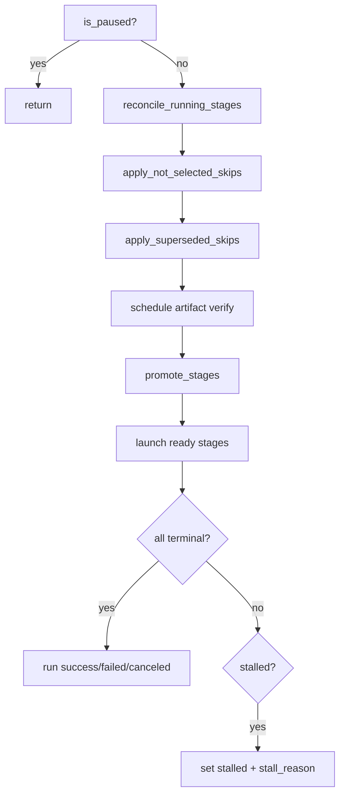
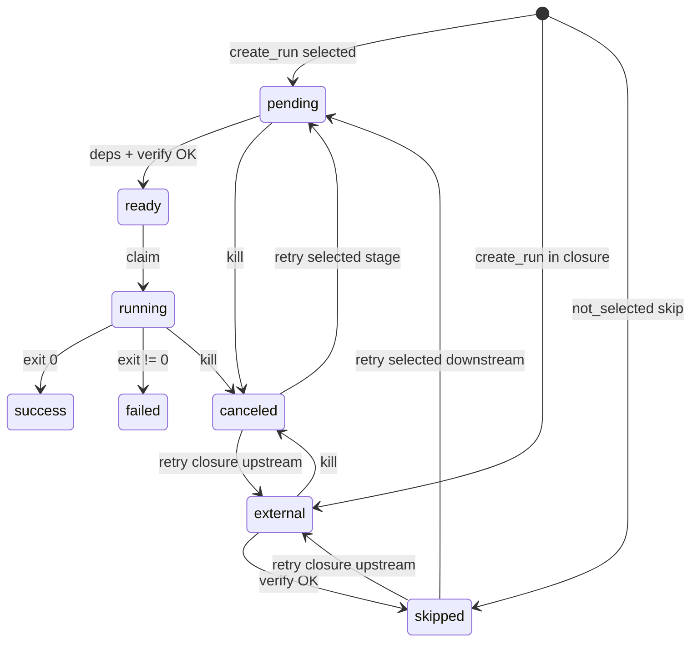

# Pipeline State Machine Reference

Exhaustive reference for how SQLite `stage_runs` statuses evolve across submission
types and control operations in the unified SynDiff orchestrator.

Source of truth: `common/orchestration/state.py`, `common/orchestration/scheduler.py`,
`pipeline_spec.py`, `run_report.py`, and `docs/template_pipeline.md`.

---

## 1. Status semantics

### Stage statuses (`stage_runs.status`)

| Status | Meaning | Terminal? | Dep satisfied? |
|--------|---------|-----------|----------------|
| `pending` | Selected stage waiting on deps and/or artifact verify | No | No |
| `ready` | Deps satisfied + verify gate passed; waiting for pool slot | No | No |
| `running` | Worker launched (local or Condor) | No | No |
| `success` | Exit code 0 | Yes | Yes |
| `skipped` | Logical skip or artifacts verified complete | Yes | Yes |
| `failed` | Non-zero exit; triggers `block_downstream` | Yes | No |
| `canceled` | User kill or SIGTERM (exit 143) | Yes | No |
| `blocked` | Never started because upstream failed | No | No |
| `external` | Not in `--stages` but in upstream closure; verify once → `skipped` | No | No |

**Code sets:**

- `TERMINAL_STATUSES`: `{success, failed, skipped, canceled}`
- `SATISFIED_STATUSES` (dependency resolution): `{success, skipped}`
- `NONTERMINAL_STATUSES` (stall detection): `{pending, ready, running, blocked, external}`

### Skip reasons (`artifacts.artifact_type = 'skip_reason'`)

| Reason | Display | Meaning |
|--------|---------|---------|
| `stream_mode` | `n/a` | `ps1_download` skipped when `ps1_source=stream` |
| `not_selected` | `n/a` | Stage outside upstream closure of `--stages` |
| `superseded` | `n/a` | Upstream verify redundant (downstream already satisfied) |
| `artifacts_verified` | `skip` | External stage verified complete on disk |

### Run statuses (`runs.status`)

| Status | When |
|--------|------|
| `running` | Active work, launchable ready rows, or verify backlog (`sc_q`/`scan`) |
| `stalled` | No running/launchable work, verify backlog empty, non-terminal stages remain |
| `success` / `failed` / `canceled` | All stage rows terminal |

### Status grid abbreviations

| Label | Condition |
|-------|-----------|
| `sc_q` | Stage is **eligible** for artifact verify (`external_verify_attempted` is false, verify backlog applies) **and** (for `pending` rows) upstream dependencies are satisfied |
| `scan` | Verify worker currently scanning this stage |
| `n/a` | `skipped` with reason `stream_mode`, `not_selected`, or `superseded` |
| `pend`, `runn`, `succ`, etc. | First four characters of SQLite status |

`sc_q` means the stage is queued for (or awaiting) its **one-time pre-launch artifact check**, not that a scan is actively walking NFS.

| Situation | Grid label | Meaning |
|-----------|------------|---------|
| `pending`, upstream deps not done | `pend` | Waiting on upstream stages; verify not eligible yet |
| `pending`, deps done, verify not run | `sc_q` | In verify backlog (or about to be scheduled) |
| `pending`, verify ran, outputs incomplete | `pend` | Check cached; waiting for promote / launch |
| `external`, verify needed | `sc_q` | Upstream artifact check before `skipped` |
| Worker running `stage_complete` | `scan` | Active NFS/metadata scan |

Run-level `scan_queued` / `scan_running` in `progress` count only deps-eligible verify candidates (same closure as the scheduler). Per-stage `sc_q` previously appeared on all unverified `pending` rows even when deps blocked verify; the grid now matches scheduler eligibility.

`sc_q` is shown for `external` stages needing verify and selected `pending` stages whose dependencies are satisfied.
---

## 2. Stage dependency DAG (7 stages)

```text
tess_ffi_download
       │
       ▼
  wcs_grouping ─────────────────────────────┐
       │                                     │
       ▼                                     │
   mapping                                   │
       │                                     │
       ▼                                     │
 ps1_download                                │
       │                                     │
       ▼                                     │
  ps1_process ───────────────────────────────┤
                                             ▼
                                       downsample
                                             │
                                             ▼
                                            diff
```

| Stage | Depends on |
|-------|------------|
| `wcs_grouping` | `tess_ffi_download` |
| `mapping` | `wcs_grouping` |
| `ps1_download` | `mapping` |
| `ps1_process` | `ps1_download` (or `mapping` only when `ps1_source=stream`) |
| `downsample` | `wcs_grouping`, `mapping`, `ps1_process` |
| `diff` | `downsample` |

### Partial-run concepts

- `upstream_stages_for(active)` — transitive deps of selected stages (excludes selected).
- `run_stage_closure(active)` — `active ∪ upstream_stages_for(active)`.
- Stages **in closure but not selected** → start `external`, then verify → `skipped`.
- Stages **outside closure** → `apply_not_selected_skips` → immediate `skipped` (`not_selected`).

### Upstream closure by `--stages`

| `--stages` | `run_stage_closure` |
|------------|---------------------|
| all 7 (preset `all`) | all 7 |
| template preset (6 stages, no `diff`) | tess … down |
| `diff` preset | tess … down, diff |
| `mapping` | tess, wcs, mapping |
| `downsample` | all 7 |
| `mapping,downsample` | all 7 |
| `wcs_grouping` | tess, wcs |
| `ps1_process` | tess, wcs, mapping, ps1_dl, ps1_pr |
| `ps1_process,downsample` | all 7 |

### Diff-only artifact verify closure

For `syndiff diff submit` (`--stages diff`), `artifact_verify_closure` is **narrower** than `run_stage_closure` (`spec.py::DIFF_VERIFY_UPSTREAM`):

| Stage | In run closure? | Artifact verify? |
|-------|-----------------|------------------|
| `tess_ffi_download`, `wcs_grouping`, `downsample` | yes | yes |
| `mapping`, `ps1_download`, `ps1_process` | yes | no — immediate **n/a** (`not_selected`) |
| `diff` | yes (selected) | yes (before launch) |

Only `tess_ffi_download`, `wcs_grouping`, and `downsample` are scanned on disk; mapping CSV and PS1 Zarr are not verified for diff-only runs.

---

## 3. Submission — initial status after `create_run`

`create_run` inserts all 7 stages per target:

- Stage ∈ `--stages` → **`pending`**
- Stage ∉ `--stages` → **`external`**

Post-create hooks (before daemon tick):

1. `apply_ps1_stream_download_skips` — stream mode → `ps1_download` skipped
2. `apply_not_selected_skips` — outside closure → `skipped` (`not_selected`)
3. `apply_superseded_skips` — redundant upstream → `skipped` (`superseded`)

Legend: **P** = pending, **E** = external, **S(n/a)** = skipped (not_selected)

### 3.1 Primary submission types

**Template-only (6 stages, no `diff`)** — `syndiff template submit` default:

| Stage | Template (6) | `mapping` only | `downsample` only | `mapping,downsample` |
|-------|--------------|----------------|-------------------|----------------------|
| `tess_ffi_download` | P | E | E | E |
| `wcs_grouping` | P | E | E | E |
| `mapping` | P | P | E | P |
| `ps1_download` | P | S(n/a) | E | E |
| `ps1_process` | P | S(n/a) | E | E |
| `downsample` | P | S(n/a) | P | P |
| `diff` | S(n/a) | S(n/a) | S(n/a) | S(n/a) |

**Full end-to-end (7 stages)** — `syndiff all submit`: all seven stages start **P** (pending) unless stream-mode or supersede skips apply; `diff` is included.

### 3.2 Diff preset (`syndiff diff submit`)

| Stage | `diff` only |
|-------|-------------|
| `tess_ffi_download` | E (verify → skip) |
| `wcs_grouping` | E (verify → skip) |
| `mapping` | S(n/a) |
| `ps1_download` | S(n/a) |
| `ps1_process` | S(n/a) |
| `downsample` | E (verify → skip) |
| `diff` | P |

### 3.3 Other partial runs

| `--stages` | Pending | External (verify path) | Skipped immediately (n/a) |
|------------|---------|------------------------|---------------------------|
| `tess_ffi_download` | tess | — | wcs, map, ps1_dl, ps1_pr, down |
| `tess_ffi_download,wcs_grouping` | tess, wcs | — | map, ps1_dl, ps1_pr, down |
| `wcs_grouping` | wcs | tess | map, ps1_dl, ps1_pr, down |
| `ps1_process` | ps1_pr | tess, wcs, map, ps1_dl | down |
| `ps1_process,downsample` | ps1_pr, down | tess, wcs, map, ps1_dl | — |
| `mapping,ps1_process` | map, ps1_pr | tess, wcs, ps1_dl | down |
| `mapping,ps1_process,downsample` | map, ps1_pr, down | tess, wcs, ps1_dl | — |
| `ps1_download` | ps1_dl | tess, wcs, map | ps1_pr, down |
| `wcs_grouping,downsample` | wcs, down | tess, map, ps1_dl, ps1_pr | — |

### 3.4 `force_rerun=true` vs `false` on submit

| Aspect | `force_rerun=false` (default) | `force_rerun=true` |
|--------|-------------------------------|---------------------|
| Selected stages at create | `pending` | `pending` (same) |
| `runs.force_rerun` flag | 0 | 1 |
| Verify for selected stages | Required before promotion | Bypassed (`may_promote_without_verify`) |
| Verify for external upstream | Normal | Normal (unless superseded / not_selected) |
| Stage worker | Normal artifact checks | `--force-rerun`; may delete outputs first |

---

## 4. Daemon tick pipeline

Each `_tick_run`:

1. `reconcile_running_stages`
2. `apply_not_selected_skips`
3. `apply_superseded_skips`
4. `_schedule_external_and_pending_skips` (artifact verify)
5. `promote_stages` (`pending` → `ready`)
6. Launch ready stages (pool limits)
7. Stall detection / summary write



### Promotion gate

`pending` → `ready` when:

- `deps_satisfied`, AND
- `external_verify_attempted` OR (`force_rerun` AND stage ∈ `--stages`)

Complete verify → `skipped` (via `_apply_verify_outcome`). Incomplete verify → cached `path='0'` and stage promotes to execute.

### Artifact verify scheduling (`_iter_verify_candidates`)

Eligible when status is `pending` or `external`, subject to:

- Not skipped with `not_selected` / `superseded`
- Not `ps1_download` in stream mode
- **`force_rerun`**: skip verify for stages ∈ `--stages`
- **`external`**: `artifact_verify_needed()` is true
- **`pending`**: stage ∈ `--stages` only (**pending outside `--stages` is never verified**)
- Deps satisfied (for pending)
- Not already `external_verify_attempted` (for pending selected stages)

Verify outcome: complete → `skipped` + cache; incomplete → cache `path='0'`, retry later.

### Launch gate

Only stages in `runs.stages` (`active_stages`) are launched.

---

## 5. Normal submission — end-to-end walkthroughs

### 5.1 Full run (all 7 stages)

```
All stages: pending
→ tess → wcs → mapping → ps1_dl → ps1_pr → downsample → diff (per target, pool-limited)
→ run: success
```

### 5.2 `mapping` only

```
tess: sc_q → skip
wcs:  sc_q → skip
map:  pend → runn → succ
ps1_dl, ps1_pr, down: n/a
→ run: success
```

### 5.3 `downsample` only

```
tess, wcs, map, ps1_dl, ps1_pr: sc_q → skip (sequential verify)
down: pend → runn → succ
→ run: success
```

### 5.4 `mapping,downsample`

```
tess, wcs, ps1_dl, ps1_pr: sc_q → skip
map:  pend → runn → succ
down: pend → runn → succ  (after ps1_pr satisfied)
```

Mapping and downsample can overlap across different targets (separate resource pools).

### 5.5 `wcs_grouping` only

```
tess: sc_q → skip
wcs:  pend → runn → succ
map, ps1_*, down: n/a
→ run: success
```

### 5.6 `ps1_process` only

```
tess, wcs, map, ps1_dl: sc_q → skip (ps1_dl may be superseded once ps1_pr satisfied)
ps1_pr: pend → runn → succ
down: n/a
→ run: success
```

### 5.7 `ps1_process,downsample`

```
tess, wcs, map, ps1_dl: sc_q → skip
ps1_pr: pend → runn → succ
down:   pend → runn → succ
→ run: success
```

### 5.8 `diff` only (`syndiff diff submit`)

```
tess, wcs, down: sc_q → skip   (DIFF_VERIFY_UPSTREAM only)
map, ps1_dl, ps1_pr: n/a       (not artifact-verified)
diff: pend → runn → succ
→ run: success
```

---

## 6. Cancel (`kill`)

**Daemon order:** terminate workers → cancel verify → mark SQLite → notify.

| Prior status | After cancel |
|--------------|--------------|
| `running` | `canceled` (exit 143) |
| `pending`, `ready`, `blocked`, `external` | `canceled` |
| `success`, `failed`, `skipped` | **Unchanged** |

Run status → `canceled`.

**Critical:** `external` upstream stages become `canceled`. They are no longer `external`.

### Cancel by run type

| Run type | Canceled | Untouched |
|----------|----------|-----------|
| Template (6) / All (7) | All non-terminal non-skipped | Prior `success`/`failed`/`skipped` |
| `mapping` only | tess(E), wcs(E), mapping(P) | ps1_*, down (n/a skipped) |
| `downsample` only | All 5 upstream(E) + down(P) | — |
| `mapping,downsample` | tess, wcs, ps1_dl, ps1_pr(E) + map, down(P) | — |
| `wcs_grouping` only | tess(E), wcs(P) | map..down (n/a) |

---

## 7. Retry

### 7.1 Bulk retry (`syndiff retry`)

- Seeds: all `failed`, `canceled`, `blocked` stages
- Per seed: `reset_stage_for_retry(seed, reset_downstream=True)`
- Run status → `running`
- Cancels all in-flight verify for the run

### 7.2 `reset_stage_for_retry` mechanics

```python
reopen_status = STATUS_PENDING if stage in active_stages else STATUS_EXTERNAL
UPDATE status=reopen_status  # for each stage in reset list
DELETE artifacts cache for each stage in reset list
```

| Stage relationship to `--stages` | After retry |
|----------------------------------|-------------|
| In `--stages` (selected) | **`pending`** — will re-execute |
| In closure but not selected | **`external`** — artifact verify → `skipped` |
| Outside closure (downstream of seed) | **`external`** → `apply_not_selected_skips` → `skipped` (n/a) |

Each supervisor tick also runs `repair_orphaned_pending_upstream()` to normalize any
legacy orphan `pending` rows in the closure back to `external`.

### 7.3 Targeted retry (`--scc X --stage Y`)

- CLI passes `reset_downstream: true` by default; use `--no-reset-downstream` to reopen
  only the targeted stage
- If target stage is `running`: terminate → `requeue_to_ready` (not full reset)
- Else: `reset_stage_for_retry` with given `reset_downstream`
- Cancels verify for stage + downstream

### 7.4 `reset_downstream=False` (`--no-reset-downstream` on CLI)

- Only seed stage → `pending` (if selected) or `external` (if not)
- Downstream untouched
- Safe for partial runs when downstream artifacts remain valid

### 7.5 `force_rerun` command (daemon intent, not CLI subcommand)

1. `runs.force_rerun = 1`
2. `runs.stages` ← new stage list
3. `reset_stages_for_force_rerun` — unconditional `pending` for listed stages
4. Run → `running`; cancel all verify

Does not expand downstream. Next tick re-applies `not_selected` / `superseded` skips.

### 7.6 `force_launch` command (`syndiff launch`)

1. CLI inserts `force_launch` command with `target_label` + `stage`
2. Daemon sets `stage_runs.force_launch = 1` (persists across restarts)
3. `_launch_force_overrides` runs at the top of `_tick_run` (before pause check) and again after `promote_stages`
4. Matching `ready` rows launch via `_try_launch_ready_row` **without** `_pool_capacity` check
5. On successful launch, `force_launch` cleared to 0

Adds concurrent jobs beyond `resources.<pool>.max_concurrent`; does not terminate jobs already holding pool slots.

### 7.7 Pause / Resume

| Operation | Effect |
|-----------|--------|
| **Pause** | `runs.paused = 1`; normal `_tick_run` dequeuing skipped (force-launch overrides still honored) |
| **Resume** | `runs.paused = 0`; normal tick resumes |

Running workers continue until exit during pause.

---

## 8. Cross-product: operation × run-type outcomes

### 8.1 Bulk retry without prior cancel (generally safe)

| Run type | Reopened | External upstream | Downstream n/a |
|----------|----------|-------------------|----------------|
| Template (6) / All (7) | failed/blocked/canceled + downstream → P | E unchanged | — |
| `mapping` only | mapping → P; downstream → E briefly | E | Re-skipped next tick ✓ |
| `mapping,downsample` | failed map/down → P | ps1 stays E ✓ | — |
| `ps1_process` only | ps1_pr → P; down S → P briefly | E | down re-skipped next tick ✓ |

### 8.2 Cancel + bulk retry (safe after fix)

| Run type | After retry | Outcome |
|----------|-------------|---------|
| **`mapping,downsample`** | map/down → P; ps1/tess/wcs in closure → E | ps1 sc_q → skip → down runs ✓ |
| **`downsample` only** | down → P; upstream → E | upstream sc_q → skip → down runs ✓ |
| **`mapping` only** | map → P; tess/wcs → E; ps1/down → E → n/a | Works ✓ |
| Template (6) / All (7) | All reset to pending | Works ✓ |

**Historical example:** `mapping_downsample_v1` hit this deadlock before the fix; after
deploy, `repair_orphaned_pending_upstream` auto-recovers such runs on the next daemon tick.

### 8.3 Targeted retry `--stage mapping` (reset_downstream=True)

| Run type | map | tess/wcs | ps1_dl/pr | down |
|----------|-----|----------|-----------|------|
| Template (6) / All (7) | P | unchanged | P | P |
| `mapping` only | P | E | P→S(n/a) next tick | P→S(n/a) next tick |
| `mapping,downsample` | P | E | E | P |

### 8.4 After retry — pending vs external vs skipped

| Stage relationship | Prior status | After retry | After next tick (typical) |
|--------------------|--------------|-------------|---------------------------|
| Seed | failed/canceled/blocked | **pending** | relaunch |
| Seed | external | **external** | verify → skip |
| Downstream | external | **external** | verify → skip |
| Downstream | skipped (n/a, outside closure) | **pending** | re-skipped ✓ |
| Downstream | skipped (in closure, not active) | **pending** | **STUCK** ✗ |
| Downstream | success (full run) | **pending** | re-execute chain |
| Upstream (not in reset list) | any | unchanged | unchanged |

---

## 9. Scenario walkthroughs

### A. Normal `mapping,downsample` (happy path)

```
tess:sc_q → skip | wcs:sc_q → skip | map:runn → succ
ps1_dl:sc_q → skip | ps1_pr:sc_q → skip
down:pend → runn → succ
```

### B. `mapping` only (happy path)

```
tess:sc_q → skip | wcs:sc_q → skip | map:runn → succ
ps1_dl:n/a | ps1_pr:n/a | down:n/a
```

### C. `downsample` only (happy path)

```
tess:sc_q → skip | wcs:sc_q → skip | map:sc_q → skip
ps1_dl:sc_q → skip | ps1_pr:sc_q → skip
down:pend → runn → succ
```

### D. `mapping,downsample` + cancel + bulk retry (recovery path)

**After cancel:**

```
map:canc | down:canc | tess/wcs/ps1:canc (if non-terminal)
```

**After retry:**

```
map:pend | down:pend | tess:exte | wcs:exte | ps1_dl:exte | ps1_pr:exte
```

**Progression:**

```
ps1_dl:sc_q → skip | ps1_pr:sc_q → skip | map:runn → succ | down:runn → succ
```

### E. `mapping,downsample` + retry failed mapping (no cancel)

```
map:pend (relaunch) | ps1:exte → sc_q → skip | down:pend → runn → succ  ✓
```

### F. Full run + ps1_dl fails + bulk retry

```
ps1_dl:pend | ps1_pr:pend (was success) | down:pend
→ ps1 chain must re-run before downsample  ✓ (intentional)
```

---

## 10. Deadlock catalog (historical + remaining)

| ID | Trigger | Status |
|----|---------|--------|
| **D1** | Cancel + retry on partial run (orphan pending) | **Fixed** — retry reopens to `external`; `repair_orphaned_pending_upstream` self-heals |
| **D2** | Retry + reset_downstream, PS1 was `skipped` | **Fixed** — PS1 reopens to `external` |
| **D3** | Orphan pending in closure | **Fixed** — shows `sc_q`; repair normalizes to `external` |
| **D4** | Downsample-only, missing upstream artifacts | Transient — stays `running` while sc_q > 0 |

### Self-healing mechanisms

- `apply_not_selected_skips` (every tick): re-skips stages **outside** closure.
- `repair_orphaned_pending_upstream` (every tick): `pending` in closure but not in
  `--stages` → `external`.
- `_iter_verify_candidates`: accepts orphaned `pending` in closure as verify candidates.

---

## 11. Stall detection

Run marked **`stalled`** when:

- `running == 0`
- `launchable == 0`
- `nonterminal > 0`
- verify backlog empty (`scan_queued == 0` and `scan_running == 0`)

Common `stall_reason` strings:

| Reason | Cause |
|--------|-------|
| `waiting on X=pending` | Upstream orphan pending (D1/D2) |
| `artifact verify queued` | Needs verify (transient if backlog > 0) |
| `pending promotion` | Selected pending, verify incomplete |
| `blocked by upstream failure` | Upstream failed, not retried |
| `pool X saturated` | Ready but no pool capacity |

---

## 12. State machine diagram



---

## 13. Safe operation guide

| Goal | Safe approach |
|------|---------------|
| Retry failed mapping in `mapping,downsample` | Bulk or targeted retry (cancel+retry supported) |
| Retry without invalidating downstream | `syndiff retry --scc ... --stage ... --no-reset-downstream` |
| Recover after kill on partial run | `syndiff retry` (auto-repairs orphan pending) |
| Re-run from scratch | `submit --force-rerun` with **new** `--run-id` |

---

## 14. Implemented fix (four layers)

| Layer | Change | Effect |
|-------|--------|--------|
| 1 | `reset_stage_for_retry`: non-active → `external`, active → `pending` | Prevents deadlock at source |
| 2 | `_iter_verify_candidates`: accept orphan pending in closure | Defense in depth |
| 3 | `repair_orphaned_pending_upstream()` each tick | Self-heal stuck runs |
| 4 | `run_report` + `_stall_reasons`: show `sc_q` for orphan pending | Better observability |

Cancel + retry on `mapping,downsample` produces:

```
ps1_dl:sc_q → skip | ps1_pr:sc_q → skip | down:runn → succ
```

---

## 15. Quick function reference

| Function | File | Role |
|----------|------|------|
| `create_run` | state.py | Initial pending/external materialization |
| `apply_not_selected_skips` | state.py | Outside closure → skipped (n/a) |
| `apply_superseded_skips` | state.py | Redundant upstream → skipped |
| `artifact_verify_needed` | state.py | Whether external stage needs sc_q |
| `promote_stages` | state.py | blocked→pending, pending→ready |
| `cancel_run_stages` | state.py | Kill non-terminal (except skipped/success/failed) |
| `reset_stage_for_retry` | state.py | Retry reset; active→pending, closure upstream→external |
| `repair_orphaned_pending_upstream` | state.py | Self-heal orphan pending in closure |
| `reopen_status_for_retry` | state.py | Helper for retry reopen status |
| `stage_needs_artifact_verify_display` | state.py | sc_q / stall-reason eligibility |
| `reopen_failed_canceled` | state.py | Bulk retry seeds |
| `apply_force_rerun` | state.py | Force flag + unconditional pending reset |
| `_iter_verify_candidates` | scheduler.py | sc_q scheduling |
| `_tick_run` | scheduler.py | Main orchestration |
| `_format_stage_status_short` | run_report.py | sc_q / scan / n/a display |
