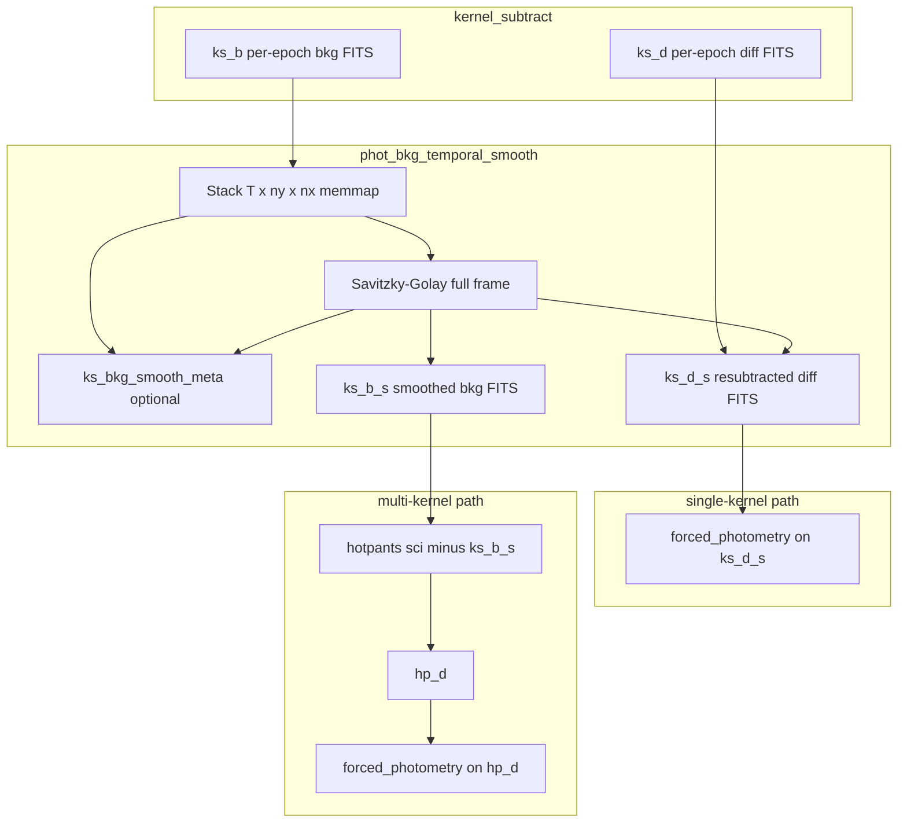

# Unified background stage (`background`)

This document describes the **production** `background` differencing stage: spatial photutils estimation, optional temporal Savitzky–Golay smoothing, and optional TESS strap correction. Steps are toggleable via `steps.spatial`, `steps.temporal`, and `steps.strap`.

**Module:** [`syndiff_pipeline/difference_imaging/stages/background/`](../../syndiff_pipeline/difference_imaging/stages/background/)

**Savitzky–Golay primitive:** [`syndiff_pipeline/difference_imaging/stages/adaptive_background.py`](../../syndiff_pipeline/difference_imaging/stages/adaptive_background.py) (`savgol_smooth_3d`, `savgol_smooth_3d_parallel`)

**Configs:** [`config/diff_config_single_kernel.yaml`](../../config/diff_config_single_kernel.yaml), [`config/diff_config_multi_kernel.yaml`](../../config/diff_config_multi_kernel.yaml), [`config/diff_config_multi_kernel_resume.yaml`](../../config/diff_config_multi_kernel_resume.yaml)

**Experimental predecessor:** [`experimental/phot_bkg_temporal_smooth/`](../../experimental/phot_bkg_temporal_smooth/) (cutout-only prototypes; production always smooths the **full crop**)

---

## Table of contents

1. [Problem statement](#problem-statement)
2. [Pipeline placement](#pipeline-placement)
3. [Naming: `ks_` vs `hp_`](#naming-ks_-vs-hp_)
4. [Inputs from `kernel_subtract`](#inputs-from-kernel_subtract)
5. [End-to-end data flow](#end-to-end-data-flow)
6. [Stage algorithm (step by step)](#stage-algorithm-step-by-step)
7. [Savitzky–Golay smoothing](#savitzkygolay-smoothing)
8. [Resubtracted diffs (`ks_d_s`)](#resubtracted-diffs-ks_d_s)
9. [Workspace layout](#workspace-layout)
10. [Metadata folder (`ks_bkg_smooth_meta`)](#metadata-folder-ks_bkg_smooth_meta)
11. [Footprint union and target pixel IDs](#footprint-union-and-target-pixel-ids)
12. [YAML configuration](#yaml-configuration)
13. [Performance and resources](#performance-and-resources)
14. [Verification and debugging](#verification-and-debugging)
15. [What this stage does *not* do](#what-this-stage-does-not-do)

---

## Problem statement

The `kernel_subtract` stage estimates a **per-epoch spatial background** on the algebraic difference image `ffi − convolved_template` using photutils `Background2D` (masked by the shared Gaia mask). That background map is smooth in space but can vary **temporally** on scales of hours to days because of:

- scattered light and Earth/Moon angle changes,
- residual large-scale structure not removed by the static template,
- slow drifts in the photutils mesh fit.

For forced photometry we want a background estimate that is **slowly varying in time** so difference images used for light curves are not dominated by background residuals.

`phot_bkg_temporal_smooth` applies a **temporal** Savitzky–Golay filter to the full `(time, y, x)` cube of `ks_b` backgrounds, then propagates the change into diff images via a resubtraction formula.

### Why full-frame smoothing?

**Multi-kernel:** Hotpants subtracts the photutils background from the **entire** science crop before running its own difference imaging (`sci = sci − ks_b` when `round_id > 1`). If only a small region around the target were temporally smoothed, the rest of the frame would still carry temporal background structure into Hotpants.

**Single-kernel:** Forced photometry reads `ks_d_s`. Using the same full-frame smoothed `ks_b_s` keeps algebra consistent everywhere on the crop.

Footprint-only smoothing of science products is **not** implemented in the production stage (it would be incompatible with multi-kernel Hotpants). Footprint geometry is used only for **optional metadata** cubes (see below).

---

## Pipeline placement

### Single-kernel (`diff_config_single_kernel.yaml`)

```text
shared_mask → kernel_fit → convolved_templates → kernel_subtract
  → phot_bkg_temporal_smooth → forced_photometry (diffs = ks_d_s)
```

No Hotpants. Photometry runs directly on resubtracted algebraic diffs.

### Multi-kernel (`diff_config_multi_kernel.yaml`)

```text
… → kernel_subtract → phot_bkg_temporal_smooth → hotpants (bkg = ks_b_s) → forced_photometry (diffs = hp_d)
```

Hotpants sees temporally smoothed photutils backgrounds. Photometry uses Hotpants diffs `hp_d`, not `ks_d_s`.

### Resume multi-kernel (`diff_config_multi_kernel_resume.yaml`)

Reuses `ks_b` and `ks_d` from a completed single-kernel workspace (`workspace_inherit: from: single_hp_kernel`), runs `phot_bkg_temporal_smooth`, then Hotpants on `ks_b_s`. Use this when single-kernel products already exist and you only need the Hotpants leg in a new `workspace_run_id`.



---

## Naming: `ks_` vs `hp_`

Workspace labels use a **prefix by stage family**:

| Prefix | Stage | Meaning |
|--------|-------|---------|
| `ks_` | `kernel_subtract` | Kernel-subtract family: algebraic diff + photutils bkg |
| `hp_` | `hotpants` | Hotpants difference imaging products |

The smooth stage runs **after** `kernel_subtract` but **before** Hotpants. It still operates on kernel-subtract products, so outputs use the `ks_` family with an **`_s` suffix** (smoothed):

| Label | Description |
|-------|-------------|
| `ks_b` | Raw photutils background per epoch (input) |
| `ks_d` | Raw algebraic diff `ffi − convolved` per epoch (input); bkg **not** subtracted from this FITS |
| `ks_b_s` | Temporally smoothed background per epoch (full crop) |
| `ks_d_s` | Resubtracted diff per epoch (full crop) |
| `ks_bkg_smooth_meta/` | Optional diagnostics (not consumed by downstream stages) |

Do **not** label pre-Hotpants smoothed products `hp_*`; that collides with Hotpants outputs (`hp_d`, `hp_b`, `hp_c`).

---

## Inputs from `kernel_subtract`

For each FFI in the manifest, `kernel_subtract`:

1. Loads the cropped science FFI and the matching convolved template.
2. Forms `diff_raw = ffi − convolved`.
3. Runs `photutils_background_masked(diff_raw, shared_mask, box_size=phot_box_size)`.
4. Writes:
   - `ks_d`: `diff_raw` (background **not** subtracted from the diff image),
   - `ks_b`: the photutils 2D background map.

Both are full-crop FITS with WCS headers from the template handoff. The smooth stage reads **all epochs** in BTJD order (same ordering as Hotpants background stages: `btjd_for_hotpants_order` on manifest + product IDs).

---

## End-to-end data flow

At a high level, for `T` epochs and crop size `(ny, nx)`:

1. **Stack** raw `ks_b` into a float32 memmap `(T, ny, nx)`.
2. **Smooth** the cube along time with Savitzky–Golay (optionally parallel over spatial tiles).
3. **Write** `ks_b_s` — one FITS per epoch from the smoothed cube.
4. **Resubtract** — for each epoch, `ks_d_s = ks_d + ks_b − ks_b_s` (pixel-wise, full frame).
5. **Meta (optional)** — slice a photometry-footprint union from raw and smoothed cubes; write `.npy`, ID maps, JSON.

Temporary memmaps `_bkg_stack_raw_tmp.npy` and `_bkg_stack_smooth_tmp.npy` are created under the `ks_b_s` workspace during the run and deleted afterward.

---

## Stage algorithm (step by step)

Implementation entry point: `run_phot_bkg_temporal_smooth()` in `phot_bkg_temporal_smooth.py`. The orchestrator calls it from `execute.py` when `kind: phot_bkg_temporal_smooth` appears in the YAML pipeline.

### 1. Build frame records

`build_bkg_frame_records()`:

- Lists `ks_b` FITS under the input workspace label.
- Matches `ffi_product_id` to manifest rows.
- Attaches paths to paired `ks_d` FITS.
- Sorts by BTJD (then product id).
- Produces a list of `BkgFrameRecord` dataclass instances.

### 2. Stack raw backgrounds

`stack_phot_bkg_full()`:

- Allocates memmap `(T, ny, nx)` at `_bkg_stack_raw_tmp.npy`.
- Loads spatial **tiles** (default tile size 256) from per-epoch FITS with optional parallel I/O (`io_jobs`).
- Avoids holding the full cube in RAM until the memmap is filled.

### 3. Temporal smooth

`smooth_phot_bkg_full()`:

- Time axis: `time_mjd = BTJD + 57000` (MJD convention used elsewhere in the pipeline).
- If `tile_size <= 0` or `n_jobs <= 1`: calls `savgol_smooth_3d` on the full array.
- Otherwise: `savgol_smooth_3d_parallel` — parallel per-tile **core** smoothing, then a single **global** frame fallback pass (see below).
- Writes into `_bkg_stack_smooth_tmp.npy` memmap when parallel path is used.

### 4. Write smoothed backgrounds

`write_smoothed_phot_bkg()`:

- One `ks_b_s` FITS per epoch, preserving headers from raw `ks_b`.

### 5. Resubtract diffs

`write_resubtracted_diffs()`:

- For each epoch: read `ks_b` (raw), `ks_d`, and the just-written `ks_b_s`.
- Compute and write `ks_d_s`.

### 6. Metadata (if `write_meta: true`)

See [Metadata folder](#metadata-folder-ks_bkg_smooth_meta).

---

## Savitzky–Golay smoothing

Implemented in `adaptive_background.py`. The production stage uses **Savitzky–Golay only** — not the adaptive median filter (which requires TESSVectors Earth/Moon angles). The adaptive path remains in the library for `background_adaptive` and experimental scripts.

### Time segments (gap handling)

Cadence gaps (e.g. momentum dumps, downlinks) must not be bridged by the filter.

1. Compute median Δt between consecutive epochs.
2. Mark breaks where `Δt > gap_thresh × median(Δt)` (default `gap_thresh = 3`).
3. Run all filtering **inside each segment independently**.

### Default window length

If `savgol_window` is `null` in YAML:

- Estimate cadence from `median(diff(time))` in days.
- Choose an odd window spanning **~6 hours** (`0.25` days): `n_frames = round(0.25 / cadence)`, forced odd, minimum 3.
- For TESS 30-minute FFIs this is typically **13 frames**.

### Per-pixel processing (the “core”)

For each spatial pixel, along time within each segment:

**Pass 1 — NaN fill**

- Non-finite values are interpolated linearly along time within the segment.

**Pass 2 — First Savitzky–Golay**

- `scipy.signal.savgol_filter` along axis 0 with `polyorder` (default 2).
- Window is reduced if a segment is shorter than the requested window.

**Pass 3 — Sigma clipping (optional, default on)**

- Residuals `data − first_pass` per pixel.
- Robust scatter: `MAD × 1.4826` across **all epochs** for that pixel.
- Mask outliers where `|residual| > sigma_clip × robust_std` (default `sigma_clip = 5`).
- Interpolate over masked points, then **second Savitzky–Golay pass**.

This two-pass clip prevents asteroids and other transient signals from biasing the smooth background estimate.

### Frame fallback (global safety check)

After the per-pixel core, one **cheap global** step runs on the full `(T, ny, nx)` array:

1. For each epoch `t`, compute the median absolute residual between smoothed and raw across **all pixels**.
2. If that whole-frame statistic is an outlier (MAD-based, same `sigma_clip` scale), **restore the entire raw frame** for that epoch.

This prevents a scattered-light jump from being smeared into neighboring epochs. Because this step uses spatial medians over the full frame, parallel tile workers must **not** apply it independently — `savgol_smooth_3d_parallel` runs the core per tile, then frame fallback once on the assembled cube.

### Parallel execution

| Parameter | Default | Role |
|-----------|---------|------|
| `tile_size` | 256 | Spatial tile edge for parallel core (pixels) |
| `n_jobs` | `cfg.n_jobs` | joblib workers for tile cores |
| `io_jobs` | `cfg.n_jobs` | Parallel FITS read/write for stack and FITS output |

Benchmark on s0020 (1183 epochs, 1024×1024): serial smooth ~3–4 min; tiled parallel with 8–16 workers ~30–45 s (order of magnitude).

---

## Resubtracted diffs (`ks_d_s`)

Kernel subtract stores the diff **without** subtracting the photutils background from the image:

```text
ks_d = ffi − convolved_template
```

Photometry on single-kernel configs should use a diff where the **temporally smoothed** background has been removed. Algebraically, the correction for changing background estimate is:

```text
ks_d_s = ks_d + ks_b_raw − ks_b_smoothed
```

Equivalently: add back the raw background and subtract the smoothed one, pixel by pixel, every epoch. Outside regions where `ks_b_s == ks_b`, `ks_d_s == ks_d`; after full-frame smooth, every pixel is updated.

**Single-kernel:** `forced_photometry` `inputs.diffs: ks_d_s`.

**Multi-kernel:** Hotpants uses `inputs.bkg: ks_b_s` on the science image; photometry reads `hp_d`. `ks_d_s` is still written for QA and comparison.

---

## Workspace layout

Under `{workspace_root}/events/{target_label}/ws/{workspace_run_id}/` (or canonical `ws/`):

```text
ks_b/                          # input from kernel_subtract
  tess1234567890_ks_b.fits
ks_d/
  tess1234567890_ks_d.fits
ks_b_s/                        # output smoothed bkg
  tess1234567890_ks_b_s.fits
ks_d_s/
  tess1234567890_ks_d_s.fits
ks_bkg_smooth_meta/            # optional, write_meta: true
  bkg_stack.npy
  bkg_stack_smoothed.npy
  target_pixel_ids.npy
  target_pixel_ids.fits
  smooth_params.json
```

FITS stems follow `workspace_frame_stem(product_id, label)` → `tess<sector_camera_timestamp>_<label>.fits`.

---

## Metadata folder (`ks_bkg_smooth_meta`)

Written only when `write_meta: true` (default). Downstream stages **do not** read this folder; it is for inspection, notebooks, and validation.

| File | Shape | Contents |
|------|-------|----------|
| `bkg_stack.npy` | `(T, H, W)` float32 | Raw `ks_b` cutout over photometry footprint union |
| `bkg_stack_smoothed.npy` | `(T, H, W)` float32 | Smoothed `ks_b` over the **same** footprint |
| `target_pixel_ids.npy` | `(H, W)` int16 | Patch-local source ID map |
| `target_pixel_ids.fits` | `(ny, nx)` int16 | Full-crop map (−1 outside footprint patch) |
| `smooth_params.json` | JSON | Parameters, bounds, timings, source names |

**Important:** Meta cubes are **not** full 1024×1024 stacks (~5 GB each). They are a small union of photometry cutouts (~29×29 for default 15×15 cutouts and five offset targets on s0020 → ~8 MB total).

Extraction happens **after** full-frame smooth by slicing `[y0:y1, x0:x1]` from the memmaps — no extra FITS I/O.

### `smooth_params.json` fields

Includes (non-exhaustive):

- `n_frames`, `ny`, `nx` — full crop dimensions
- `cutout_bounds` — `[y0, y1, x0, x1]` inclusive-exclusive slice into crop
- `phot_cutout_size` — side length used for footprint union
- `gap_thresh`, `savgol_window`, `savgol_polyorder`, `sigma_clip`, `tile_size`, `n_jobs`
- `source_names` — `["primary", "offset_top", …]`
- `target_pixel_ids` — mapping of names to integer IDs
- `timings` — `stack_s`, `smooth_s`, `total_s`

---

## Footprint union and target pixel IDs

### Footprint bounds

`resolve_photometry_footprint_bounds()` computes the smallest axis-aligned rectangle that covers all photometry cutouts:

1. **Primary target:** `per_frame_target_crop_xy(wcs_table, target_ra, target_dec, crop_bounds)` → `(x, y)` per epoch.
2. **Additional forced targets:** `additional_forced_targets` from config (offsets, sky positions, etc.) via `resolve_forced_target_xy`.
3. For each source and each epoch with finite position, form a `phot_cutout_size × phot_cutout_size` square (`cutout_bounds`).
4. **Union** all squares over sources and epochs.
5. Optionally expand by `smooth_pad` pixels; clip to crop.

`phot_cutout_size` resolution:

1. Explicit `phot_cutout_size` in stage YAML if set.
2. Else `max(phot_cutout_size)` over PSF methods in the **next** `forced_photometry` stage (`upcoming_phot_cutout_size()`), default 15.

### Target pixel ID map

`build_target_pixel_id_map()` labels which LC channel each pixel supports:

| Value | Meaning |
|-------|---------|
| `−1` | Not in any source cutout (within the footprint patch) |
| `0` | Primary target cutout |
| `1, 2, …` | `additional_forced_targets` in config order |

**Overlap rule:** if a pixel lies in multiple source cutouts, the **lowest index wins** (primary `0` beats extras). Sources are painted in order; only pixels still `−1` receive the next source ID.

---

## YAML configuration

Minimal stage block (also see site configs):

```yaml
- kind: phot_bkg_temporal_smooth
  inputs:
    phot_bkg: ks_b
    diffs: ks_d
  output:
    phot_bkg: ks_b_s
    diffs: ks_d_s
    meta: ks_bkg_smooth_meta
  gap_thresh: 3.0
  savgol_polyorder: 2
  sigma_clip: 5.0
  savgol_window: null          # auto ~6 h window
  tile_size: 256
  n_jobs: null                 # defaults to cfg.n_jobs
  io_jobs: null
  write_meta: true
  phot_cutout_size: null       # infer from next forced_photometry
  smooth_pad: 0
```

### Allowed keys

Validated in `stage_params.PHOT_BKG_TEMPORAL_SMOOTH_ALLOWED`. Unknown keys raise at config parse time.

### DAG validation

- `inputs.phot_bkg` and `inputs.diffs` must exist and refer to labels produced by an earlier stage (typically `kernel_subtract`).
- `output.phot_bkg` and `output.diffs` must differ from the input labels.
- `output.meta` is required in YAML but is not consumed as an input by later stages.

### Disabling metadata

```yaml
  write_meta: false
```

No `ks_bkg_smooth_meta/` directory is created; science FITS are unchanged.

---

## Performance and resources

| Step | Dominant cost | Notes |
|------|----------------|-------|
| Stack `ks_b` | FITS I/O | Tiled parallel reads; ~tens of seconds for ~1k frames |
| Savitzky–Golay | CPU | O(T × ny × nx); parallel tiles + global fallback |
| Write FITS | FITS I/O | Two full-crop products per epoch (`ks_b_s`, `ks_d_s`) |
| Meta slice | Memory bandwidth | Cheap vs full smooth |

**RAM:** Peak usage is dominated by one or two `(T, ny, nx)` float32 memmaps during the run (~5 GB for T=1183, 1024×1024). Temporary files are removed after success.

**Condor:** Site configs request 8 CPUs and ~100 GB RAM for diff jobs; smooth stage benefits from `n_jobs` matching allocated CPUs.

---

## Verification and debugging

### Pipeline completion

`diff_verify._final_stage_complete()` for `phot_bkg_temporal_smooth` checks:

- `ks_b_s/` and `ks_d_s/` contain FITS.
- If `write_meta` is true (default), `ks_bkg_smooth_meta/smooth_params.json` exists.

### Unit tests

[`tests/test_phot_bkg_temporal_smooth.py`](../../tests/test_phot_bkg_temporal_smooth.py) covers footprint bounds, resubtract algebra, meta stack shapes, parallel vs serial Savitzky–Golay parity, and YAML validation.

### Manual checks

1. Load `bkg_stack.npy` and `bkg_stack_smoothed.npy`; plot a pixel light curve at the target center — smoothed curve should be less noisy at high frequency than raw.
2. Compare `target_pixel_ids.fits` in DS9 with `targets.reg` and offset cutouts.
3. Confirm `ks_d_s − ks_d ≈ ks_b − ks_b_s` per epoch (numerically).
4. For multi-kernel, confirm Hotpants `inputs.bkg` points to `ks_b_s`, not raw `ks_b`.

### Experimental comparison

The [`experimental/phot_bkg_temporal_smooth`](../../experimental/phot_bkg_temporal_smooth/) tree may still contain cutout-only or adaptive-median runs under `phot_bkg_smooth_exp/`. Production outputs use `ks_*` labels and full-frame smooth; compare `bkg_stack_smoothed.npy` in meta against experimental savgol cutouts only after aligning `cutout_bounds` in `smooth_params.json`.

---

## What this stage does *not* do

| Topic | Notes |
|-------|-------|
| Footprint-only science smooth | Not supported — full crop only for `ks_b_s` / `ks_d_s` |
| Adaptive median / TESSVectors | Not used in this stage |
| Hotpants background (`hp_b`) | Separate product; smooth stage only touches `ks_b` |
| `background_adaptive` / `background_rough` | Different pipeline branch (Hotpants rough bkg stacks) |
| syndiff_viewer auto-discovery | Meta folder is not yet wired into the viewer |

For orchestration (how to submit diff jobs, Condor, workspace inheritance), see [template pipeline guide](../template_pipeline.md) and [config README](../../config/README.md).
