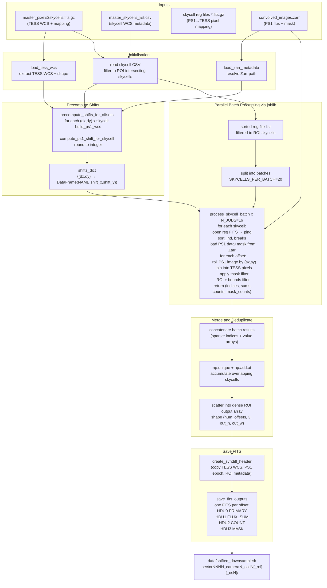

> **Package integration**: `syndiff-template` stage `downsample` · module `template/downsample.py` · legacy script `multi_offset_downsampling.py`  
> **Orchestration docs**: [template pipeline guide](../template_pipeline.md)

# Multi-Offset Downsampling — Detailed Technical Reference

`multi_offset_downsampling.py` projects convolved Pan-STARRS 1 (PS1) skycell images onto the TESS pixel grid, producing one downsampled template image per requested sub-pixel offset `(dx, dy)`. Each offset simulates a small pointing shift of the TESS telescope and generates an independent synthetic-difference template that matches the expected appearance of the sky under that pointing jitter. Output is a set of multi-extension FITS files, one per offset, containing flux sums, pixel counts, and mask counts at TESS resolution.

---

## Table of Contents

1. [Concepts and Data Model](#1-concepts-and-data-model)
2. [Pipeline Overview](#2-pipeline-overview)
3. [Input Directory Layout](#3-input-directory-layout)
4. [Function Reference](#4-function-reference)
   - 4.1 [extract\_skycell\_name\_from\_reg\_file](#41-extract_skycell_name_from_reg_file)
   - 4.2 [load\_zarr\_metadata](#42-load_zarr_metadata)
   - 4.3 [load\_zarr\_data\_for\_skycell](#43-load_zarr_data_for_skycell)
   - 4.4 [precompute\_shifts\_for\_offsets](#44-precompute_shifts_for_offsets)
   - 4.5 [process\_skycell\_batch](#45-process_skycell_batch)
   - 4.6 [create\_syndiff\_header](#46-create_syndiff_header)
   - 4.7 [save\_fits\_outputs](#47-save_fits_outputs)
   - 4.8 [main](#48-main)
5. [Shift Computation Detail](#5-shift-computation-detail)
6. [Sparse Accumulation and Deduplication](#6-sparse-accumulation-and-deduplication)
7. [Output FITS Structure](#7-output-fits-structure)
8. [ROI and Oversampling](#8-roi-and-oversampling)
9. [Mask Bit Handling](#9-mask-bit-handling)
10. [Key Constants and Defaults](#10-key-constants-and-defaults)
11. [CLI Reference](#11-cli-reference)
12. [Example Invocations](#12-example-invocations)

---

## 1. Concepts and Data Model

### TESS Pixels and PS1 Skycells

TESS Full-Frame Images (FFIs) are divided into individual **TESS pixels**, each subtending ~21 arcsec on the sky. Pan-STARRS 1 images are organized into **skycells** — small sky patches ~0.25 deg × 0.25 deg at ~0.26 arcsec/pixel resolution. Because the PS1 pixel scale is roughly 80× finer than TESS, every TESS pixel corresponds to a bin of ~6400 PS1 pixels.

### The Registration Map

For each TESS sector/camera/CCD, the `pancakes_v2.py` script pre-computes a **registration map** — a per-skycell FITS image that assigns each PS1 pixel a linearized TESS pixel index. This mapping is stored as a compressed FITS file (`.fits.gz`) per skycell, plus a single master file (`master_pixels2skycells`) whose pixel data lists, for each TESS pixel, the index of its dominant skycell. This master file also carries the TESS WCS.

### Downsampling

**Downsampling** is the process of aggregating PS1 flux values into TESS pixels using the registration map. For each PS1 pixel `p` that maps to TESS pixel `t`, the value of `p` is added to a running sum for `t`. A count of contributing PS1 pixels and a count of masked pixels are tracked separately. The result is three images at TESS resolution: `FLUX_SUM`, `COUNT`, and `MASK`.

### Offsets

An **offset** `(dx, dy)` is a sub-pixel displacement expressed in TESS pixel units. Applying an offset simulates the telescope pointing at a slightly different position. Before downsampling, each PS1 skycell image is shifted by `(sx, sy)` PS1 pixels — the integer-rounded equivalent of `(dx, dy)` in the PS1 coordinate frame — using `numpy.roll`. A different shift is computed for every skycell because each skycell has a different WCS orientation relative to TESS. The shift computation uses a sky-coordinate round-trip through both WCS systems (see [Section 5](#5-shift-computation-detail)).

### Zarr Convolved Data

The script reads PS1 images from a **Zarr store** rather than individual FITS files. The store produced by `process_ps1.py` holds the fully convolved (PSF-matched) PS1 image and mask for every skycell that overlaps the TESS field:

```
data/convolved_results/sector_NNNN_camera_N_ccd_N.zarr
    skycell.<proj>.<cell>_data   ← float32 convolved image
    skycell.<proj>.<cell>_mask   ← uint32 bit-packed quality mask
```

### Oversampling

When the registration map was generated with `--oversampling_factor N > 1`, each base TESS pixel is sub-divided into an N×N grid of virtual "oversampled" pixels, giving finer spatial resolution at the cost of a larger mapping. The downsampling code selects the correct oversampled mapping directory and decodes oversampled pixel indices back to base-pixel coordinates and sub-pixel positions.

---

## 2. Pipeline Overview



The pipeline runs in three logical phases:

1. **Initialisation**: load the TESS WCS and master mapping, filter skycells to those that overlap the requested ROI, resolve the Zarr path.
2. **Shift precomputation**: for every `(dx, dy)` offset, compute the integer PS1 pixel shift for every skycell. Results cached in `shifts_dict`.
3. **Parallel downsampling**: joblib dispatches `process_skycell_batch` across 16 workers. Each worker processes 20 skycells. Results are sparse (index + value arrays) to minimize memory. After all batches complete, results are concatenated, deduplicated by TESS pixel index, and scattered into the dense output array.

---

## 3. Input Directory Layout

All paths below are relative to `data_root` (default: `./data` next to the script).

```
data/
├── skycell_pixel_mapping/                       ← default mapping_root
│   └── sector_NNNN/
│       └── camera_N/
│           └── ccd_N/
│               ├── tess_sNNNN_N_N_master_pixels2skycells.fits.gz   ← master mapping + TESS WCS
│               ├── tess_sNNNN_N_N_master_skycells_list.csv          ← skycell WCS metadata
│               └── skycell.PPPP.CCC_*.fits.gz                       ← per-skycell reg files
│
│   └── oversampling_N/                          ← used when --oversampling-factor N > 1
│       └── sector_NNNN/camera_N/ccd_N/
│           ├── tess_sNNNN_N_N_master_pixels2skycells_osN.fits.gz
│           ├── tess_sNNNN_N_N_master_skycells_list_osN.csv
│           └── skycell.PPPP.CCC_*.fits.gz
│
├── convolved_results/                           ← default convolved_dir
│   └── sector_NNNN_camera_N_ccd_N.zarr
│       ├── skycell.PPPP.CCC_data               ← float32 PS1 convolved image
│       └── skycell.PPPP.CCC_mask               ← uint32 quality mask
│
└── shifted_downsampled/                         ← default output_base
    └── sectorNNNN_cameraN_ccdN[_xX0-X1_yY0-Y1][_osN]/
        └── syndiff_template_sNNNN_N_N[_roi][_osN]_dx0.000_dy0.000.fits
```

All three path roots (`mapping_dir`, `convolved_dir`, `output_base`) can be overridden independently via CLI flags.

---

## 4. Function Reference

### 4.1 `extract_skycell_name_from_reg_file`

```python
def extract_skycell_name_from_reg_file(reg_file: str) -> str | None
```

Extracts the skycell identifier `skycell.<proj>.<cell>` from a registration filename using the regex `r"(skycell\.\d+\.\d+)"`. Returns `None` if the filename does not match the expected pattern. Used during registration file discovery to build the `skycell_names` list that is paired with `reg_files`.

---

### 4.2 `load_zarr_metadata`

```python
def load_zarr_metadata(sector, camera, ccd, convolved_data_path) -> Path
```

Constructs the Zarr store path:

```
{convolved_data_path}/sector_{sector:04d}_camera_{camera}_ccd_{ccd}.zarr
```

Raises `FileNotFoundError` if the path does not exist. Returns the resolved `Path` object. Called once in `main` before the parallel batch loop so all workers can receive the same validated path.

---

### 4.3 `load_zarr_data_for_skycell`

```python
def load_zarr_data_for_skycell(skycell_name, zarr_store) -> tuple[np.ndarray, np.ndarray]
```

Reads a single skycell's data from an open Zarr store:

- Normalises the key prefix: if `skycell_name` does not already start with `"skycell."`, prepends it.
- Reads `zarr_store[f"{skycell_key}_data"]` → float32 image array.
- Reads `zarr_store[f"{skycell_key}_mask"]` → uint32 mask array.
- Forces a full array materialisation with `np.array(...)` to avoid lazy-loading issues inside joblib workers.

Returns `(image_data.astype(np.float32), mask_data.astype(np.uint32))`.

---

### 4.4 `precompute_shifts_for_offsets`

```python
def precompute_shifts_for_offsets(tess_wcs, skycell_df, offsets) -> dict[tuple[float, float], pd.DataFrame]
```

Iterates over every `(dx, dy)` pair in `offsets` (outer loop, tqdm progress bar) and every row in `skycell_df` (inner loop). For each combination:

1. Calls `build_ps1_wcs(row)` to construct the PS1 WCS from the CSV columns.
2. Calls `compute_ps1_shift_for_skycell(tess_wcs, dx, dy, row["RA"], row["DEC"], ps1_wcs)` to obtain the fractional PS1 shift `(sx, sy)`.
3. Rounds each shift to the nearest integer with `int(round(...))` — **no sub-pixel interpolation is performed**.

Returns a dictionary mapping each `(dx, dy)` tuple to a `pd.DataFrame` with columns `NAME`, `shift_x`, `shift_y`. This dict is passed to every `process_skycell_batch` worker so shifts do not need to be recomputed per batch.

---

### 4.5 `process_skycell_batch`

```python
def process_skycell_batch(
    batch_idx, reg_files, skycell_names, offsets,
    shifts_dict, base_tess_shape, zarr_path, roi_bounds,
    oversampling_factor=1, ignore_mask_bits=[]
) -> tuple[np.ndarray, np.ndarray, np.ndarray, np.ndarray]
```

This is the **core parallel worker**, one call per batch of ~20 skycells. It runs entirely inside a joblib subprocess (no shared state). The function returns sparse arrays rather than dense images to minimise inter-process data transfer.

#### Registration binning setup (per skycell)

1. Opens the per-skycell registration FITS file and reads HDU 1 as an integer array `ps1_assignment` — shape matches the PS1 skycell, values are linearized TESS pixel indices.
2. Flattens to `pind = ps1_assignment.ravel()`.
3. Sorts `pind` with `np.argsort` → `sort_ind`. The sorted order groups all PS1 pixels belonging to the same TESS pixel together.
4. Identifies `tess_pixels = np.unique(pind[np.isfinite(pind)])`, filtered to non-negative values.
5. Computes `breaks` — the split points between consecutive TESS pixel groups in the sorted order — via `np.diff(pind[sort_ind]) > 0`. Appending `len(sort_ind)` gives an end sentinel, so `breaks[i]:breaks[i+1]` slices all PS1 pixels for TESS pixel `i`.

#### Per-offset processing

For each `(dx, dy)` offset:

1. Looks up `shift_df = shifts_dict[(dx, dy)]` and finds the pre-computed `(sx, sy)` for this skycell by name.
2. Applies the shift: `np.roll(ps1_base, (sy, sx), axis=(0, 1))` and the same roll to the mask. `np.roll` wraps at array boundaries — this is appropriate because the shift is always much smaller than the skycell dimension (~0.2 pixels in TESS space → a few PS1 pixels).
3. Flattens and reorders the shifted arrays with `sort_ind` so they align with the `breaks` grouping.
4. Iterates over TESS pixel groups using the `breaks` array. For each group:
   - `counts[i] = len(slice_data)` — total PS1 pixels assigned.
   - `sums[i] = np.nansum(slice_data[~ignored_pixels])` — sum excluding masked pixels.
   - `mask_counts[i] = np.sum(slice_mask != 0)` — count of any non-zero mask value.
5. Stores per-TESS-pixel results in `pixel_sums[:, offset_idx]`, `pixel_counts[:, offset_idx]`, `pixel_mask_counts[:, offset_idx]`.

#### Mask bit filtering

Before the offset loop, an `ignore_mask` bitmask is built by OR-ing `1 << bit` for each bit index in `ignore_mask_bits`. Inside each group: `ignored_pixels = (slice_mask & ignore_mask) > 0`. Only non-ignored pixels contribute to the sum; the count always includes all pixels.

#### ROI filtering

After all offsets are processed for a skycell, TESS pixel indices are decoded to `(y_base, x_base)` base-coordinate pairs. When `oversampling_factor > 1`, the oversampled index `idx` is decoded as:

```
os_width = t_x * oversampling_factor
y_os     = idx // os_width
x_os     = idx % os_width
y_base   = y_os // oversampling_factor
x_base   = x_os // oversampling_factor
```

A boolean mask `valid_mask` keeps only pixels within `[x_min, x_max) × [y_min, y_max)` (base coordinates) and within the full TESS image bounds. Only valid pixels are appended to the batch output lists.

#### Return values

| Array | Shape | dtype | Contents |
|---|---|---|---|
| `indices` | `(N_valid,)` | int64 | Linearized TESS (or oversampled) pixel indices |
| `sums` | `(N_valid, num_offsets)` | float32 | PS1 flux sums per TESS pixel per offset |
| `counts` | `(N_valid, num_offsets)` | int32 | Total PS1 pixel counts per TESS pixel per offset |
| `mask_counts` | `(N_valid, num_offsets)` | int32 | Non-zero mask pixel counts per TESS pixel per offset |

If no valid data is found for the entire batch, empty arrays with the correct shapes are returned.

---

### 4.6 `create_syndiff_header`

```python
def create_syndiff_header(tess_header, roi_bounds=None, oversampling_factor=1) -> fits.Header
```

Constructs the output FITS header from the TESS master mapping header. Steps:

1. **Instrument keywords** — copies `TELESCOP`, `INSTRUME`, `CAMERA`, `CCD`.
2. **PS1 epoch** — sets `MJD-OBS = 55197.00000`, `DATE-OBS = 2010-01-01T00:00:00.000`, `DATE-END = 2015-01-01T00:00:00.000`.
3. **WCS and quality keywords** — copies all keys starting with `A_`, `B_`, `AP_`, `BP_`, `RA_`, `DEC_`, `ROLL_` (SIP distortion and pointing), plus a fixed list: `RADESYS`, `EQUINOX`, `WCSAXES`, `CTYPE1`, `CTYPE2`, `CRVAL1`, `CRVAL2`, `CRPIX1`, `CRPIX2`, `CD1_1`, `CD1_2`, `CD2_1`, `CD2_2`, `DQUALITY`, `IMAGTYPE`.
4. **SYNDIFF tag** — `SYNDIFF = True`.
5. **Oversampling WCS scaling** (if `oversampling_factor > 1`) — divides all CD matrix elements and CDELT values by `oversampling_factor` to reflect the finer pixel scale. Records `OVERSAMP`.
6. **ROI crop** (if `roi_bounds` is not `None`) — adjusts `CRPIX1` and `CRPIX2` by subtracting `x_min * oversampling_factor` and `y_min * oversampling_factor` respectively, so the WCS correctly describes the cropped output image. Records `XMIN`, `XMAX`, `YMIN`, `YMAX`, `ROIW`, `ROIH`.

---

### 4.7 `save_fits_outputs`

```python
def save_fits_outputs(
    output_dir, sector, camera, ccd,
    results, offsets, tess_header,
    roi_bounds=None, oversampling_factor=1
)
```

Iterates over all `(dx, dy)` offsets and writes one multi-extension FITS file per offset:

- Calls `create_syndiff_header` once to build the shared base header.
- Per offset, copies the header and adds `DX_SHIFT` and `DY_SHIFT` keywords.
- Constructs the HDU list: `PRIMARY` (no data) + `FLUX_SUM` + `COUNT` + `MASK`.
- Builds the output filename with optional ROI and oversampling suffixes:
  ```
  syndiff_template_sNNNN_N_N[_xX0-X1_yY0-Y1][_osN]_dxD.DDD_dyD.DDD.fits
  ```
  The ROI suffix is omitted when the ROI covers the full image with `x_min=0, y_min=0`.
- Writes with `overwrite=True`.

---

### 4.8 `main`

```python
def main(sector, camera, ccd, offsets, ignore_mask_bits,
         data_root, mapping_dir, convolved_dir, output_base,
         x_min, y_min, x_max, y_max, oversampling_factor)
```

End-to-end orchestration:

1. **Path resolution** — builds `mapping_root`, `convolved_dir`, and `output_base` from arguments; appends `oversampling_{N}` sub-directory to `mapping_root` when `oversampling_factor > 1`.
2. **Output directory naming** — `OUTPUT_DIR` includes ROI bounds in the name only if the ROI is non-trivial (not full-image).
3. **Load TESS data** — calls `load_tess_wcs` on the master mapping file; also loads `tess_data` (the mapping image itself) and `tess_header` for later use.
4. **Shape computation** — derives `base_shape = (ny, nx)` in base TESS pixel units. With oversampling, divides the loaded shape by `oversampling_factor` and validates divisibility.
5. **ROI validation** — if all four ROI bounds are `None`, defaults to the full base image. If any are provided, all four must be provided. Validates bounds are within `base_shape`.
6. **Skycell CSV loading** — reads `NAME`, `RA`, `DEC`, and all `RELEVANT_WCS_KEYS` columns.
7. **ROI prefiltering** — slices `tess_data` to the ROI (applying oversampling scale), takes `np.unique` of the mapping IDs, maps IDs to skycell names via `skycell_df.iloc[roi_ids]`, and drops skycells with no pixels in the ROI. This avoids loading Zarr data for skycells that cannot contribute to the output.
8. **Zarr path** — calls `load_zarr_metadata`.
9. **Shift precomputation** — calls `precompute_shifts_for_offsets`.
10. **Registration file discovery** — globs `*.fits.gz` in the mapping directory, excludes the master file, extracts skycell names, filters to ROI-intersecting skycells only.
11. **Batch splitting** — divides `reg_files` and `skycell_names` into chunks of `SKYCELLS_PER_BATCH=20` using `np.array_split`.
12. **Parallel execution** — dispatches all batches with `joblib.Parallel(n_jobs=16)`.
13. **Result assembly** — concatenates batch outputs, deduplicates by TESS pixel index (see [Section 6](#6-sparse-accumulation-and-deduplication)), scatters into the dense `combined_results` array of shape `(num_offsets, 3, out_h, out_w)`.
14. **FITS output** — calls `save_fits_outputs`.
15. **Summary** — prints processing time, skycell count, batch count, offset list, and output path.

---

## 5. Shift Computation Detail

`compute_ps1_shift_for_skycell` (in `compute_ps1_skycell_shifts.py`) converts a TESS pixel offset `(dx, dy)` into a PS1 pixel shift `(sx, sy)` for a given skycell via a WCS round-trip:

```
1. Project skycell center RA/Dec → TESS pixel (x_tess, y_tess)
2. Compute sky position at (x_tess,          y_tess)    → world1
3. Compute sky position at (x_tess + dx,     y_tess + dy) → world2
4. Project world1 → PS1 pixel (u1, v1)
5. Project world2 → PS1 pixel (u2, v2)
6. Return (u2 - u1, v2 - v1)
```

Because each skycell has a unique WCS tangent point and orientation, the same TESS offset produces a different PS1 shift for every skycell. The magnitude is proportional to the TESS-to-PS1 pixel scale ratio (~80×), so a 0.05 TESS pixel offset results in a ~4 PS1 pixel shift.

The fractional result is **rounded to the nearest integer** before use. No interpolation is applied when rolling the PS1 image — pixels are shifted by whole PS1-pixel steps only. This approximation is valid because the shifts are small compared to the PS1 PSF (which was Gaussian-convolved in `process_ps1.py` to match the TESS PSF).

---

## 6. Sparse Accumulation and Deduplication

### Why sparse?

A single TESS CCD has ~2048×2048 = ~4 million pixels. With 10 offsets and 3 planes (sum, count, mask), a dense float32 output array would be ~480 MB per worker. Returning sparse (index, value) arrays instead drastically reduces inter-process data transfer and peak memory.

### Per-batch binning

Inside `process_skycell_batch`, for each skycell:

```
pind = ps1_assignment.ravel()           # PS1 pixel → TESS pixel index
sort_ind = np.argsort(pind)             # sort so same-TESS-pixel entries are adjacent
breaks = np.where(np.diff(pind[sort_ind]) > 0)[0] + 1   # group boundaries
```

Using `breaks` to slice `pind[sort_ind]` avoids looping over individual pixels; instead it loops only over TESS pixels (typically ~6400 per skycell), making the inner loop fast.

### Cross-skycell deduplication

PS1 skycells overlap each other at their edges, so a TESS pixel near a skycell boundary can receive contributions from two or more skycells in different batches. After all batch results are concatenated:

```python
combined_indices = np.concatenate(all_indices)          # may contain duplicates
combined_sums    = np.vstack(all_sums)

unique_indices, inverse_indices = np.unique(combined_indices, return_inverse=True)
unique_sums = np.zeros((len(unique_indices), num_offsets), dtype=np.float32)
np.add.at(unique_sums, inverse_indices, combined_sums)  # accumulate by index
```

`np.add.at` performs unbuffered in-place addition, correctly accumulating repeated contributions to the same TESS pixel from different skycells.

### Scatter to dense output

After deduplication, each unique TESS pixel index is decoded to `(out_y, out_x)` coordinates in the ROI output array and the value scattered in:

- Without oversampling: `out_y = y_base - y_min`, `out_x = x_base - x_min`.
- With oversampling `F`: `out_y = (y_base - y_min) * F + sub_y`, `out_x = (x_base - x_min) * F + sub_x`, where `sub_y`, `sub_x` are the within-base-pixel sub-indices.

The final dense array has shape `(num_offsets, 3, out_h, out_w)` where `out_h = roi_h * oversampling_factor` and `out_w = roi_w * oversampling_factor`.

---

## 7. Output FITS Structure

Each offset produces one FITS file with four HDUs:

| HDU index | Name | Data type | Shape | Contents |
|---|---|---|---|---|
| 0 | PRIMARY | (no data) | — | Syndiff header; instrument + WCS + epoch metadata |
| 1 | FLUX_SUM | float32 | `(out_h, out_w)` | Sum of PS1 flux values per TESS pixel (masked pixels excluded from sum) |
| 2 | COUNT | int32 | `(out_h, out_w)` | Total number of PS1 pixels mapped to each TESS pixel (includes masked) |
| 3 | MASK | int32 | `(out_h, out_w)` | Number of PS1 pixels with any non-zero mask value per TESS pixel |

The average PS1 flux per TESS pixel can be computed as `FLUX_SUM / COUNT`. To obtain the fraction of masked pixels: `MASK / COUNT`.

### Key header keywords

| Keyword | Value / source | Description |
|---|---|---|
| `SYNDIFF` | `True` | Marks file as a syndiff template |
| `DX_SHIFT` | offset dx | TESS pixel x-shift for this file |
| `DY_SHIFT` | offset dy | TESS pixel y-shift for this file |
| `MJD-OBS` | `55197.00000` | PS1 survey start (2010-01-01) |
| `DATE-OBS` | `2010-01-01T00:00:00.000` | PS1 survey start |
| `DATE-END` | `2015-01-01T00:00:00.000` | PS1 survey end |
| `XMIN/XMAX` | ROI bounds | ROI x extent in base TESS pixels |
| `YMIN/YMAX` | ROI bounds | ROI y extent in base TESS pixels |
| `ROIW/ROIH` | derived | ROI width/height in base TESS pixels |
| `OVERSAMP` | oversampling_factor | Set only when > 1 |
| `CRPIX1/2` | adjusted | Shifted by ROI origin × oversampling_factor |
| `CD1_1` … `CD2_2` | scaled | Divided by oversampling_factor |
| `TELESCOP/INSTRUME/CAMERA/CCD` | from TESS header | Instrument provenance |

---

## 8. ROI and Oversampling

### Region of Interest

The ROI clips the output to a sub-region of the TESS CCD, specified in **base TESS pixel coordinates** (exclusive upper bound):

```
x ∈ [x_min, x_max)    y ∈ [y_min, y_max)
```

All four bounds must be provided together or all omitted (defaults to full image). Validation enforces `0 ≤ x_min < x_max ≤ base_width` and similarly for y.

The ROI is used in three places:

1. **Prefiltering skycells** — only skycells whose registration map overlaps the ROI are loaded from Zarr and processed.
2. **Batch filtering** — `process_skycell_batch` discards TESS pixels outside `[x_min, x_max) × [y_min, y_max)`.
3. **Output array** — the dense output has shape `(roi_h × F, roi_w × F)` where `F = oversampling_factor`.

The output directory and filename both encode the ROI bounds (omitted when the ROI is the full image):
```
sectorNNNN_cameraN_ccdN_xX0-X1_yY0-Y1_osN/
syndiff_template_sNNNN_N_N_xX0-X1_yY0-Y1_osN_dx0.000_dy0.000.fits
```

### Oversampling

When `oversampling_factor F > 1`, the registration map was generated at `F` times the base resolution. Each base TESS pixel is divided into an F×F grid of virtual pixels. The mapping directory path automatically includes `oversampling_F`, and the mapping filename suffix becomes `_osF`:

```
skycell_pixel_mapping/oversampling_F/sector_NNNN/camera_N/ccd_N/
    tess_sNNNN_N_N_master_pixels2skycells_osF.fits.gz
    tess_sNNNN_N_N_master_skycells_list_osF.csv
```

The oversampled index encoding is:
```
os_width = base_nx * F
idx      = y_os * os_width + x_os
y_base   = (idx // os_width) // F
x_base   = (idx %  os_width) // F
sub_y    = (idx // os_width) %  F     ← sub-pixel row within base pixel
sub_x    = (idx %  os_width) %  F     ← sub-pixel column within base pixel
```

The output array size scales accordingly: a 1025×1025 base ROI with F=4 produces 4100×4100 output images.

---

## 9. Mask Bit Handling

PS1 quality masks are stored as uint32 bit-packed arrays in the Zarr store. Each bit encodes a different quality flag. The `ignore_mask_bits` parameter (default `[12]`) controls which bits cause a PS1 pixel to be **excluded from the flux sum**.

```python
ignore_mask = 0
for bit in ignore_mask_bits:
    ignore_mask |= 1 << bit          # e.g. bit 12 → ignore_mask = 0x1000

ignored_pixels = (slice_mask & ignore_mask) > 0
sums[i] = np.nansum(slice_data[~ignored_pixels])   # sum only non-ignored pixels
counts[i] = len(slice_data)                         # count includes all pixels
```

Bit 12 (`0x1000`) corresponds to the PS1 saturation mask. Excluding these pixels prevents saturated star cores from inflating the template flux.

The `MASK` HDU extension counts pixels with **any** non-zero mask value (`slice_mask != 0`), regardless of `ignore_mask_bits`. This provides a general quality indicator independent of the specific bits being ignored.

To derive a clean average, divide `FLUX_SUM` by `(COUNT - MASK)` — though note that `MASK` counts all masked bits, not only the ignored ones.

---

## 10. Key Constants and Defaults

| Constant / Parameter | Value | Location | Meaning |
|---|---|---|---|
| `N_JOBS` | 16 | `main()` | Number of parallel joblib workers |
| `SKYCELLS_PER_BATCH` | 20 | `main()` | Skycells processed per batch per worker |
| `sector` (default) | 20 | `main()` / CLI | Default TESS sector |
| `camera` (default) | 3 | `main()` / CLI | Default TESS camera |
| `ccd` (default) | 3 | `main()` / CLI | Default TESS CCD |
| `ignore_mask_bits` | `[12]` | `__main__` | Default mask bit to exclude (PS1 saturation) |
| `oversampling_factor` | 1 | `main()` / CLI | Default: no oversampling |
| Default offsets | 10 pairs | `__main__` | See table below |

### Default offset array

| Index | dx | dy |
|---|---|---|
| 0 | 0.0000 | 0.0000 |
| 1 | −0.0122 | −0.0154 |
| 2 | −0.0180 | −0.0345 |
| 3 | −0.0210 | −0.0541 |
| 4 | −0.0219 | −0.0749 |
| 5 | −0.0441 | −0.1133 |
| 6 | −0.0485 | −0.1147 |
| 7 | −0.0506 | −0.1135 |
| 8 | −0.0508 | −0.1114 |
| 9 | −0.0506 | −0.1120 |

These offsets represent calibrated pointing dithers for specific TESS exposures. The offset `(0.0, 0.0)` always serves as the reference (no-shift) template.

---

## 11. CLI Reference

```bash
python multi_offset_downsampling.py [sector] [camera] [ccd] [OPTIONS]
```

| Argument | Type | Default | Description |
|---|---|---|---|
| `sector` | int (positional) | 20 | TESS sector number |
| `camera` | int (positional) | 3 | TESS camera number (1–4) |
| `ccd` | int (positional) | 3 | TESS CCD number (1–4) |
| `--data-root DIR` | str | `./data` (next to script) | Root directory for all data; used to derive default paths for mapping, convolved results, and output |
| `--mapping-dir DIR` | str | `{data-root}/skycell_pixel_mapping` | Override: skycell pixel mapping directory |
| `--convolved-dir DIR` | str | `{data-root}/convolved_results` | Override: convolved Zarr results directory |
| `--output-base DIR` | str | `{data-root}/shifted_downsampled` | Override: base output directory |
| `--x-min N` | int | None (full image) | ROI xmin in base TESS pixels (inclusive); must be provided with all other ROI bounds |
| `--y-min N` | int | None | ROI ymin in base TESS pixels (inclusive) |
| `--x-max N` | int | None | ROI xmax in base TESS pixels (exclusive) |
| `--y-max N` | int | None | ROI ymax in base TESS pixels (exclusive) |
| `--oversampling-factor N` | int | 1 | Selects the oversampled mapping directory (`oversampling_N`) and enables oversampled index decoding; must match the factor used by `pancakes_v2.py` |
| `--single-offset` | flag | False | Overrides the hardcoded offset list with a single `[0.0, 0.0]` entry; useful for fast testing |

ROI bounds are validated to satisfy `0 ≤ x_min < x_max ≤ base_nx` and `0 ≤ y_min < y_max ≤ base_ny`. Providing any subset of `{x_min, y_min, x_max, y_max}` without the others raises a `ValueError`.

---

## 12. Example Invocations

**Full-image downsampling, all 10 offsets (sector 20, camera 3, CCD 3):**

```bash
python multi_offset_downsampling.py 20 3 3 2>&1 | tee log/multi_offset_20_3_3.log
```

**Single zero-offset template (fast test run):**

```bash
python multi_offset_downsampling.py 20 3 3 --single-offset \
  2>&1 | tee log/downsample_nosat_20_3_3.log
```

**ROI cutout, default oversampling (sector 20, camera 3, CCD 3):**

```bash
python multi_offset_downsampling.py 20 3 3 \
  --x-min 1068 --y-min 1039 --x-max 2093 --y-max 2049 \
  2>&1 | tee log/multi_offset_20_3_3_cutout.log
```

**ROI cutout with 2× oversampling:**

```bash
python multi_offset_downsampling.py 20 3 3 \
  --x-min 1068 --y-min 1039 --x-max 2093 --y-max 2049 \
  --oversampling-factor 2 \
  2>&1 | tee log/multi_offset_20_3_3_cutout_os2.log
```

**ROI cutout with 4× oversampling:**

```bash
python multi_offset_downsampling.py 20 3 3 \
  --x-min 1068 --y-min 1039 --x-max 2093 --y-max 2049 \
  --oversampling-factor 4 \
  2>&1 | tee log/multi_offset_20_3_3_cutout_os4.log
```

**Custom mapping and output directories with distortion-corrected mapping:**

```bash
python multi_offset_downsampling.py 20 3 3 \
  --mapping-dir ./data/skycell_pixel_mapping_distortion \
  --output-base ./data/downsamples_distortion \
  --oversampling-factor 4 \
  --single-offset \
  2>&1 | tee log/downsample_nosat_20_3_3_os4.log
```

**Sector 48, camera 2, CCD 3, all offsets:**

```bash
python multi_offset_downsampling.py 48 2 3 \
  2>&1 | tee log/multi_offset_48_2_3.log
```

**Sector 87, camera 1, CCD 3, all offsets:**

```bash
python multi_offset_downsampling.py 87 1 3 \
  2>&1 | tee log/multi_offset_87_1_3.log
```

### Typical preceding pipeline steps

The full pipeline that must run before this script is:

```bash
# 1. Generate skycell pixel mapping (pancakes_v2.py)
python pancakes_v2.py /path/to/tess_ffic.fits 2>&1 | tee log/mapping_20_3_3.log

# 2. Download PS1 skycells and store in Zarr (download_and_store_zarr.py)
python download_and_store_zarr.py 20 3 3 2>&1 | tee log/download_zarr_20_3_3.log

# 3. Convolve PS1 skycells to TESS PSF (process_ps1.py)
python process_ps1.py 20 3 3 --remove-saturated-stars 2>&1 | tee log/comb_20_3_3_sat_rm.log

# 4. Downsample PS1 onto TESS grid at multiple offsets (this script)
python multi_offset_downsampling.py 20 3 3 2>&1 | tee log/multi_offset_20_3_3.log
```
