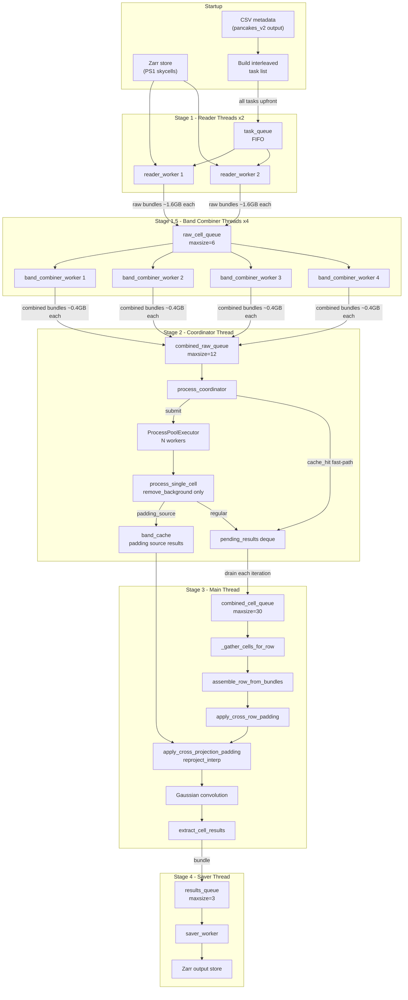
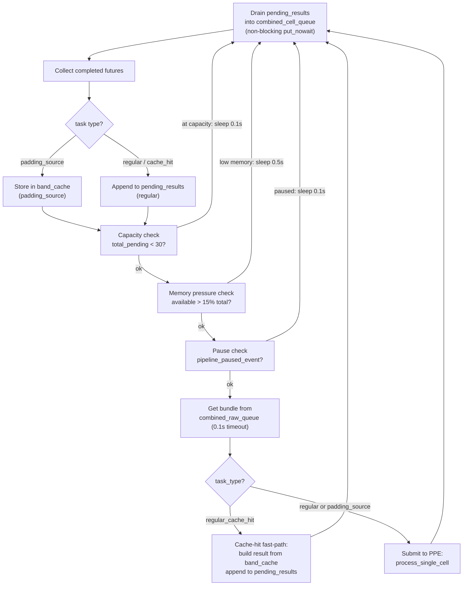
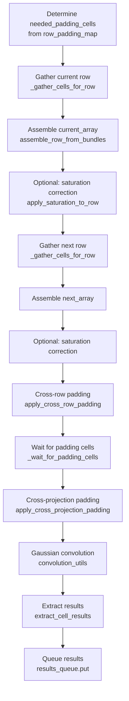
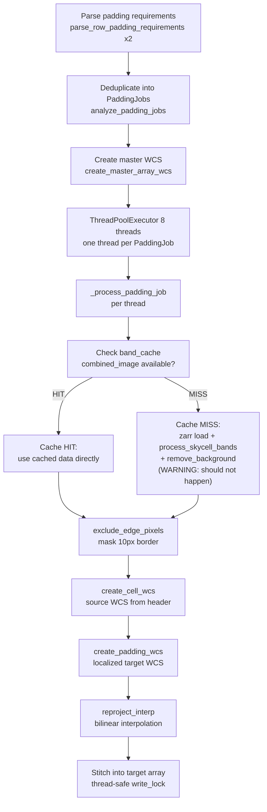

> **Package integration**: `syndiff-template` stage `ps1_process` · module `template/ps1_process.py` · legacy script `process_ps1.py`  
> **Orchestration docs**: [template pipeline guide](../template_pipeline.md) · [HTCondor](../template_pipeline.md#htcondor-integration)

# PS1 Template Processing Pipeline — Detailed Technical Reference

`process_ps1.py` builds a deep-sky reference template by reading Pan-STARRS 1 (PS1) skycell images from a Zarr store, combining multi-band exposures, removing backgrounds and saturated stars, stitching cells into large "master arrays" using a sliding window, applying padding at projection and cross-projection boundaries, convolving with a Gaussian PSF, and saving convolved results back to a Zarr store. This document explains every stage in detail.

---

## Table of Contents

1. [Concepts and Data Model](#1-concepts-and-data-model)
2. [Pipeline Overview](#2-pipeline-overview)
3. [Startup: Configuration and Task Scheduling](#3-startup-configuration-and-task-scheduling)
4. [Stage 1 — Reader Workers](#4-stage-1--reader-workers)
5. [Stage 1.5 — Band Combiner Workers](#5-stage-15--band-combiner-workers)
6. [Stage 2 — Process Coordinator and ProcessPoolExecutor](#6-stage-2--process-coordinator-and-processpoolexecutor)
7. [Cell Processing: process_single_cell](#7-cell-processing-process_single_cell)
8. [Stage 3 — Sequential Assembler (Main Thread)](#8-stage-3--sequential-assembler-main-thread)
9. [Cross-Row Padding](#9-cross-row-padding)
10. [Cross-Projection Padding](#10-cross-projection-padding)
11. [Band Cache and Padding Source Pre-loading](#11-band-cache-and-padding-source-pre-loading)
12. [Manual Fallback Loader](#12-manual-fallback-loader)
13. [Stage 4 — Saver Worker](#13-stage-4--saver-worker)
14. [Saturation Correction](#14-saturation-correction)
15. [Memory Management and OOM Prevention](#15-memory-management-and-oom-prevention)
16. [Concurrency Control and Throttling](#16-concurrency-control-and-throttling)
17. [Queue and Buffer Reference](#17-queue-and-buffer-reference)
18. [Key Constants](#18-key-constants)
19. [Running the Pipeline](#19-running-the-pipeline)
20. [Log Prefixes Quick Reference](#20-log-prefixes-quick-reference)

---

## 1. Concepts and Data Model

### Skycells

The sky is divided into a grid of **skycells** by the PS1 survey. Each skycell has a name like `skycell.2556.082` where `2556` is the **projection** (a large sky tile) and `082` is the **cell index within that projection**. Each skycell is ~4800×4800 pixels and has four band images (r, i, z, y), corresponding mask arrays (bit-packed uint16), and per-band variance ("weight") maps stored in the Zarr archive.

### Projections

A **projection** is a group of skycells that share the same tangent-point WCS. Projections are processed one at a time, sequentially. Within a projection, cells are arranged in rows (y-coordinate) and columns (x-coordinate).

### The Sliding Window

Processing a projection requires assembling cells row by row. The pipeline uses a **two-row sliding window**: at each step it holds:

- `current_array`: the master array for the row being convolved and saved
- `next_array`: the master array for the immediately following row

After convolution of `current_array`, the window advances — `next_array` becomes `current_array`, and a new empty `next_array` is prepared for the next row.

### Master Array

Each master array is a large 2-D float32 image tall enough for one cell height plus padding zones:

```
height = cell_height + 2 × PAD_SIZE    (PAD_SIZE = 480 px)
width  = PAD_SIZE + (N_cells × (cell_width - CELL_OVERLAP)) + CELL_OVERLAP + PAD_SIZE
```

Cells are placed at fixed x-offsets accounting for the `CELL_OVERLAP = 480` px between adjacent cells.

---

## 2. Pipeline Overview



The five stages run concurrently:
- **Stage 1** (2 reader threads): I/O-bound zarr reads, produces raw bundles ~1.6 GB each
- **Stage 1.5** (4 band combiner threads): CPU-bound NumPy band combination, compresses 1.6 GB → ~0.4 GB per cell
- **Stage 2** (1 coordinator thread + N PPE processes): CPU-bound SEP source extraction only
- **Stage 3** (main thread): sequential sliding-window assembly, padding, convolution
- **Stage 4** (1 saver thread): writes results to output Zarr

### Why Five Stages?

Previously, Stages 1.5 and 2 were merged: raw 4-band bundles (~1.6 GB each) were passed directly from reader threads through `raw_cell_queue` into subprocess workers, where both band combination and source extraction ran together. With `maxsize=20` and 8 workers, up to ~48 GB of raw band data could be resident in memory at once, causing the Linux OOM killer to terminate the process.

The split separates two very different workloads:
- **Band combination** (`process_skycell_bands`) is fast (~4 s), NumPy-only, thread-safe, and produces a 4× smaller output. Running it in threads (no process fork, no CoW overhead) eliminates the per-process memory tax.
- **Source extraction** (`remove_background` via SEP) is slow (~60–120 s), benefits from subprocess isolation, and now receives a much lighter ~0.4 GB bundle instead of a 1.6 GB one.

---

## 3. Startup: Configuration and Task Scheduling

### CSV Metadata

`pancakes_v2.py` produces a CSV file that maps each TESS sector/camera/CCD to a set of PS1 skycells. Each row in the CSV contains:

| Column | Meaning |
|---|---|
| `projection` | PS1 projection ID |
| `NAME` | Full skycell name (e.g. `skycell.2556.082`) |
| `x` | Column position within the projection |
| `y` | Row position (row ID for the sliding window) |
| `NAXIS1/2` | Cell pixel dimensions |

The pipeline reads this CSV, groups cells by `(projection, y)`, and determines the processing order.

### Cross-Projection Padding Identification

Before any tasks are dispatched, `identify_all_padding_sources()` scans every projection and every row in the CSV to find which skycells from *other* projections are needed to fill the padding borders of each step's master arrays. This is a pure DataFrame operation — no I/O. It returns:

- `padding_sources`: `{skycell_name → source_projection}` — the full set of unique padding source cells
- `band_cache_uses`: `{skycell_name → use_count}` — how many times each cell will be needed (for cache eviction)
- `row_padding_map`: `{(projection, row_id) → set of skycell_names}` — which cells each step needs

### Interleaved Task List

All tasks are placed into `task_queue` in a carefully computed order **before** the sequential processor starts. The order is designed so that padding source cells enter the pipeline immediately after the regular cells they accompany, giving the PPE workers maximum lead time before the main thread needs them.

The order for one projection with rows `[R0, R1, R2, R3]`:

```
[R0 regular cells]
[R1 regular cells]
[Padding cells for step 0 (uses R0 + R1)]   ← inserted here
[R2 regular cells]
[Padding cells for step 1 (uses R1 + R2)]   ← inserted here
[R3 regular cells]
[Padding cells for step 2 (uses R2 + R3)]   ← inserted here
[Padding cells for last step (R3, no next)] ← appended at end
```

Cells needed by multiple steps are only dispatched once (tracked by `already_dispatched_padding`). Subsequent steps find the cell already in `band_cache`.

After putting all tasks in `task_queue`, `None` signals are sent to terminate the reader threads. Readers are fully done — and may have exited — by the time the sequential processor starts.

---

## 4. Stage 1 — Reader Workers

**Two `reader_worker` threads** consume from `task_queue`. Each task is either a 4-tuple (regular cell) or a 5-tuple with task type (padding source):

```python
(skycell_id, projection, row_id, x_coord)               # regular
(skycell_id, projection, -1, 0, "padding_source")        # padding
```

For each task the reader:

1. **Checks `band_cache`** (regular tasks only): if already processed and cached, emits a lightweight `"regular_cache_hit"` bundle — no zarr I/O.
2. **Opens the zarr store** and calls `load_skycell_bands_masks_and_headers()` — reads r, i, z, y band arrays, mask arrays, variance arrays, and FITS header strings.
3. **Puts a `raw_bundle`** onto `raw_cell_queue` with all the loaded arrays plus task type metadata.

`raw_cell_queue` has `maxsize=6` (down from 20), holding at most ~9.6 GB of raw data at any one time. Two readers are sufficient since the downstream band combiners process bundles quickly.

---

## 5. Stage 1.5 — Band Combiner Workers

**Four `band_combiner_worker` threads** consume raw bundles from `raw_cell_queue` and output reduced bundles to `combined_raw_queue`. This is the **compression stage** of the pipeline.

### What it does

For each raw bundle (carrying r, i, z, y band arrays, masks, variance maps, and header strings), the band combiner:

1. Calls `process_skycell_bands` — applies PS1 flux conversion per band and combines the four bands into a single `combined_image` (float32), `combined_mask` (uint16), and `combined_uncert` (float32).
2. Drops the raw band arrays (`del raw_bundle`) immediately after combination to free ~1.2 GB.
3. Puts a **reduced bundle** onto `combined_raw_queue` — only `combined_image`, `combined_mask`, `combined_uncert`, `headers_data`, and metadata.

### Memory impact

| Bundle type | Approximate size |
|---|---|
| `raw_bundle` (in `raw_cell_queue`) | ~1.6 GB (4 bands × data + mask + weight) |
| `reduced_bundle` (in `combined_raw_queue`) | ~0.4 GB (combined_image + mask + uncert) |

With `raw_cell_queue` maxsize=6 and `combined_raw_queue` maxsize=12, the maximum in-queue memory is:

```
6 × 1.6 GB + 12 × 0.4 GB = 9.6 GB + 4.8 GB = 14.4 GB
```

This is less than half of the former ~48 GB peak.

### Passthrough behaviour

Bundles without `bands_data` (cache-hit fast-path bundles) are forwarded to `combined_raw_queue` unchanged, since they carry no raw arrays.

### Thread count: why 4?

Band combination is CPU-bound NumPy work (~4 s per cell). Four threads keep `combined_raw_queue` well-fed without starving the readers or over-subscribing the CPU relative to the more expensive source extraction stage downstream.

### Shutdown

Each band combiner thread exits when it reads a `None` sentinel from `raw_cell_queue` and forwards one `None` to `combined_raw_queue`. The pipeline sends exactly one sentinel per thread (`num_band_combiners = 4`), so the coordinator receives its shutdown signal after the last combiner exits.

---

## 6. Stage 2 — Process Coordinator and ProcessPoolExecutor

The **coordinator thread** bridges `combined_raw_queue` (output of band combiners) with a `ProcessPoolExecutor` (N source-extractor workers). It runs a tight loop:



### Non-blocking output (pending_results deque)

Rather than blocking on `combined_cell_queue.put()`, the coordinator appends to a local `deque`. At the top of every loop iteration it attempts `put_nowait()` into `combined_cell_queue` and stops if the queue is full. This ensures the coordinator thread can never freeze even when the main thread is occupied with multi-minute padding operations.

### Routing by task type

| Task type | What happens |
|---|---|
| `regular` | Submitted to PPE → `process_single_cell` → result appended to `pending_results` → flows to `combined_cell_queue` |
| `regular_cache_hit` | Result built directly from `band_cache` → appended to `pending_results` → flows to `combined_cell_queue`. Zero subprocess cost. |
| `padding_source` | Submitted to PPE → `process_single_cell` → result stored in `band_cache`. Never goes to `combined_cell_queue`. |

### Capacity throttling

`total_pending = len(active_tasks) + combined_cell_queue.qsize()`. When this exceeds `MAX_TOTAL_PENDING_WORK = 30`, the coordinator sleeps 0.1 s without fetching new work.

### Runtime memory pressure guard

Every iteration the coordinator checks `psutil.virtual_memory().available`. If available RAM drops below `MIN_AVAILABLE_MEMORY_FRACTION = 0.15` (15%) of total, it sleeps 0.5 s and does not submit new work. A rate-limited warning is logged at most once per 30 s. This acts as a last-resort brake against OOM kills when all other throttles are insufficient.

### Pause during cross-projection padding

When the main thread begins `apply_cross_projection_padding`, it sets a `pipeline_paused_event` (a `threading.Event`). The coordinator sees this flag, stops submitting new tasks to PPE, and sleeps 0.1 s per iteration. This frees PPE workers to finish their current tasks, giving the `reproject_interp` calls inside the padding threads more CPU bandwidth.

### PPE worker count — dynamic scaling

At startup, `num_source_extractors` is computed from available RAM and CPU count:

```python
mem_limit = max(2, int(available_gb // 4))   # each worker may dirty ~4 GB
num_source_extractors = max(2, min(ncpus // 2, mem_limit))
```

Previously workers received raw 4-band bundles and dirtied ~10 GB each (CoW fork); now they receive pre-combined ~0.4 GB bundles, so the per-worker memory budget is ~4 GB, roughly doubling the number of workers that can run safely on the same machine.

---

## 7. Cell Processing: process_single_cell

`process_single_cell` runs inside each PPE subprocess. It now receives a **pre-combined bundle** from `band_combiner_worker` — containing `combined_image`, `combined_mask`, and `combined_uncert` — and performs only the **source extraction** step.

### Background removal and source detection — `remove_background`

Uses [SEP](https://sep.readthedocs.io/) (Source Extractor as a Python library):

1. Identifies bright-star pixels: `data > nanmedian(uncert) × sigma_mask (50)`.
2. Calls `sep.extract()` with `sigma=2.5` to detect sources, producing a segmentation map.
3. Sets all non-source, non-bright-star pixels to zero (background suppression).
4. **If `--remove-saturated-stars`**: uses the PS1 saturation mask bits (`0x0020 AND 0x1000`), expands object footprints via distance transform, identifies SEP segments overlapping saturated pixels, and sets those pixels to zero. Records removed star properties (centroid, flux, size, etc.) for output to a CSV.

### Enriching star records

Removed star pixel coordinates are converted to RA/Dec using the FITS WCS from the cell's `headers_data`. Each record includes: SEP shape parameters, `skycell_id`, `ra`, `dec`.

### Shared memory output

Rather than returning large NumPy arrays through the `ProcessPoolExecutor`'s internal pickle pipe (which can deadlock on pipe buffer overflow), `process_single_cell` writes `combined_image` and `combined_mask` to POSIX shared memory blocks and returns only lightweight descriptors:

```python
{"shm_name": str, "shape": tuple, "dtype": str}
```

The coordinator calls `_materialize_shm_result` to reconstruct the arrays in the coordinator's address space and immediately unlinks the shared memory block.

### Output bundle (after materialization in coordinator)

```python
{
    "skycell_id": str,
    "projection": str,
    "row_id": int,
    "x_coord": int,
    "combined_image": np.ndarray,   # float32, 4800×4800
    "combined_mask":  np.ndarray,   # uint16, 4800×4800
    "headers_data":   dict,         # band → FITS header string
    "removed_stars":  list[dict],   # one dict per removed star
}
```

---

## 8. Stage 3 — Sequential Assembler (Main Thread)

The main thread runs `sequential_processor`, which loops over projections and, within each projection, over row steps.

### Per-step logic in `process_row_step_from_queue`



### _gather_cells_for_row

Waits for all cells of a given `(projection, row_id)` to arrive in `combined_cell_queue`. The cell buffer `cell_buffer[(projection, row_id)]` may already hold cells that arrived early (out-of-order arrivals from the coordinator).

**Timeout logic**: If no relevant cell arrives for `GATHER_TIMEOUT_SECONDS = 180` s, the function:
1. Does a non-blocking sweep of `combined_cell_queue` to recover any late arrivals.
2. Calls `_manually_process_cell` for each still-missing cell (see Section 12).

A "still gathering..." log message is emitted at most once per minute.

### assemble_row_from_bundles

Places each cell's `combined_image` into the master array at the correct x-offset. Cells overlap by `CELL_OVERLAP = 480` px; only the non-overlapping portion of each cell (past the `EDGE_EXCLUSION = 10` px guard zone) is placed. The PAD_SIZE padding areas at left, right, top, and bottom remain NaN until filled by padding steps.

### Advancing the window

After step `i` is complete, `advance_sliding_window` moves `next_array` → `current_array`, resets `next_array` to NaN, and updates all position tracking. Step `i+1` does not re-gather row `i+1` (it becomes the new current row that was the previous next row).

---

## 8. Cross-Row Padding

Before cross-projection padding and convolution, `apply_cross_row_padding` fills the top/bottom padding zones of each master array using data from the other:

```
current_array[bottom_pad] ← next_array[overlap_source]
next_array[top_pad]       ← current_array[overlap_source]
```

The `CELL_OVERLAP = 480` px between adjacent rows means there is real shared sky data to copy. The `EDGE_EXCLUSION = 10` px prevents copying the very edge pixels that may have artifacts. This step is pure in-memory numpy slicing — no I/O.

---

## 9. Cross-Projection Padding

Adjacent PS1 projections have different WCS tangent points, so their cells cannot be directly overlaid. When a TESS pixel falls near the boundary of projection A, it may need data from a skycell belonging to projection B. This is **cross-projection padding**.

The CSV produced by `pancakes_v2.py` encodes where each boundary cell needs padding from and which source skycell in an adjacent projection provides it.

### apply_cross_projection_padding

Called once per row step (for both current and next row simultaneously). The full flow:



### PaddingJob deduplication

A single source skycell may be needed by both `current_array` and `next_array`. `analyze_padding_jobs` creates one `PaddingJob` per unique source cell with a `targets` list so each cell is loaded only once per padding call, even if it contributes to multiple arrays.

### reproject_interp

This is the most expensive operation. It uses `astropy`'s `reproject_interp` to resample the source skycell (in its native WCS) into the localized WCS of each target padding location. The GIL is released during the C-level interpolation, so multiple padding threads make real parallel progress.

To give `reproject_interp` full CPU access, the coordinator pauses new PPE submissions (`pipeline_paused_event.set()`) for the duration of this call.

---

## 10. Band Cache and Padding Source Pre-loading

The `band_cache` is a shared dict used to avoid redundant processing of cells that serve dual roles.

```
band_cache[skycell_name] = {
    "combined_image": np.ndarray,   # fully processed float32 image
    "combined_mask":  np.ndarray,
    "headers_data":   dict,
    "removed_stars":  list,
}
```

### How padding sources enter the cache

At startup, all padding source cells are identified and inserted into the interleaved task list as `"padding_source"` tasks. The reader loads them from zarr; the band combiner combines the raw bands; the coordinator submits them through `process_single_cell` (background removal + optional star removal); and the coordinator routes the result to `band_cache` instead of `combined_cell_queue`.

### How the cache is used in _process_padding_job

When `_process_padding_job` runs, it first checks `band_cache[job.skycell_name]`. On a cache hit it copies the `combined_image` directly and proceeds to `exclude_edge_pixels` + `reproject_interp` — skipping zarr I/O and all band processing entirely.

### Dual-role cells

A cell like `skycell.2556.082` might be:
- A **padding source** for projection `2557`
- Also a **regular cell** in projection `2556`'s own rows

When the coordinator first processes it as `"padding_source"`, the result goes to `band_cache`. When the reader later sees the regular task for the same cell, it detects the cache hit and emits a `"regular_cache_hit"` bundle. The coordinator builds the result bundle directly from cache — zero subprocess overhead, no zarr load, no band processing.

`band_cache_uses` tracks how many times each cell will be needed. After each row step, `_evict_band_cache_for_step` decrements the use counter for all cells consumed in that step and deletes entries whose count reaches zero, keeping memory bounded.

### _wait_for_padding_cells

Before calling `apply_cross_projection_padding`, the main thread calls `_wait_for_padding_cells`:

1. Computes `remaining = needed_cells - already_in_cache`.
2. If empty: proceeds immediately.
3. Otherwise: polls `band_cache` every 0.5 s.
4. Logs "still waiting..." at most once per minute with elapsed time and timeout remaining.
5. If `timeout = 180` s passes since the last cell arrived: triggers `_manually_process_cell` for each still-missing cell (places result directly in `band_cache`).

---

## 11. Manual Fallback Loader

`_manually_process_cell` is the shared fallback used when the pipeline has not delivered a result within the timeout. It runs directly in the main thread:

```python
zarr.open() → load_skycell_bands_masks_and_headers()
            → process_skycell_bands()
            → remove_background()          # identical to pipeline path
            → RA/Dec enrichment of star records
```

Both fallback paths use this single function:

- `_gather_cells_for_row` calls it for missing **regular cells**, wraps the result in a full bundle dict.
- `_wait_for_padding_cells` calls it for missing **padding cells**, places the result directly in `band_cache`.

**Why not push to the reader queue instead?** By the time a timeout fires in `sequential_processor`, the reader threads have already exited (they exit after consuming their `None` shutdown signals, which are sent before `sequential_processor` starts). Executing directly in the main thread is the only reliable path. It completes in a known amount of time (typically 30–90 s per cell) without depending on pipeline capacity.

---

## 13. Stage 4 — Saver Worker

`saver_worker` runs as a **daemon thread**. It receives `processed_bundle` dicts from `results_queue` and calls `zarr_utils.save_convolved_results()` to write the convolved cell arrays into the output Zarr store, keyed by `(projection, row_id, skycell_id)`.

`results_queue` has `maxsize=3`, which provides backpressure — if the saver is slow, the main thread will block on `results_queue.put()`, naturally throttling the pipeline.

---

## 14. Saturation Correction

When `--enable-saturation-correction` is passed (and `--remove-saturated-stars` is not), a Gaia star catalog is loaded. After assembling each row into the master array, `apply_saturation_to_row` uses the Gaia RA/Dec coordinates of bright stars to correct saturated pixels in the master array. This step runs after each row is assembled, before padding and convolution.

---

## 15. Memory Management and OOM Prevention

Previous versions of the pipeline were vulnerable to the Linux OOM killer terminating the process when too many large raw bundles accumulated in queues. The current architecture employs a layered defence:

### Layer 1: Queue size limits on raw data

`raw_cell_queue` is capped at `maxsize=6` (down from 20). With ~1.6 GB per raw bundle, this limits raw-bundle queue memory to ~9.6 GB.

### Layer 2: Band compression before subprocesses

`band_combiner_worker` threads consume raw bundles and output ~0.4 GB combined bundles to `combined_raw_queue` (maxsize=12). The total in-queue peak across both queues is:

```
6 × 1.6 GB + 12 × 0.4 GB = 9.6 + 4.8 = ~14.4 GB
```

Previously: `20 × 1.6 GB = ~32 GB` in `raw_cell_queue` alone, plus subprocess memory.

### Layer 3: Runtime memory pressure guard

The coordinator polls `psutil.virtual_memory().available` every iteration. If available RAM falls below 15% of total (`MIN_AVAILABLE_MEMORY_FRACTION = 0.15`), no new tasks are submitted to the PPE until memory recovers.

### Layer 4: PPE capacity cap

`MAX_TOTAL_PENDING_WORK = 30` limits the combined count of in-flight PPE tasks and buffered results in `combined_cell_queue`, preventing the subprocess pool from holding unbounded processed results.

### Layer 5: Process cleanup on exit

`atexit.register(_cleanup_child_processes)` and a `try/finally` block in the pipeline orchestrator ensure that PPE worker processes are forcefully terminated if the main process exits for any reason (including an OOM kill of a subprocess), preventing orphaned worker processes from accumulating across restarts.

---

## 16. Concurrency Control and Throttling

| Mechanism | Effect |
|---|---|
| `raw_cell_queue maxsize=6` | Backpressure on readers — caps raw in-flight memory at ~9.6 GB |
| `combined_raw_queue maxsize=12` | Backpressure on band combiners — caps combined in-flight memory at ~4.8 GB |
| `combined_cell_queue maxsize=30` | Backpressure on coordinator — prevents SEP results from filling RAM |
| `results_queue maxsize=3` | Backpressure on main thread — prevents convolved results piling up if saver is slow |
| `MAX_TOTAL_PENDING_WORK=30` | Coordinator stops submitting new PPE tasks when `active + queue_size >= 30` |
| `MIN_AVAILABLE_MEMORY_FRACTION=0.15` | Coordinator pauses submissions when available RAM < 15% of total |
| `pipeline_paused_event` | Main thread signals coordinator to pause during `reproject_interp` |
| `pending_results deque` | Non-blocking buffer between PPE results and `combined_cell_queue`; prevents coordinator freeze |
| `band_cache_uses` eviction | Evicts fully-used entries after each row step; bounds peak cache memory |

---

## 17. Queue and Buffer Reference

| Name | Type | maxsize | Direction | Purpose |
|---|---|---|---|---|
| `task_queue` | `queue.Queue` | unbounded | Startup → Readers | Ordered task tuples (cell name, projection, row, x, type) |
| `raw_cell_queue` | `queue.Queue` | 6 | Readers → Band Combiners | Raw zarr-loaded band bundles (~1.6 GB each) |
| `combined_raw_queue` | `queue.Queue` | 12 | Band Combiners → Coordinator | Pre-combined bundles (~0.4 GB each) |
| `combined_cell_queue` | `queue.Queue` | 30 | Coordinator → Main thread | Fully processed cell bundles (SEP complete) |
| `results_queue` | `queue.Queue` | 3 | Main thread → Saver | Convolved row results |
| `cell_buffer` | `dict[(proj, row_id) → list]` | — | In-memory | Out-of-order cell bundles waiting for their row |
| `band_cache` | `dict[skycell_name → dict]` | — | In-memory | Fully processed images for padding and dual-role reuse |
| `pending_results` | `deque` | — | Coordinator-internal | Non-blocking staging area before `combined_cell_queue` |

All queues use `queue.Queue` (threading) rather than `multiprocessing.Queue`. This avoids POSIX semaphore corruption that occurs when `ProcessPoolExecutor` workers inherit pipe file descriptors from a `multiprocessing.Queue` created before the fork.

---

## 18. Key Constants

| Constant | Value | Meaning |
|---|---|---|
| `CELL_OVERLAP` | 480 px | Pixel overlap between adjacent cells in a row |
| `EDGE_EXCLUSION` | 10 px | Edge guard zone masked during padding |
| `EFFECTIVE_OVERLAP` | 470 px | `CELL_OVERLAP - EDGE_EXCLUSION` |
| `PAD_SIZE` | 480 px | Height of top/bottom/left/right padding zones in master array |
| `GATHER_TIMEOUT_SECONDS` | 180 s | Max wait since last cell arrival before manual fallback |
| `MAX_TOTAL_PENDING_WORK` | 30 | PPE active tasks + combined queue size cap |
| `MIN_AVAILABLE_MEMORY_FRACTION` | 0.15 | RAM fraction below which coordinator pauses submissions |
| `num_readers` | 2 | Zarr reader thread count (fixed) |
| `num_band_combiners` | 4 | Band combiner thread count (fixed) |
| `num_source_extractors` | dynamic | SEP subprocess count: `min(ncpus // 2, available_gb // 4)` |
| `band weights` | r=0.238, i=0.344, z=0.283, y=0.135 | PS1 band combination weights |

---

## 19. Running the Pipeline

```bash
python process_ps1.py SECTOR CAMERA CCD [OPTIONS]
```

| Argument | Description |
|---|---|
| `sector` | TESS sector number |
| `camera` | TESS camera number (1–4) |
| `ccd` | TESS CCD number (1–4) |
| `--data-root DIR` | Root directory for data (default: `data`) |
| `--limit N` | Process only the first N projections (useful for testing) |
| `--psf-sigma FLOAT` | Gaussian PSF sigma in pixels (default: 40.0) |
| `--enable-saturation-correction` | Apply Gaia-catalog-based saturation correction |
| `--remove-saturated-stars` | Use SEP to detect, remove, and record saturated stars |
| `--catalog-path PATH` | Override default Gaia catalog path |

**Expected directory structure:**

```
data/
  ps1_skycells_zarr/ps1_skycells.zarr   ← input
  convolved_results/                    ← output (created automatically)
  catalogs/sector_NNNN/camera_N/ccd_N/  ← Gaia catalog (if saturation correction)
  <CSV file discovered via find_csv_file>
```

**Typical run (sector 20, camera 3, CCD 3, remove saturated stars):**

```bash
python process_ps1.py 20 3 3 --remove-saturated-stars 2>&1 | tee log/comb_20_3_3_sat_rm.log
```

---

## 20. Log Prefixes Quick Reference

| Prefix | Stage | Meaning |
|---|---|---|
| `[Pipeline]` | Startup | Initialization, task dispatch, shutdown |
| `[Reader]` | Stage 1 | Zarr loads, cache hits |
| `[BandCombiner]` | Stage 1.5 | Band combination per cell (thread) |
| `[ProcessCoordinator]` | Stage 2 | Capacity, memory pressure, routing, PPE submissions |
| `[PreProcessor]` | Stage 2/PPE | Source extraction (SEP) per cell |
| `[Gather]` | Stage 3 | Waiting for cells, buffer hits, queue sweeps |
| `[ManualLoader]` | Stage 3 fallback | Synchronous zarr load when pipeline times out |
| `[Assembler]` | Stage 3 | Master array cell placement |
| `[SequentialProcessor]` | Stage 3 | Per-row step timing and progress |
| `[PaddingGather]` | Stage 3 | Waiting for padding cells in band_cache |
| `[CrossPadding]` | Stage 3 | reproject_interp job progress per cell |
| `[Saver]` | Stage 4 | Output zarr writes |
| `[Band]` | band_utils | Flux conversion, mask combination |
