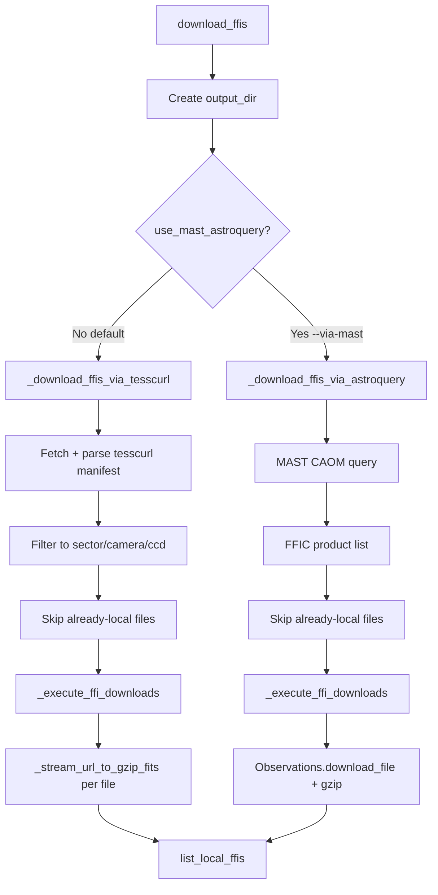
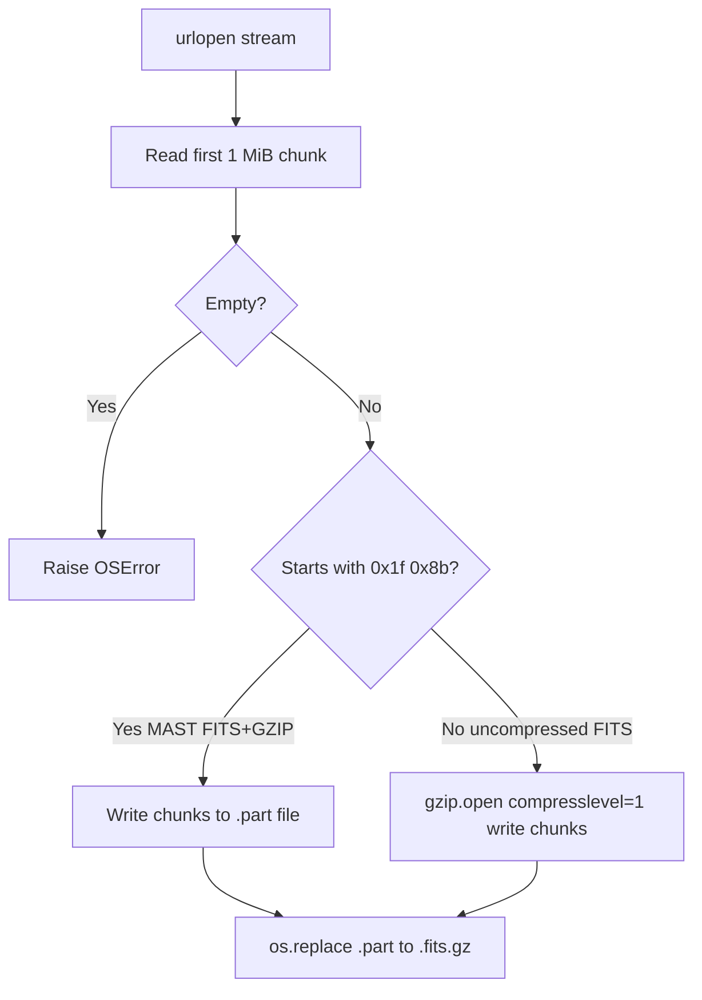

# TESS FFI FITS Download

This document describes how the syndiff pipeline downloads **calibrated TESS Full Frame Images (FFICs)** from MAST, stores them on disk, verifies completeness, and exposes them to downstream stages (WCS grouping, template creation, difference imaging).

Implementation lives in [`syndiff_pipeline/common/download.py`](../../syndiff_pipeline/common/download.py). The pipeline stage name is **`tess_ffi_download`**.

---

## Table of contents

1. [What is being downloaded](#1-what-is-being-downloaded)
2. [Role in the syndiff pipeline](#2-role-in-the-syndiff-pipeline)
3. [Source code map](#3-source-code-map)
4. [On-disk layout and naming](#4-on-disk-layout-and-naming)
5. [High-level download flow](#5-high-level-download-flow)
6. [Download path A — tesscurl manifest (default)](#6-download-path-a--tesscurl-manifest-default)
7. [Download path B — astroquery / MAST CAOM (fallback)](#7-download-path-b--astroquery--mast-caom-fallback)
8. [Streaming directly to `.fits.gz`](#8-streaming-directly-to-fitsgz)
9. [Parallel workers](#9-parallel-workers)
10. [Skip, resume, and overwrite](#10-skip-resume-and-overwrite)
11. [Artifact verification](#11-artifact-verification)
12. [Running downloads](#12-running-downloads)
13. [Progress reporting](#13-progress-reporting)
14. [How downstream stages read FFIs](#14-how-downstream-stages-read-ffis)
15. [Performance notes (NFS and workers)](#15-performance-notes-nfs-and-workers)
16. [Troubleshooting](#16-troubleshooting)
17. [API reference](#17-api-reference)

---

## 1. What is being downloaded

TESS observes the sky in **sectors**. Each sector covers a patch of sky for roughly four weeks. Within a sector, data are organized by **camera** (1–4) and **CCD** (1–4). For each camera/CCD pair the SPOC pipeline produces a time series of **Full Frame Images (FFIs)** — calibrated 2D images of the entire CCD.

The syndiff pipeline downloads the **calibrated FFI product** from MAST:

| Property | Value |
|----------|-------|
| MAST product subgroup | `FFIC` (calibrated full-frame image) |
| Provenance | `SPOC` |
| Typical file size | ~30 MB on disk as `.fits.gz` (MAST serves FITS+GZIP) |
| Image shape | 2136 × 2078 pixels (science array in HDU 1) |
| Cadence | Depends on TESS cycle (30 min, 10 min, or 200 s) |

**Filename pattern** (manifest basename, before local gzip suffix):

```text
tess<timestamp>-s<sector>-<camera>-<ccd>-<frame>-s_ffic.fits
```

Example:

```text
tess2020019142923-s0020-3-3-0165-s_ffic.fits
```

Decoded fields:

| Token | Meaning |
|-------|---------|
| `tess2020019142923` | Timestamp embedded in the SPOC product ID |
| `s0020` | Sector 20 |
| `3` | Camera 3 |
| `3` | CCD 3 |
| `0165` | Frame index within the sector/camera/CCD sequence |
| `_ffic` | Calibrated FFI product type |

On disk the pipeline stores **`*.fits.gz`**, not plain `*.fits`.

---

## 2. Role in the syndiff pipeline

`tess_ffi_download` is the **first template-creation stage** for a target. It populates a shared cache under `{data_root}/tess_ffi/` that later stages consume:


Key properties:

- **Shared cache:** FFIs for a given sector/camera/CCD (SCC) are downloaded once and reused across targets that share the same SCC.
- **Diff-only runs:** `tess_ffi_download` is in `DIFF_VERIFY_UPSTREAM` — diff imaging verifies that upstream FFI artifacts exist before launching.
- **No per-target FFI copies:** Science FITS written later live under `events/{label}/ws/`; the raw SPOC cache stays under `tess_ffi/`.

Stage dispatch ([`dispatch.py`](../../syndiff_pipeline/template_creation/orchestration/dispatch.py)):

```python
download_ffis(sector=t.sector, camera=t.camera, ccd=t.ccd, output_dir=out_dir)
```

`max_workers` is not overridden in dispatch — the module default (**8**) applies.

---

## 3. Source code map

| File | Responsibility |
|------|----------------|
| [`syndiff_pipeline/common/download.py`](../../syndiff_pipeline/common/download.py) | Download logic, path helpers, CLI |
| [`syndiff_pipeline/template_creation/orchestration/dispatch.py`](../../syndiff_pipeline/template_creation/orchestration/dispatch.py) | Runs `download_ffis` for stage `tess_ffi_download` |
| [`syndiff_pipeline/template_creation/orchestration/verify.py`](../../syndiff_pipeline/template_creation/orchestration/verify.py) | `verify_tess_ffi_download` — completeness check |
| [`syndiff_pipeline/template_creation/orchestration/stage_progress.py`](../../syndiff_pipeline/template_creation/orchestration/stage_progress.py) | Parses `FFI download progress: N/M` from logs |
| [`syndiff_pipeline/template_creation/orchestration/runner_config.py`](../../syndiff_pipeline/template_creation/orchestration/runner_config.py) | Resolves `ffi_dir` from site config |
| [`docs/storage_layout.md`](../storage_layout.md) | Canonical directory tree |
| [`tests/test_download_ffis.py`](../../tests/test_download_ffis.py) | Unit tests for gzip paths, streaming, parallelism |

---

## 4. On-disk layout and naming

### Directory tree

Default layout (function `nested_ffi_dir`):

```text
{ffi_dir}/
  s{sector:04d}/
    cam{camera}_ccd{ccd}/
      tess*_ffic.fits.gz
      tesscurl_sector_{sector}_ffic.sh    # cached manifest (tesscurl path only)
```

`ffi_dir` resolves from site config:

1. Explicit `ffi_dir` in deployment config, if set.
2. Otherwise `{data_root}/tess_ffi`.

Example for sector 20, camera 3, CCD 3:

```text
/astro/armin/koji/syndiff/data/tess_ffi/s0020/cam3_ccd3/
  tess2020019142923-s0020-3-3-0165-s_ffic.fits.gz
  tess2020019142924-s0020-3-3-0166-s_ffic.fits.gz
  ...
  tesscurl_sector_20_ffic.sh
```

### Manifest basename vs on-disk name

The **tesscurl manifest** lists basenames ending in `_ffic.fits`. Locally we store `_ffic.fits.gz`.

| Context | Example basename |
|---------|------------------|
| tesscurl manifest / MAST product table | `tess..._ffic.fits` |
| On disk (current) | `tess..._ffic.fits.gz` |
| Legacy on disk (still supported) | `tess..._ffic.fits` |

Mapping helpers:

- `spoc_ffi_gzip_basename("…_ffic.fits")` → `…_ffic.fits.gz`
- `manifest_basename_from_local("…_ffic.fits.gz")` → `…_ffic.fits`

Skip logic and verification compare **manifest basenames**, so a local `.fits.gz` satisfies a manifest entry for `.fits`.

### Glob and discovery

`list_local_ffis(ffi_dir, sector, camera, ccd)`:

1. Globs `tess*-s{sector:04d}-{camera}-{ccd}-*_*_ffic.fits.gz` first.
2. Falls back to plain `*_ffic.fits` for legacy trees.
3. If both exist for the same product, **prefers `.fits.gz`**.

---

## 5. High-level download flow

Entry point: `download_ffis(sector, camera, ccd, output_dir, ...)`.



Returns: sorted list of absolute paths to all local FFIs for that SCC (downloaded + pre-existing).

---

## 6. Download path A — tesscurl manifest (default)

### Why tesscurl?

STScI publishes per-sector shell scripts that list `curl` commands for every FFI in the sector:

```text
https://archive.stsci.edu/missions/tess/download_scripts/sector/tesscurl_sector_{N}_ffic.sh
```

The pipeline **does not execute curl**. It:

1. Downloads the script body via `urllib`.
2. Parses each line matching `curl … -o <basename> <url>`.
3. Filters URLs to the requested camera/CCD.
4. Downloads FITS bytes with `urllib` directly from the parsed URLs.

This avoids a `curl` subprocess dependency and gives full control over streaming, gzip handling, and parallelism.

### Step-by-step

| Step | Function | Details |
|------|----------|---------|
| 1 | `_fetch_bytes(script_url)` | GET manifest; timeout 120 s |
| 2 | Write cache | `tesscurl_sector_{N}_ffic.sh` under output dir |
| 3 | `parse_tesscurl_script` | Regex `_CURL_LINE_RE` extracts `(basename, url)` pairs |
| 4 | `_ffic_product_basename_matches` | Keep only this SCC |
| 5 | Skip existing | Compare manifest basenames to `list_local_ffis` unless `overwrite=True` |
| 6 | Build tasks | One closure per file calling `_stream_url_to_gzip_fits` |
| 7 | `_execute_ffi_downloads` | Run tasks with `max_workers` threads |
| 8 | `list_local_ffis` | Return final file list |

### HTTP client settings

| Setting | Value |
|---------|-------|
| User-Agent | `syndiff_pipeline/TESS-FFI` |
| Chunk size | 1 MiB (`_CHUNK_BYTES`) |
| Per-file timeout | 600 s (`_DOWNLOAD_TIMEOUT_FITS_S`) |
| Manifest timeout | 120 s |

### Partial files and atomic writes

Each file download writes to `*.fits.gz.part` and atomically renames to `*.fits.gz` on success. On failure the `.part` file is removed. This prevents downstream stages from reading half-written FITS.

---

## 7. Download path B — astroquery / MAST CAOM (fallback)

Enable with `use_mast_astroquery=True` or CLI `--via-mast`.

Use when:

- The tesscurl script is unavailable or outdated.
- You need CAOM metadata queries instead of manifest parsing.

### Step-by-step

| Step | Action |
|------|--------|
| 1 | Query MAST: `obs_id=tess-s{sector:04d}-{camera}-{ccd}`, `provenance_name=SPOC` |
| 2 | Fallback: query full sector table and filter by `obs_id` |
| 3 | `Observations.get_product_list` → filter `productSubGroupDescription == "FFIC"` |
| 4 | Filter filenames to this SCC |
| 5 | Skip existing (same as tesscurl path) |
| 6 | Per file: `Observations.download_file(dataURI, local_path=…_ffic.fits)` |
| 7 | `_gzip_fits_file` — compress to `.fits.gz`, delete plain `.fits` |

### Differences from tesscurl path

| Aspect | tesscurl | astroquery |
|--------|----------|------------|
| URL discovery | tesscurl shell script | MAST CAOM API |
| HTTP client | `urllib` stream | astroquery |
| Gzip | Stream directly to `.fits.gz` | Plain `.fits` then gzip (extra disk I/O) |
| Dependency | stdlib only | `astroquery` |
| Parallelism | Yes (`max_workers`) | Yes (`max_workers`) |

The astroquery path still benefits from parallel workers but does **not** use the single-pass stream-to-gzip optimization, because astroquery writes the file itself.

---

## 8. Streaming directly to `.fits.gz`

Function: `_stream_url_to_gzip_fits(url, gz_dest_path, timeout)`.

### Problem this solves

An older implementation downloaded each file as plain `.fits`, then read it back from disk and gzip-compressed it to `.fits.gz`. On NFS that meant **~2× uncompressed disk traffic per file** plus extra metadata operations (create / rename / delete).

The current implementation performs **one disk write per file**.

### Algorithm



**MAST typically serves pre-gzip-compressed bytes** even though tesscurl basenames end in `.fits`. The magic-byte peek (`\x1f\x8b`) detects this and **passes bytes through unchanged** — re-wrapping with `gzip.open(wb)` would double-compress and corrupt the file.

For the rare uncompressed payload, chunks are compressed on the fly with `compresslevel=1` (fast, adequate ratio for float FITS data).

### Legacy migration helper

`compress_spoc_ffi_to_gzip` / `_gzip_fits_file` remain for:

- Astroquery path post-download gzip.
- Manually converting legacy plain `.fits` files in the cache.

---

## 9. Parallel workers

Function: `_execute_ffi_downloads(tasks, max_workers)`.

| Parameter | Default | CLI flag |
|-----------|---------|----------|
| `max_workers` | **8** | `--workers N` |

### Implementation

- **I/O-bound** work → `concurrent.futures.ThreadPoolExecutor`.
- Each task is `(manifest_basename, callable)`; errors are caught per file.
- `max_workers <= 1` uses a sequential loop with optional `tqdm` progress bar.
- `max_workers > 1` uses `as_completed`; progress logged every 10 files or 30 seconds.

### Thread safety

A `threading.Lock` guards the shared progress counter and log lines. Each worker writes to a **distinct output file** (no file-level contention).

---

## 10. Skip, resume, and overwrite

### Default behavior (`overwrite=False`)

Before downloading, the code builds `existing = local_ffi_manifest_basenames(list_local_ffis(...))` and **drops any manifest basename already present** locally (whether stored as `.fits` or `.fits.gz`).

Re-running `tess_ffi_download` on a partially complete SCC **resumes** from missing files only.

### Overwrite (`overwrite=True`, CLI `--overwrite`)

All manifest entries are downloaded again regardless of local state.

### Interrupted downloads

Files only appear in the final glob after atomic `os.replace` from `.part`. A killed worker mid-download leaves a `.part` file that is **not** counted as complete; the next run re-downloads that file.

---

## 11. Artifact verification

Function: `verify_tess_ffi_download` in [`verify.py`](../../syndiff_pipeline/template_creation/orchestration/verify.py).

| Check | Method |
|-------|--------|
| Expected file set | `expected_ffi_basenames` from **cached** tesscurl script (`local_only=True`) |
| Actual file set | `list_local_ffis` + `local_ffi_manifest_basenames` |
| Pass | Every expected manifest basename has a local counterpart |
| Partial fail | `"Partial FFI download: X/Y files (Z missing)"` |
| Unknown | No local files and no cached manifest; or files exist but manifest unavailable |

Verification uses the cached `tesscurl_sector_{N}_ffic.sh` in the SCC directory — it does **not** contact MAST during verify. The manifest must have been saved by a prior download attempt.

---

## 12. Running downloads

### Pipeline stage (automatic)

Configured in your site YAML / targets CSV like any other template stage. The scheduler runs `tess_ffi_download` per target; output goes to `resolved.ffi_dir`.

### Standalone CLI

```bash
mamba activate syndiff

# Default: tesscurl path, 8 workers, nested output dir
python -m syndiff_pipeline.common.download \
  --sector 20 --camera 3 --ccd 3

# Explicit NFS output path
python -m syndiff_pipeline.common.download \
  --sector 20 --camera 3 --ccd 3 \
  --output-dir /astro/armin/koji/syndiff/data/tess_ffi/s0020/cam3_ccd3

# Tune parallelism
python -m syndiff_pipeline.common.download \
  --sector 20 --camera 3 --ccd 3 --workers 8

# Force re-download
python -m syndiff_pipeline.common.download \
  --sector 20 --camera 3 --ccd 3 --overwrite

# Fallback path
python -m syndiff_pipeline.common.download \
  --sector 20 --camera 3 --ccd 3 --via-mast
```

### Python API

```python
from syndiff_pipeline.common.download import download_ffis, nested_ffi_dir, list_local_ffis

out = nested_ffi_dir(20, 3, 3, root="/astro/armin/koji/syndiff/data/tess_ffi")
paths = download_ffis(
    sector=20,
    camera=3,
    ccd=3,
    output_dir=out,
    overwrite=False,
    max_workers=8,
)
print(f"{len(paths)} FFIs on disk")
```

### Inspecting local cache without downloading

```python
from syndiff_pipeline.common.download import list_local_ffis, expected_ffi_basenames

ffi_leaf = "/astro/armin/koji/syndiff/data/tess_ffi/s0020/cam3_ccd3"
local = list_local_ffis(ffi_leaf, sector=20, camera=3, ccd=3)
expected = expected_ffi_basenames(20, 3, 3, output_dir=ffi_leaf, local_only=True)
print(len(local), "local;", len(expected or []), "expected")
```

---

## 13. Progress reporting

Log lines (parsed by `stage_progress._parse_tess_ffi_download`):

```text
Found 1296 FFIC file(s) for this camera/CCD in tesscurl manifest.
Downloading 840 FITS file(s) to /path/to/s0020/cam3_ccd3 (workers=8) ...
FFI download progress: 10/840
FFI download progress: 20/840
...
Download finished (840 ok, 0 errors).
```

With `tqdm` installed and `max_workers=1`, a progress bar is shown. Parallel mode uses log lines only (thread-safe).

---

## 14. How downstream stages read FFIs

Downstream code opens `.fits.gz` with Astropy:

```python
from astropy.io import fits

with fits.open(ffi_path, memmap=True) as hdul:
    sci = hdul[1].data          # calibrated image
    err = hdul[2].data          # uncertainty (when present)
    wcs = WCS(hdul[1].header)
```

`memmap=True` works with gzip-compressed FITS — Astropy decompresses transparently.

Path resolution for a manifest basename:

```python
from syndiff_pipeline.common.download import resolve_local_ffi_path

path = resolve_local_ffi_path(ffi_dir, "tess2020019142923-s0020-3-3-0165-s_ffic.fits")
# → …/tess2020019142923-s0020-3-3-0165-s_ffic.fits.gz if present
```

Pipeline per-epoch science outputs use a **different naming scheme** (`ffi_naming.py`): `{ffi_product_id}_{workspace_label}.fits.gz` under `events/{label}/ws/`. The `tess_ffi/` cache retains original SPOC basenames.

---

## 15. Performance notes (NFS and workers)

Benchmarks on this project's NFS (`/astro/armin/koji/syndiff/…`) with 8 FFIs from sector 22 (median of 2 repeats):

| Workers | Median time (8 files) | Notes |
|--------:|----------------------:|-------|
| 1 | ~17 s | Sequential baseline |
| 2 | ~40 s | **Slower than 1** — NFS write contention; avoid |
| 4 | ~5 s | Good |
| 6 | ~3 s | Good |
| **8** | **~2 s** | **Default** — stable sweet spot |
| 10 | ~2.1 s | Marginal gain over 8 |
| 12 | ~2.3 s | Higher variance |
| 14 | ~2.0 s | Best median, only ~18% faster than 8 |

Recommendations:

- **Default 8** for production NFS downloads.
- **Do not use 2 workers** on NFS.
- Try **6** if the filesystem is under heavy shared load.
- **10–14** only if profiling shows consistent gains in your environment.

Single-pass stream-to-gzip eliminates the old double-write pattern (~50% less disk traffic per file on the tesscurl path).

---

## 16. Troubleshooting

### `No FFIC URLs for sector=… camera=… ccd=…`

- Sector manifest may not exist yet on MAST for very new data.
- Camera/CCD typo — must be 1–4.
- Try `--via-mast` as fallback.

### `Could not download tesscurl script`

- MAST / network outage. Retry later.
- Use `--via-mast` if astroquery is installed.

### `Partial FFI download: X/Y files (Z missing)`

- Prior run interrupted or individual HTTP failures.
- Re-run the stage; skip logic fetches only missing files.
- Check logs for `File tess…: <error>` warnings.

### Corrupt / unreadable `.fits.gz`

- Ensure file is not a stale `.part` renamed manually.
- Re-download with `--overwrite` for affected basenames.

### HTTP 429 / 503 from MAST

- Reduce `--workers` (try 4 or 2 — but not 2 on NFS if throughput matters).
- Retry after a delay.

### Legacy plain `.fits` in cache

- Still discovered by `list_local_ffis`.
- Optional one-off migration:

```python
from syndiff_pipeline.common.download import compress_spoc_ffi_to_gzip
compress_spoc_ffi_to_gzip("/path/to/tess…_ffic.fits")
```

### `Cannot verify completeness … tesscurl manifest unavailable`

- Run at least one download attempt so `tesscurl_sector_{N}_ffic.sh` is cached in the SCC directory.
- Or copy the manifest from another machine that downloaded the same sector.

---

## 17. API reference

### Primary entry points

| Function | Description |
|----------|-------------|
| `download_ffis(sector, camera, ccd, output_dir, …)` | Download all FFICs for one SCC |
| `nested_ffi_dir(sector, camera, ccd, root=…)` | Conventional cache subdirectory path |
| `list_local_ffis(ffi_dir, sector, camera, ccd)` | Glob local FFIs for one SCC |

### Manifest and verification

| Function | Description |
|----------|-------------|
| `parse_tesscurl_script(text)` | Parse tesscurl shell script → `[(basename, url), …]` |
| `load_tesscurl_script_text(sector, output_dir, local_only=…)` | Load cached or remote manifest |
| `expected_ffi_basenames(sector, camera, ccd, …)` | Expected manifest basenames for one SCC |
| `local_ffi_manifest_basenames(paths)` | Map local paths → manifest basenames |

### Path / naming helpers

| Function | Description |
|----------|-------------|
| `spoc_ffi_gzip_basename(name)` | `…_ffic.fits` → `…_ffic.fits.gz` |
| `manifest_basename_from_local(path)` | `…_ffic.fits.gz` → `…_ffic.fits` |
| `resolve_local_ffi_path(directory, spoc_basename)` | Prefer `.fits.gz`, fall back to `.fits` |
| `is_spoc_ffi_filename(name)` | True for SPOC FFI basenames |

### Internal (tests / advanced)

| Function | Description |
|----------|-------------|
| `_stream_url_to_gzip_fits(url, gz_dest, timeout)` | Single-file stream download |
| `_execute_ffi_downloads(tasks, max_workers)` | Parallel/sequential task runner |
| `compress_spoc_ffi_to_gzip(plain_path)` | Migrate plain `.fits` → `.fits.gz` |

### `download_ffis` parameters

| Parameter | Default | Description |
|-----------|---------|-------------|
| `sector` | (required) | TESS sector number |
| `camera` | (required) | Camera 1–4 |
| `ccd` | (required) | CCD 1–4 |
| `output_dir` | (required) | Destination directory (created if missing) |
| `overwrite` | `False` | Re-download existing files |
| `use_mast_astroquery` | `False` | Use astroquery instead of tesscurl |
| `max_workers` | `8` | Concurrent download threads |

### Constants

| Name | Value |
|------|-------|
| `_DEFAULT_MAX_WORKERS` | 8 |
| `_CHUNK_BYTES` | 1 MiB |
| `_DOWNLOAD_TIMEOUT_FITS_S` | 600 s |
| `_DOWNLOAD_TIMEOUT_SCRIPT_S` | 120 s |
| `_GZIP_COMPRESSLEVEL` | 1 |
| `TESSCURL_SCRIPT_URL` | `https://archive.stsci.edu/missions/tess/download_scripts/sector/tesscurl_sector_{sector}_ffic.sh` |

---

## Related documentation

- [Storage layout (`docs/storage_layout.md`)](../storage_layout.md) — full `{data_root}` tree
- [FFI naming for pipeline outputs (`ffi_naming.py`)](../../syndiff_pipeline/difference_imaging/support/ffi_naming.py) — per-workspace science FITS basenames
- [Unit tests (`tests/test_download_ffis.py`)](../../tests/test_download_ffis.py)
