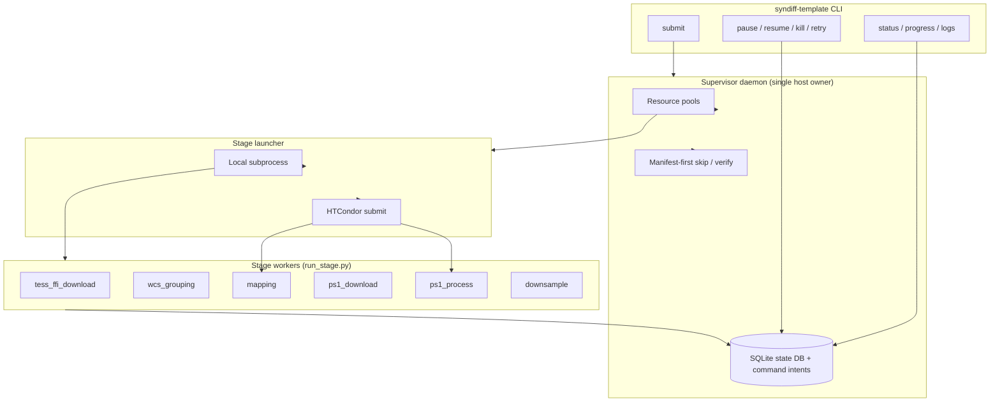

# SynDiff PS1 Template Pipeline (`syndiff-template`)

This document describes the **template-building pipeline** orchestrated by the `syndiff-template` CLI. It turns TESS Full Frame Images (FFIs) and Pan-STARRS1 (PS1) skycell data into per-offset PS1 template FITS files that feed the main SynDiff difference-imaging pipeline (`run_pipeline.py`).

For difference imaging, Hotpants, ePSF, and forced photometry, see the [main README](../README.md).

**Documentation index**: [`docs/README.md`](README.md)

---

## Table of Contents

- [Overview](#overview)
- [Documentation layers and code lineage](#documentation-layers-and-code-lineage)
- [Architecture](#architecture)
- [Installation](#installation)
- [Quick Start](#quick-start)
- [Concepts](#concepts)
  - [Targets](#targets)
  - [Runs and stages](#runs-and-stages)
  - [Resource pools](#resource-pools)
  - [Local vs HTCondor execution](#local-vs-htcondor-execution)
- [Pipeline Stages](#pipeline-stages)
- [Configuration Reference](#configuration-reference)
- [Targets CSV Formats](#targets-csv-formats)
- [CLI Reference](#cli-reference)
- [Run Lifecycle](#run-lifecycle)
- [Logging and Artifacts](#logging-and-artifacts)
- [Verification](#verification)
- [HTCondor Integration](#htcondor-integration)
- [Force Rerun Behavior](#force-rerun-behavior)
- [Per-SCC Overrides](#per-scc-overrides)
- [Troubleshooting](#troubleshooting)
- [Relationship to SynDiff Diff Imaging](#relationship-to-syndiff-diff-imaging)
- [Stage algorithm deep-dives](#stage-algorithm-deep-dives)
- [Module Map](#module-map)

---

## Overview

The template pipeline produces **PS1-based templates on the TESS pixel grid** for one or more science targets (sector / camera / CCD, or “SCC”). A typical end-to-end flow:

1. Download TESS FFIs (optional if already on disk).
2. **WCS grouping** — measure target pixel drift across epochs; assign template offset groups; write handoff JSON.
3. **Mapping** (“pancakes”) — map TESS pixels to PS1 skycells; download Gaia catalog for the reference FFI.
4. **PS1 download** — fetch PS1 skycell cutouts into a shared Zarr store.
5. **PS1 process** — convolve PS1 data onto the TESS grid (CPU-heavy; optionally on HTCondor).
6. **Downsample** — combine convolved skycells at multiple sub-pixel offsets → `syndiff_template_*.fits`.

The runner is designed for **batch operation across many SCCs**:

- A host-level **supervisor daemon** (single owner via flock) dequeues work for all active runs subject to resource-pool limits.
- Progress is tracked in **SQLite (WAL)** and on disk (logs, summaries, per-stage status/manifest files).
- Stages can be run **subset-by-subset** (e.g. only `ps1_process,downsample`) when upstream artifacts already exist.
- **`mapping`** and **`ps1_process`** can run on a shared **HTCondor** pool; all other stages run as local subprocesses on the submit host.

---

## Documentation layers and code lineage

This guide covers **orchestration** — how to configure and run `syndiff-template` across many targets. The **algorithms** behind each stage are documented separately because they were developed and originally documented in the standalone [`syndiff`](../../syndiff/) research repository before being integrated into `syndiff_pipeline`.

| Layer | Location | What it covers |
|-------|----------|----------------|
| Orchestration | This file (`docs/template_pipeline.md`) | YAML config, scheduler, SQLite, Condor, CLI, logs |
| Stage algorithms | [`docs/stages/`](stages/README.md) | PanCAKES mapping, PS1 convolution, downsampling internals |
| Legacy standalone workflow | [`docs/stages/standalone_pipeline_overview.md`](stages/standalone_pipeline_overview.md) | Original `pipeline.py` + per-script CLI |
| Diff imaging | [`README.md`](../README.md) | Hotpants → photometry after templates exist |

### Script → module → stage mapping

| Legacy script (`syndiff/`) | Package module | `syndiff-template` stage |
|----------------------------|----------------|--------------------------|
| — | `download.py` | `tess_ffi_download` |
| — | `wcs_grouping.py` + `template_runner/handoff.py` | `wcs_grouping` |
| `pancakes_v2.py` | `template/pancakes.py` | `mapping` |
| `download_and_store_zarr.py` | `template/ps1_download.py` | `ps1_download` |
| `process_ps1.py` | `template/ps1_process.py` | `ps1_process` |
| `multi_offset_downsampling.py` | `template/downsample.py` | `downsample` |

The runner adds capabilities not present in the standalone scripts: **multi-target batching**, **WCS drift grouping** for transients, **artifact verification**, **force-rerun cleanup**, **pause/kill/retry**, and **HTCondor** for `mapping` and `ps1_process`.

If you previously used `syndiff/run.sh` one-liners, the equivalent production path is `syndiff-template submit` with `example/template_runner/config_real.yaml` (paths aligned to the same data layout).

---

## Architecture



**Hybrid execution model**

| Stage | Default executor | Resource pool | Notes |
|-------|------------------|---------------|-------|
| `tess_ffi_download` | local | `network` | MAST / tesscurl downloads |
| `wcs_grouping` | local | `cpu_light` | Writes per-target handoff under `handoff_root` |
| `mapping` | **condor** | `mapping` | Gaia + skycell mapping (pancakes); lighter Condor claim than `ps1_process` |
| `ps1_download` | local | `network` | Shared Zarr at `{data_root}/ps1_skycells_zarr/` |
| `ps1_process` | **condor** | `ps1_process` | Whole-node jobs; configurable |
| `downsample` | local | `cpu_light` | Reads convolved Zarr + mapping |

**Stage dependency graph**

```text
tess_ffi_download
       │
       ▼
  wcs_grouping ─────────────────────────────┐
       │                                     │
       ▼                                     │
   mapping                                   │
       │                                     │
       ▼                                     │
 ps1_download                                │
       │                                     │
       ▼                                     │
  ps1_process ───────────────────────────────┤
                                             ▼
                                       downsample
```

`downsample` requires both `wcs_grouping` (crop bounds / ROI from `cluster_template_job.json`) and `ps1_process` (convolved Zarr).

When you run a **stage subset**, dependencies outside the subset are satisfied if **on-disk artifacts pass verification** (see [Verification](#verification)).

---

## Installation

The template runner ships with the `syndiff-pipeline` package.

```bash
# From a clone of this repository
pip install -e .

# Or install in your conda/mamba environment
mamba activate syndiff   # recommended env name in this project
pip install -e /path/to/syndiff_pipeline
```

This registers the console script:

```bash
syndiff-template --help
```

**Python**: ≥ 3.10 (see `pyproject.toml`).

**Core dependencies** (shared with the rest of SynDiff): `numpy`, `pandas`, `astropy`, `zarr`, `pyyaml`, `sep`, `scipy`, `shapely`, `numba`, `tqdm`, `filelock`, and others used by the `template/` modules.

**Mapping-specific**: the PanCAKES stage requires a **modified MOCPy** build with `MOC.filter_points_in_polygons` (Rust backend). See [`docs/stages/mapping_pancakes.md`](stages/mapping_pancakes.md) and the standalone repo’s `install_mocpy.sh`. Standard `pip install mocpy` is not sufficient.

**Cluster / Condor** (optional): HTCondor client tools (`condor_submit`, `condor_q`, `condor_history`, `condor_rm`) on the submit node. No `python-htcondor` package is required.

**Hardware** (from production experience): `ps1_process` expects a **whole node** (~64 cores, 512 GB RAM on the STScI science cluster). Mapping and downsample are lighter but benefit from multi-core hosts and fast NFS.

---

## Quick Start

### 1. Prepare config and targets

Copy and edit the examples under `example/template_runner/`:

```bash
cp example/template_runner/config_example.yaml my_config.yaml
cp example/template_runner/targets_example.csv my_targets.csv
```

Set at minimum:

- `data_root` — science data tree (FFIs, mapping, Zarr, templates).
- `ffi_dir` — TESS FFI directory (often `{data_root}/tess_ffi`).
- `handoff_root` — per-target WCS handoffs and pipeline metadata.
- `skycell_wcs_csv` — PS1 skycell WCS table (SkyCells list).
- `gaia_credentials` — Gaia archive credentials file (for mapping).

See [Configuration Reference](#configuration-reference).

### 2. Verify prerequisites (optional but recommended)

```bash
syndiff-template verify \
  --config my_config.yaml \
  --targets my_targets.csv \
  --stages tess_ffi_download,wcs_grouping,mapping,ps1_download
```

### 3. Submit a detached run

Always activate your conda environment first so the scheduler records the correct Python path in stage commands:

```bash
mamba activate syndiff

syndiff-template submit \
  --config my_config.yaml \
  --targets my_targets.csv \
  --stages ps1_process,downsample
```

On submit, the source config and targets are **copied into the run directory** (`config.yaml`, `targets.csv`) with all config paths normalized to absolute. The scheduler and all stage workers use only those frozen copies.

Example output:

```text
Submitted run_id=20260607_210919 scheduler_pid=2692578
  logs: /path/to/runs/20260607_210919/scheduler.log
Monitor: syndiff-template progress --run-dir /path/to/runs/20260607_210919
```

### 4. Monitor

Use `--run-dir` for run-scoped commands (no config/target paths needed):

```bash
syndiff-template progress --run-dir /path/to/runs/20260607_210919
syndiff-template status --watch --run-dir /path/to/runs/20260607_210919
syndiff-template tail --run-dir /path/to/runs/20260607_210919 \
  --target s0023_c1_k3_2020ftl --stage ps1_process
```

`progress` prints a one-line summary (`pending=…`, `running=…`, etc.) and, when any stages are **running**, a detail section parsed from each worker’s stage log or sidecar (e.g. `ps1_dl: 342/1009` for PS1 skycell downloads, `ps1_pr: 2/19 projections 5/10 rows` for convolution, `down: 45/84` for downsample skycell-weighted progress from `per_target/<label>/downsample.progress.json`). Use `--no-detail` for summary-only output (scripts). For full worker output, `tail -f` the log under `per_target/<target_label>/<stage>.log`.

**Discord alerts** (optional): when `notifications.enabled: true` in config, the supervisor posts to a webhook on run/stage events. Messages include the same **progress** summary and **status** grid as the CLI. Preview without changing pipeline state:

```bash
syndiff-template notify test --config my_config.yaml --run-id batch_no4
```

See [Discord notifications](#discord-notifications).

Or set the runs root once per shell session and pass `--run-id` for each run you are watching:

```bash
export SYNDIFF_RUNS_ROOT=/path/to/runs
syndiff-template progress --run-id 20260607_210919
syndiff-template status --watch --run-id 20260607_210919
syndiff-template retry --run-id 20260607_210919
```

Shorthand (uses site config only to locate `runs_root`):

```bash
syndiff-template progress --config my_config.yaml --run-id 20260607_210919
```

### 5. Use templates in SynDiff

Downsampled FITS appear under `{data_root}/shifted_downsampled/` (or `stages.downsample.output_base`). Point the main SynDiff config’s `template_dir` at that tree before running `run_pipeline.py`.

---

## Concepts

### Targets

A **target** is one SCC (sector, camera, CCD) plus transient coordinates and a name. Targets are loaded from CSV (see [Targets CSV Formats](#targets-csv-formats)).

Each target gets a stable **label** used in logs and SQLite:

```text
s{sector:04d}_c{camera}_k{ccd}_{target_name}
```

Example: `s0023_c1_k3_2020ftl` for sector 23, camera 1, CCD 3, SN 2020ftl.

### Runs and stages

A **run** is one batch identified by `run_id` (default: UTC timestamp `YYYYMMDD_HHMMSS`). Each target materializes the **full 6-stage DAG** in SQLite. Stages selected at submit start `pending`; others start `external` and are resolved once to `skipped` when on-disk artifacts verify complete.

| Status | Meaning |
|--------|---------|
| `pending` | Not yet eligible (waiting on dependencies) |
| `ready` | Dependencies satisfied; waiting for pool capacity |
| `running` | Stage command launched |
| `success` | Exit code 0 |
| `failed` | Non-zero exit; downstream stages blocked |
| `skipped` | Artifacts verified complete (no rerun) |
| `blocked` | Never started (upstream failure) |
| `canceled` | User kill (retryable) |
| `external` | Outside `--stages`; verify once then `skipped` |

Run-level status (`runs.status`): `running`, `stalled`, `success`, `failed`, `canceled`. A `stalled` run has no running or launchable work but non-terminal stages remain (see `stall_reason` in `progress`/`status`).

### Resource pools

Concurrency is limited per **pool** (not globally):

| Pool | Stages | Typical limit | Purpose |
|------|--------|---------------|---------|
| `network` | `tess_ffi_download`, `ps1_download` | 3 | Throttle MAST / PS1 API |
| `cpu_light` | `wcs_grouping`, `downsample` | 2 | Moderate CPU / I/O |
| `mapping` | `mapping` | 6 | Condor slot count for mapping jobs |
| `ps1_process` | `ps1_process` | 4 | Condor slot count for PS1 convolution |

Configure under `resources:` in YAML. For Condor stages, each pool's `max_concurrent` caps **simultaneous Condor submissions** for that stage, not CPUs per job.

### Local vs HTCondor execution

- **Local**: `subprocess.Popen` with `start_new_session=True` (own process group for clean kill).
- **Condor**: `mapping` and `ps1_process` by default (`stages.mapping.executor: condor`, `stages.ps1_process.executor: condor`).

The Condor path:

1. Writes a `.condor.submit` file next to the stage log.
2. Submits via `condor_submit`.
3. Stores the **cluster ID** in SQLite as `pid`.
4. Polls with `condor_q` / `condor_history`.

Execute nodes run `template_runner/condor_wrapper.sh`, which activates the `syndiff` conda env and `exec`s the same `run_stage.py` command the local launcher would use.

---

## Pipeline Stages

### `tess_ffi_download`

**Module**: `syndiff_pipeline.download`

Downloads calibrated TESS FFIs for the target SCC into `ffi_dir` using the shared download helpers.

**Verification**: at least one FFI file present under the nested sector/camera/ccd directory.

---

### `wcs_grouping`

**Module**: `template_runner/handoff.py` → `syndiff_pipeline.wcs_grouping`

**Inputs**: FFIs on disk; target RA/Dec from targets CSV.

**Outputs** (under `{handoff_root}/{target_label}/`):

| File | Description |
|------|-------------|
| `syndiff_ffi_frames.csv` | Per-FFI WCS drift, template group IDs |
| `cluster_template_job.json` | Reference FFI, crop bounds, offsets for downsample |

**Verification**: valid `cluster_template_job.json` with existing `reference_ffi_path`.

---

### `mapping`

**Module**: `template/pancakes.py` (ported from `pancakes_v2.py`)

Builds TESS↔PS1 skycell pixel mappings for the reference FFI from `cluster_template_job.json`. Optionally downloads a Gaia catalog (`skip_download_catalog: false` by default).

**Algorithm summary** (see [PanCAKES deep-dive](stages/mapping_pancakes.md)):

1. Build a TESS MOC footprint and filter the PS1 skycell catalog to overlapping cells.
2. Assign every TESS pixel to a skycell index (mocpy + Numba point-in-polygon).
3. In parallel, project each skycell’s TESS pixel footprints onto the PS1 grid → per-skycell registration FITS.
4. Compute padding skycells at projection edges for downstream convolution.

**Outputs** (under `{data_root}/skycell_pixel_mapping/`):

```text
sector_{SSSS}/camera_{C}/ccd_{K}/
  tess_s{SSSS}_{C}_{K}_master_skycells_list.csv
  tess_s{SSSS}_{C}_{K}_master_pixels2skycells.fits.gz
  tess_s{SSSS}_{C}_{K}_{skycell}.fits   (per skycell)
```

With `oversampling_factor > 1`, paths include an `oversampling_{N}/` prefix and `_os{N}` suffixes.

**Verification**: master skycells CSV exists.

**Deep dive**: [mapping_pancakes.md](stages/mapping_pancakes.md)

---

### `ps1_download`

**Module**: `template/ps1_download.py` (ported from `download_and_store_zarr.py`)

Downloads PS1 skycell data listed in the mapping CSV into a **shared Zarr store**:

```text
{data_root}/ps1_skycells_zarr/ps1_skycells.zarr
```

Uses a lock file (`ps1_skycells.zarr.lock`) so concurrent downloads for different SCCs on the same `data_root` serialize safely. Tune `resources.network.max_concurrent` accordingly.

**Verification**: Zarr store exists and is non-empty.

**Standalone CLI reference**: [standalone pipeline overview — Download PS1](stages/standalone_pipeline_overview.md#2-download-ps1-data)

---

### `ps1_process`

**Module**: `template/ps1_process.py` (ported from `process_ps1.py`)

Reads PS1 Zarr + mapping CSV; runs the **modern sliding-window convolution pipeline**. Sizes worker counts from **whole-machine** `os.cpu_count()` and available RAM — on Condor this expects a **whole-node** claim (`request_cpus=64`, large memory).

**Algorithm summary** (see [PS1 process technical reference](stages/ps1_process_technical.md)):

- Five concurrent stages: zarr readers → band combiners → SEP source extraction (process pool) → sequential sliding-window assembler (padding + Gaussian convolution) → Zarr saver.
- Master arrays use a two-row sliding window with 480 px cell overlap and cross-projection padding via `reproject_interp`.
- Optional `--remove-saturated-stars` writes a removed-star CSV used later by downsample / SynDiff sat templates.

**Outputs**:

| Path | Description |
|------|-------------|
| `{data_root}/convolved_results/sector_{SSSS}_camera_{C}_ccd_{K}.zarr` | Convolved skycell arrays (`*_data`, masks) |
| `{data_root}/convolved_results/sector_{SSSS}_camera_{C}_ccd_{K}_removed_stars.csv` | Optional removed-star records (when enabled) |

**Verification**: convolved Zarr contains the expected number of non-empty `*_data` arrays (derived from mapping CSV and `projections_limit`).

**Key parameters**: `psf_sigma`, `remove_saturated_stars`, `projections_limit` (smoke testing), Condor resource requests.

**Deep dive**: [ps1_process_technical.md](stages/ps1_process_technical.md) (architecture diagrams, queue reference, log prefixes)

---

### `downsample`

**Module**: `template/downsample.py` (ported from `multi_offset_downsampling.py`)

Combines convolved Zarr data at multiple sub-pixel offsets from `cluster_template_job.json`. Produces template FITS for SynDiff Hotpants.

**Algorithm summary** (see [downsample technical reference](stages/downsample_technical.md)):

1. Load TESS WCS + master registration map; filter skycells to the WCS-grouping ROI.
2. Precompute per-skycell PS1 pixel shifts for each `(dx, dy)` offset via WCS round-trip.
3. Parallel joblib workers bin shifted PS1 flux into TESS pixels using registration FITS.
4. Deduplicate overlapping skycell contributions; write one multi-extension FITS per offset (`FLUX_SUM`, `COUNT`, `MASK`).

Default production offsets are the calibrated dither list from the standalone script (10 pairs); WCS grouping supplies the subset needed for each transient’s template groups.

**Outputs** (under `output_base`, default `{data_root}/shifted_downsampled/`):

```text
sector{SSSS}_camera{C}_ccd{K}[_x..._y...][_os{N}]/
  syndiff_template_s{SSSS}_{C}_{C}_dx{X.XXX}_dy{Y.YYY}.fits
  ...
```

**Verification**: at least one `syndiff_template_*.fits` under the target directory glob.

**Progress sidecar**: during pipeline runs, parallel batch workers update `per_target/<label>/downsample.progress.json` (beside `downsample.log`) with skycell-weighted progress (`skycells_done` / `total_skycells`). `syndiff-template progress` reads this file for in-flight fraction; shift precompute shows as `shifts k/n` phase text. The log is unchanged aside from existing batch completion lines.

**Deep dive**: [downsample_technical.md](stages/downsample_technical.md)

---

## Configuration Reference

Configuration is YAML loaded by `template_runner/runner_config.py`. Paths may be absolute or relative to the **config file’s directory**.

### Top-level keys

| Key | Required | Description |
|-----|----------|-------------|
| `data_root` | yes | Root for mapping, Zarr, convolved results, default template output |
| `ffi_dir` | no | TESS FFI root (defaults to `data_root`) |
| `handoff_root` | yes | Per-target WCS handoffs (`{handoff_root}/{target_label}/`) |
| `runs_root` | no | Run logs and summaries (default: `{handoff_root}/runs`) |
| `state_db_path` | no | SQLite DB (default: `{handoff_root}/pipeline_state.sqlite`) |
| `skycell_wcs_csv` | yes | PS1 SkyCells WCS CSV |
| `gaia_credentials` | no | Gaia archive credentials (mapping) |
| `stages` | no | Per-stage parameters (see below) |
| `resources` | no | Pool concurrency limits |
| `scheduler` | no | Scheduler tuning |
| `notifications` | no | Discord webhook alerts (see below) |
| `overrides` | no | Per-SCC parameter overrides |

### Scheduler

```yaml
scheduler:
  heartbeat_interval_s: 30.0
```

### Discord notifications

Optional alerts to a Discord channel via incoming webhook. The webhook URL lives in a **gitignored** `secrets.yaml` beside your site config (copy from `secrets.yaml.example`); frozen run directories do not need their own copy — the daemon falls back to `source_config_path` from `run_meta.json`.

```yaml
notifications:
  enabled: true
  secrets_file: secrets.yaml
  events:
    run_completed: true
    run_failed: true
    run_canceled: true
    run_stalled: true
    run_resumed: true
    stage_failed: true
    stage_completed: true
    stage_canceled: true
    stage_died: true
    daemon_unhealthy: true
```

`secrets.yaml` (not committed):

```yaml
discord_webhook_url: https://discord.com/api/webhooks/...
```

Alternatively set `DISCORD_WEBHOOK_URL` in the environment.

**Events** (supervisor daemon, deduplicated in SQLite `notification_events`):

| Event | When |
|-------|------|
| `run_completed` / `run_failed` | All stages terminal |
| `run_canceled` | `syndiff-template kill` (whole run canceled) |
| `run_stalled` / `run_resumed` | Scheduler stall detection / recovery |
| `stage_completed` / `stage_failed` | Worker exits 0 / nonzero |
| `stage_canceled` | Worker SIGTERM (`kill`) or exit 143 |
| `stage_died` | Process lost without exit record (requeued to `ready`) |
| `daemon_unhealthy` | Supervisor wedged while runs are active |

Message body matches CLI output: `progress` summary (counts + running log fractions) plus truncated `status` per-target grid. Large batches can be noisy when `stage_completed: true` — disable per event if needed.

**Test** (read-only; does not write `notification_events` or change run state):

```bash
syndiff-template notify test --config my_config.yaml --run-id batch_no4
syndiff-template notify test --run-dir /path/to/runs/batch_no4 --dry-run   # print locally
```

### Resource pools

```yaml
resources:
  network:
    max_concurrent: 3
  cpu_light:
    max_concurrent: 2
  mapping:
    max_concurrent: 6
  ps1_process:
    max_concurrent: 4
```

Defaults if omitted: `network=3`, `cpu_light=2`, `mapping=6`, `ps1_process=4`.

### Stage parameters

Unknown keys under `stages.*` raise `ValueError` at load time (strict allow-list).

#### `stages.wcs_grouping`

| Key | Default | Description |
|-----|---------|-------------|
| `offset_threshold` | `0.01` | Max pixel drift before new template group |
| `wcs_drift_savgol_window` | `11` | Savitzky–Golay window for drift smoothing |
| `wcs_drift_savgol_polyorder` | `2` | SG polynomial order |
| `bkg_vector_path` | null | Optional TESSVectors path for Earth/Moon angles |
| `crop_quadrant` | `"full"` | Default crop mode if bounds not set (`full` = entire FFI; `full_science` = usable area only) |
| `x_min`, `x_max`, `y_min`, `y_max` | null | Explicit crop bounds (pixels) |
| `x_left_dead`, `x_right_dead` | `44` | Horizontal dead columns |
| `y_edge_strip` | `30` | Vertical edge strip |

#### `stages.mapping`

| Key | Default | Description |
|-----|---------|-------------|
| `buffer`, `tess_buffer`, `pad_distance` | various | Pancakes geometry buffers |
| `edge_exclusion`, `edge_buffer_large`, `edge_buffer_small` | various | Edge handling |
| `n_threads` | `8` | Thread count |
| `max_workers` | null | Optional process pool cap |
| `oversampling_factor` | `1` | Sub-pixel oversampling |
| `overwrite` | `true` | Overwrite mapping FITS |
| `skip_download_catalog` | `false` | Skip Gaia download if catalog exists |
| `executor` | `"condor"` | `"condor"` or `"local"` |
| `condor_request_cpus` | `16` | HTCondor `request_cpus` |
| `condor_request_memory` | `100000` | HTCondor `request_memory` (MB) |
| `condor_requirements` | `Memory <= 500000 && LoadAvg < 10` | Machine requirements expression (avoids 512 GB nodes) |
| `condor_rank` | `-LoadAvg` | Prefer lower load average |

#### `stages.ps1_download`

| Key | Default | Description |
|-----|---------|-------------|
| `num_workers` | `8` | Download parallelism |
| `use_local_files` | `false` | Read from local PS1 tree instead of API |
| `local_data_path` | `data/ps1_skycells` | Local PS1 path when `use_local_files` |
| `overwrite` | `false` | Re-download into Zarr |
| `log_level` | `INFO` | Logging level |

#### `stages.ps1_process`

| Key | Default | Description |
|-----|---------|-------------|
| `projections_limit` | null | Limit skycell rows (smoke tests); null = all |
| `psf_sigma` | `60.0` | Gaussian convolution sigma |
| `enable_saturation_correction` | `true` | Saturation handling |
| `remove_saturated_stars` | `false` | Track removed stars → CSV |
| `catalog_path` | null | Override Gaia catalog path |
| `bright_star_mag_threshold` | `13.0` | Bright-star cutoff |
| `executor` | `"condor"` | `"condor"` or `"local"` |
| `condor_request_cpus` | `64` | HTCondor `request_cpus` |
| `condor_request_memory` | `500000` | HTCondor `request_memory` (MB) |
| `condor_requirements` | `Memory >= 500000 && LoadAvg < 10` | Machine requirements expression |
| `condor_rank` | `-LoadAvg` | Prefer lower load average |

#### `stages.downsample`

| Key | Default | Description |
|-----|---------|-------------|
| `ignore_mask_bits` | `[12]` | PS1 mask bits to ignore |
| `oversampling_factor` | `1` | Must match mapping |
| `mapping_dir` | null | Override mapping root |
| `convolved_dir` | null | Override convolved Zarr directory |
| `output_base` | null | Template FITS output root |
| `single_offset` | `false` | Single `[0,0]` offset only (smoke) |

### Resolved per-target paths

For each target, `resolve_config()` derives:

| Field | Path |
|-------|------|
| `handoff_dir` | `{handoff_root}/{target_label}/` |
| `mapping_root` | `{data_root}/skycell_pixel_mapping/` |
| `zarr_dir` | `{data_root}/ps1_skycells_zarr/` |
| `template_output_base` | `{data_root}/shifted_downsampled/` |

---

## Targets CSV Formats

### Normalized format (recommended)

Header (all columns required):

```csv
sector,camera,ccd,target_ra,target_dec,target_name,enabled
23,1,3,185.015708,5.343289,2020ftl,true
```

Rows with `enabled=false` are skipped.

### SN event catalog format

Header:

```csv
ID,redshift,type,ra,dec,...,tess_coverage,...
```

`ID` may be prefixed with `SN `. `tess_coverage` uses tokens like `S23C1D3` or `S44C2D1; S45C1D4` for multi-SCC events. One target row is expanded per SCC token.

See `example/template_runner/events_example.csv`.

---

## CLI Reference

| Command | `--config` | `--targets` | Run identification |
|---------|------------|-------------|-------------------|
| `submit`, `run` | required (source) | required (source) | optional `--run-id` |
| `status`, `progress`, `logs`, `show`, `pause`, `resume`, `kill`, `retry`, `notify test` | optional (runs_root lookup) | n/a | `--run-dir` or `--run-id` (+ `--config`) |
| `runs`, `active` | required | n/a | n/a |
| `verify` | optional | optional | `--run-dir` (frozen copies) or pre-run `--config --targets` |

| Command | Description |
|---------|-------------|
| `submit` | Insert run rows + ensure supervisor daemon; copies config/targets into run dir |
| `run` | Foreground inline scheduler loop (debugging) |
| `daemon start\|stop\|status` | Control the host-level supervisor (`--config`) |
| `status` | Per-target stage status grid (`--watch`, `--interval`); shows `stalled` + reasons |
| `progress` | Aggregate status counts (+ `stall_reason` when stalled) |
| `runs` | List recent runs from SQLite |
| `active` | Active runs + supervisor daemon liveness |
| `show` | Print `run_meta.json` |
| `logs` | Print daemon or stage log (`--target`, `--stage`, `--follow`) |
| `tail` | Alias for `logs --follow` |
| `verify` | Check on-disk artifacts (`--scc`, `--stages`) |
| `reconcile-manifests` | Backfill stable cross-run completion manifests for already-complete outputs (`--scc`, `--stages`, `--quiet`) |
| `retry` | Insert retry intent; ensures daemon running; `--no-start-daemon` to skip |
| `pause` | Insert pause intent (daemon stops dequeuing) |
| `resume` | Insert resume intent |
| `kill` | Insert cancel intent; daemon terminates workers and marks run `canceled` |
| `notify test` | Send read-only Discord preview (`progress` + `status` grid); `--dry-run` prints locally |

### Common flags

| Flag | Commands | Description |
|------|----------|-------------|
| `--run-dir PATH` | run-scoped commands | Full run directory (frozen `config.yaml` + `targets.csv`) |
| `SYNDIFF_RUNS_ROOT` | run-scoped commands | Runs root directory; use with `--run-id` (required) |
| `--targets PATH` | submit, run, verify (pre-run) | Source targets CSV |
| `--stages LIST` | submit, run, verify | Comma-separated subset (default: all stages) |
| `--run-id ID` | run-scoped commands | Explicit run (default: `latest` symlink when using `--config`) |
| `--force-rerun` | submit, run | Re-run stages; see [Force Rerun](#force-rerun-behavior) |

### Examples

```bash
# Full pipeline, detached
syndiff-template submit --config cfg.yaml --targets targets.csv

# Re-process PS1 convolution + downsample from scratch
syndiff-template submit --config cfg.yaml --targets targets.csv \
  --stages ps1_process,downsample --force-rerun

# Monitor (preferred: --run-dir)
syndiff-template progress --run-dir /path/to/runs/20260607_210919

# Verify one SCC (pre-run)
syndiff-template verify --config cfg.yaml --targets targets.csv \
  --scc 23,1,3 --stages ps1_process

# Verify using frozen run config
syndiff-template verify --run-dir /path/to/runs/20260607_210919 --scc 23,1,3

# Backfill stable manifests for already-complete data (one-shot)
syndiff-template reconcile-manifests --config cfg.yaml --targets targets.csv

# Retry all failed stages in a run
syndiff-template retry --run-dir /path/to/runs/20260607_210919

# Retry one SCC/stage after a fix
syndiff-template retry --run-dir /path/to/runs/20260607_210919 \
  --scc 23,1,3 --stage mapping

# Kill a run (Condor + local)
syndiff-template kill --run-dir /path/to/runs/20260607_210919
```

Global listing still uses site config:

```bash
syndiff-template runs --config cfg.yaml
syndiff-template active --config cfg.yaml
```

---

## Run Lifecycle

### Submit (`submit`)

1. Creates `{runs_root}/{run_id}/` layout and `run_meta.json`.
2. Copies source config and targets into the run directory as frozen `config.yaml` and `targets.csv`.
3. Inserts run + full 6-stage DAG per target in SQLite (`pending` for selected stages, `external` for others).
4. Ensures the host-level **supervisor daemon** is running (flock-guarded single owner).
5. Symlinks `{runs_root}/latest` → `run_id`.

### Supervisor daemon loop

One daemon per host schedules **all** active runs. The CLI only inserts **command intents**; the daemon is the sole writer of execution state.

1. **Ingest commands** (`cancel`, `pause`, `resume`, `retry`, `retry_stage`).
2. **Reconcile** `running` rows from durable `*.status.json`, PID liveness, and Condor poll (wall-clock grace).
3. **Resolve external/pending skips** (cached in SQLite): manifest-only fast path on the main thread when stable manifests exist; otherwise schedule full on-disk `stage_complete()` checks on a small background thread pool (budget per tick, default 16). The main loop never blocks on NFS-heavy verification.
4. **Promote** `pending`/`blocked` → `ready` using the single `deps_satisfied()` (success/skipped only).
5. **Atomic claim** `ready` → `running` (launch token + executor/native_id/submit_epoch).
6. **Detect completion** or **stall** (`running==0`, `launchable==0`, `nonterminal>0`).
7. Throttled writes of `summary.json` / `summary.csv`.

### Pause / resume / kill / retry

These insert rows into the `commands` table; the daemon applies them on the next tick. `kill` marks stages `canceled` and the run `canceled`. `retry` reopens failed/canceled/blocked stages (+ downstream) to `pending`. Use `--no-start-daemon` to queue the intent without ensuring the daemon is running.

Single-target retry resolves SCC from the frozen `targets.csv`, falling back to the run's SQLite `targets` table when the CSV row is missing or `enabled=false`.

Before large batches on NFS-backed data, run `reconcile-manifests` for targets that already have on-disk outputs. That backfills stable manifests under `{runs_root}/.manifests/` so the supervisor can skip stages via a fast manifest read instead of full padding/Zarr scans.

Optional scheduler knobs (in `config.yaml` under `scheduler:`):

```yaml
scheduler:
  verify_max_workers: 1
  verify_budget_per_tick: 16
```

`status` and `progress` show `verify_in_flight=N` when background artifact checks are running (read from a host-local counter file written by the daemon each tick; the CLI does not import the heavy verify stack).

---

## Logging and Artifacts

### Run directory layout

```text
{runs_root}/{run_id}/
  config.yaml            # frozen run config (absolute paths)
  targets.csv            # frozen targets from submit time
  run_meta.json          # submit metadata, source + run-local paths, force_rerun flag
  summary.json           # live status counts
  summary.csv            # flat stage table
  per_target/
    {target_label}/
      {stage}.log
      {stage}.status.json   # durable local job state (launch_token, pid, exit)
      {stage}.manifest.json # per-run completion manifest (config fingerprint, artifact paths)

{runs_root}/.manifests/
  {target_label}/
    {stage}.manifest.json   # stable cross-run completion manifest (backfilled by reconcile-manifests)
```

Host-level supervisor files live next to `state_db_path`:

```text
{handoff_root}/
  pipeline_state.sqlite
  daemon.lock
  daemon.pid
  daemon.log
```

Condor-specific artifacts under `per_target/{target_label}/`:

```text
      {stage}.condor.submit
      {stage}.condor.stdout
      {stage}.condor.stderr
      {stage}.condor.log
      {stage}.condor.clusters
```

**Primary debugging path**: `{stage}.log` — written by `run_stage.py` on NFS, including on Condor execute nodes.

Condor `.condor.*` files capture wrapper/submit diagnostics when the job fails before Python starts.

### SQLite state

Default: `{handoff_root}/pipeline_state.sqlite`

Tables: `runs`, `targets`, `stage_runs`. Safe to query while scheduler runs (WAL timeout 60s). Used by all status/progress commands.

---

## Verification

`syndiff-template verify` checks **on-disk artifacts**, not SQLite run state.

| Stage | Check |
|-------|-------|
| `tess_ffi_download` | All FFI basenames from the tesscurl manifest present (tri-state `unknown` when the manifest is unavailable) |
| `wcs_grouping` | Valid `cluster_template_job.json` |
| `mapping` | Master skycells CSV |
| `ps1_download` | Every expected skycell has all 12 arrays (`{band}`, `{band}_mask`, `{band}_wt` for r/i/z/y) with materialized chunks |
| `ps1_process` | Each expected skycell's `{skycell}_data` array has materialized chunks |
| `downsample` | All per-offset `syndiff_template_*.fits` present (one per offset) |

Partial convolved Zarr (interrupted run) reports e.g. `Partial convolved zarr: 3/120 skycells saved`.

Use verify before subset runs to confirm upstream stages are satisfied off-run.

### Fast, metadata-only Zarr verification

The Zarr verifiers (`ps1_download`, `ps1_process`) are **filesystem-metadata only**:
they never call `zarr.open` and never decompress a chunk. A Zarr array counts as
present when its chunk root (`{array}/c/` for Zarr v3) contains at least one
materialized chunk. This mirrors the download writer's completeness definition
(`ps1_download.skycell_array_status`) while avoiding the per-skycell chunk reads
that previously made verification take ~30 min on NFS — it now completes in
seconds. A one-line timing log (`verify_ps1_download: N/M skycells complete in Xs`)
is emitted for visibility.

### Completion manifests

On success a stage writes a JSON **completion manifest** (`schema_version`,
`stage`, `expected_count`, `produced_count`, `artifacts`, `config_fingerprint`,
`completed_at`). `stage_complete()` is **manifest-first**: a manifest is honored
only when its schema and config fingerprint match the current config and every
listed artifact still exists, otherwise it falls back to the on-disk verifier.

Manifests are written in two places:

- **Per-run**: `{runs_root}/{run_id}/per_target/{label}/{stage}.manifest.json`
  (avoids re-verifying within a run).
- **Stable / cross-run**: `{runs_root}/.manifests/{label}/{stage}.manifest.json`
  (lets a *fresh* run skip re-scanning an already-complete output). The supervisor
  self-heals this file whenever it confirms a stage complete on disk.

**Skip-verify before promote:** A selected stage in `pending` is not promoted to
`ready` (and therefore not launched) until the supervisor has run at least one
`stage_complete()` check for that stage in the current run. Each tick performs up
to 16 such checks; stages that are not checked yet stay `pending` until a later
tick. If the check finds complete outputs (manifest-first, then on-disk fallback),
the stage is marked `skipped`; if not, it is cached as incomplete and may then
promote to `ready`. This prevents downstream stages from launching before stable
manifests are consulted when upstream skip checks consume the per-tick budget.

### `reconcile-manifests` (backfill)

For data produced before manifests existed (e.g. existing `/astro` Zarr stores),
run a one-shot backfill to write stable manifests for everything already complete:

```bash
syndiff-template reconcile-manifests --config cfg.yaml --targets targets.csv
# or against a frozen run:  --run-dir /path/to/runs/<run_id>
# scope with --scc S/C/D and --stages ps1_download,ps1_process
```

It scans outputs read-only via the fast verifiers and writes a stable manifest for
each complete stage. After a backfill, future runs read one small JSON instead of
re-scanning the store.

---

## HTCondor Integration

### Requirements

- Submit host: Condor client tools, `syndiff` conda env, NFS access to `data_root`, `handoff_root`, and `runs_root`.
- Execute nodes: same NFS mounts for `/home` (conda) and science data; no inbound file transfer (`should_transfer_files = NO`).
- Jobs run as the submitting Unix user (`getenv = false` — wrapper sets up environment).

### Wrapper script

`template_runner/condor_wrapper.sh`:

1. Resolves `HOME` via `getent` (Condor does not export it).
2. `source ~/miniforge3/etc/profile.d/conda.sh && conda activate syndiff`
3. `exec` the stage command (absolute Python path from submit host).

**Important**: Run `syndiff-template submit` with `syndiff` activated so `sys.executable` in the command points at the correct env.

Adjust the miniforge path in the wrapper if your install location differs.

### Submit file (generated)

Per job, written to `per_target/{target}/{stage}.condor.submit`:

- `executable = .../condor_wrapper.sh`
- `arguments = /path/to/python -m syndiff_pipeline.template_runner.run_stage ...`
- `request_cpus`, `request_memory`, `requirements`, `rank`
- `output`, `error`, `log` → sibling `.condor.*` files

### Resource sizing (example: STScI science cluster)

Typical `mapping` settings for 128 GB science nodes (excludes 512 GB whole-node machines):

```yaml
stages:
  mapping:
    condor_request_cpus: 16
    condor_request_memory: 100000
    condor_requirements: "Memory <= 500000 && LoadAvg < 10"
    condor_rank: "-LoadAvg"
resources:
  mapping:
    max_concurrent: 6
```

Typical `ps1_process` settings for 64-core / 512 GB nodes:

```yaml
stages:
  ps1_process:
    condor_request_cpus: 64
    condor_request_memory: 500000
    condor_requirements: "Memory >= 500000 && LoadAvg < 10"
    condor_rank: "-LoadAvg"
resources:
  ps1_process:
    max_concurrent: 4
```

`ps1_process` auto-scales workers to the allocated machine; partial-node claims are not supported.

### Monitoring Condor jobs

```bash
condor_q -submitter $(whoami)
condor_history <cluster_id>
```

Cluster IDs match SQLite `stage_runs.pid` for running `ps1_process` stages.

### Local fallback

For laptops or debugging:

```yaml
stages:
  ps1_process:
    executor: local
```

---

## Force Rerun Behavior

`--force-rerun` on `submit` or `run`:

1. **Scheduler bookkeeping**: resets selected stages to `pending` in SQLite (even if previously `success` or `skipped`).
2. **Skips artifact-exists checks** for those stages.
3. **Does not** automatically delete upstream artifacts for other stages.

### `ps1_process` artifact cleanup

When `ps1_process` runs with `--force-rerun`, it **deletes existing outputs first**:

- `{data_root}/convolved_results/sector_{SSSS}_camera_{C}_ccd_{K}.zarr`
- `{data_root}/convolved_results/sector_{SSSS}_camera_{C}_ccd_{K}_removed_stars.csv`

Deletion is logged in `ps1_process.log`. This ensures a clean Zarr rewrite (`ps1_process` opens Zarr in append mode otherwise).

Other stages are **not** auto-deleted on force rerun. Remove mapping CSV, shared PS1 Zarr, or template FITS manually if you need a full rebuild.

---

## Per-SCC Overrides

The `overrides` map keys SCC as `"sector/camera/ccd"` or `"sector/camera/ccd"` matching `Target.scc_key()`:

```yaml
overrides:
  "23/2/1":
    stages:
      ps1_process:
        projections_limit: 1   # smoke test on one SCC
```

Optional per-override `data_root` redirects that SCC’s data paths.

---

## Troubleshooting

### Condor job exits immediately (exit code 1)

Check `ps1_process.condor.stderr` first.

| Symptom | Likely cause |
|---------|----------------|
| `HOME: unbound variable` | Old wrapper; upgrade to current `condor_wrapper.sh` |
| `cannot find miniforge3` | Execute node lacks NFS home or different install path |
| Empty `ps1_process.log` | Wrapper failed before Python started |

### Partial or stale convolved Zarr

Verify reports partial counts. Use `--force-rerun` with `ps1_process` (auto-deletes Zarr + removed-stars CSV) or delete the Zarr directory manually.

### Stage stuck in `pending`

Upstream dependency not `success`/`skipped` in-run, or off-run artifact missing. Run `verify` for dependency stages.

### `ps1_download` contention

Multiple SCCs share one Zarr. Lock file serializes writers; excessive `network.max_concurrent` may queue internally — normal.

### Scheduler died but Condor jobs still running

Run `syndiff-template kill` (or `condor_rm` manually using cluster IDs from `condor_q`). Check `active` and `runs` commands.

### Import errors on Condor execute nodes

Ensure the same conda env exists on NFS and the submit host used `syndiff` when submitting. Mapping imports `pancakes` at module load — even `ps1_process`-only runs pull in heavy deps through `stages.py`.

---

## Relationship to SynDiff Diff Imaging

```text
┌─────────────────────────────────────┐
│  syndiff-template (this document)   │
│  PS1 templates on TESS grid         │
│  → shifted_downsampled/*.fits       │
└─────────────────┬───────────────────┘
                  │ template_dir
                  ▼
┌─────────────────────────────────────┐
│  run_pipeline.py / SynDiff          │
│  WCS grouping → Hotpants → ePSF →   │
│  background → forced photometry     │
└─────────────────────────────────────┘
```

Template pipeline **handoff** (`cluster_template_job.json`, frame manifest) is written under `handoff_root`, separate from SynDiff’s main `output_dir`. You can reuse WCS grouping logic in both contexts; paths are configured independently.

---

## Stage algorithm deep-dives

For maintainers and algorithm reviewers, full step-by-step technical references (originally in `../syndiff/`) are vendored under [`docs/stages/`](stages/README.md):

| Stage | Document | Highlights |
|-------|----------|------------|
| `mapping` | [mapping_pancakes.md](stages/mapping_pancakes.md) | MOC filtering, master pixel map, padding skycells, output FITS layout |
| `ps1_process` | [ps1_process_technical.md](stages/ps1_process_technical.md) | 5-stage pipeline, queues, memory guards, cross-projection padding |
| `downsample` | [downsample_technical.md](stages/downsample_technical.md) | Shift precompute, sparse binning, ROI/oversampling, FITS HDUs |
| All (legacy CLI) | [standalone_pipeline_overview.md](stages/standalone_pipeline_overview.md) | `pipeline.py`, per-script invocations, `run.sh` equivalents |

---

## Module Map

| Module | Role |
|--------|------|
| `template_runner/cli.py` | `syndiff-template` entry point |
| `template_runner/scheduler.py` | Resource-pool orchestration |
| `template_runner/state.py` | SQLite schema and queries |
| `template_runner/runner_config.py` | YAML loading, path resolution, overrides |
| `template_runner/stage_params.py` | Typed stage parameters + validation |
| `template_runner/stages.py` | Stage registry and in-process execution |
| `template_runner/run_stage.py` | Subprocess/Condor worker entry point |
| `template_runner/launcher.py` | Local vs Condor launch |
| `template_runner/condor.py` | Condor submit file + CLI polling |
| `template_runner/condor_wrapper.sh` | Conda activation on execute nodes |
| `template_runner/daemon.py` | Detached scheduler spawn + process trees |
| `template_runner/logs.py` | Log paths, frozen input materialization, tee helper |
| `template_runner/run_context.py` | Resolve frozen config/targets from a run directory |
| `template_runner/targets.py` | CSV target loading |
| `template_runner/verify.py` | Artifact verification + force-rerun cleanup |
| `template_runner/handoff.py` | WCS grouping wrapper |
| `template/pancakes.py` | Mapping stage |
| `template/ps1_download.py` | PS1 Zarr download |
| `template/ps1_process.py` | Convolution pipeline |
| `template/downsample.py` | Multi-offset template FITS |

---

## Example files

| File | Purpose |
|------|---------|
| `example/template_runner/config_example.yaml` | Annotated starter config |
| `example/template_runner/config_real.yaml` | Production-style STScI cluster config |
| `example/template_runner/targets_example.csv` | Normalized multi-target CSV |
| `example/template_runner/events_example.csv` | SN catalog format |
| `example/template_runner/README.md` | Quick-start pointer |
| `docs/stages/` | Algorithm deep-dives (from `../syndiff/` step READMEs) |
| `../syndiff/run.sh` | Historical per-SCC command log (reference only) |

---

*For questions, bug reports, or contributions, use the project’s GitHub issue tracker once published.*
