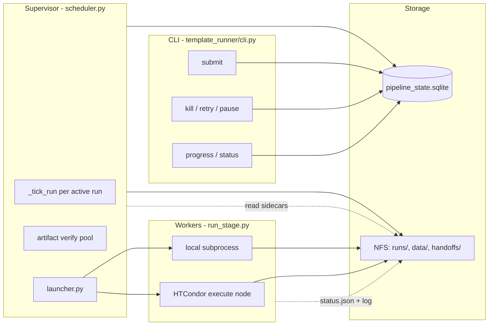
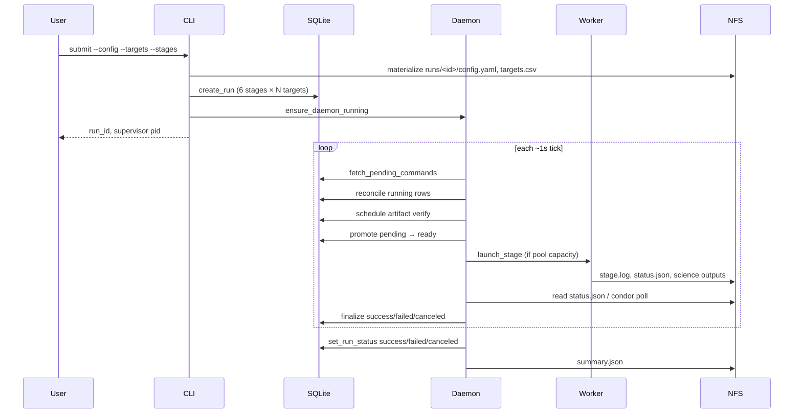

# `template_runner` architecture

This document explains **how the `template_runner` package works internally** — the supervisor daemon, scheduler loop, SQLite state machine, artifact verification, stage launching, and recovery paths. It is written for maintainers who need to read or change the ~5k lines of orchestration code.

For CLI usage see [`template_pipeline.md`](template_pipeline.md). For a one-line-per-script index see [`syndiff_template_scripts.md`](syndiff_template_scripts.md).

---

## Table of contents

- [Mental model](#mental-model)
- [Workspace layout](#workspace-layout)
- [Three roles: CLI, supervisor, workers](#three-roles-cli-supervisor-workers)
- [End-to-end: submit to finished run](#end-to-end-submit-to-finished-run)
- [The supervisor main loop](#the-supervisor-main-loop)
- [Per-run tick (`_tick_run`)](#per-run-tick-_tick_run)
- [Stage status machine](#stage-status-machine)
- [Dependency graph and partial runs](#dependency-graph-and-partial-runs)
- [Artifact verification and manifests](#artifact-verification-and-manifests)
- [Launching stages](#launching-stages)
- [Reconciling running jobs](#reconciling-running-jobs)
- [Command intents](#command-intents)
- [Resource pools](#resource-pools)
- [Configuration layers](#configuration-layers)
- [Recovery and failure modes](#recovery-and-failure-modes)
- [Discord bot lifecycle](#discord-bot-lifecycle)
- [Observability](#observability)
- [Module map](#module-map)

---

## Mental model

`template_runner` is a **batch orchestrator**, not a workflow engine in the Airflow sense. The design choices are:

| Principle | What it means in code |
|-----------|----------------------|
| **One supervisor per workspace** | A flock-guarded daemon (`scheduler.py --daemon`) owns `{handoff_root}`. Only it mutates execution state. |
| **CLI writes intents, not state** | `retry`, `kill`, `pause` insert rows into `commands`; the daemon applies them. |
| **SQLite is the schedule of record** | `stage_runs.status` drives what runs next. Workers do not update SQLite on success — the supervisor does after reading durable sidecars. |
| **Durable sidecars survive daemon restarts** | Each worker writes `*.status.json` and `*.log` on NFS. After a crash, the supervisor reconciles from disk, not from lost `Popen` handles. |
| **Global pool limits** | `network`, `mapping`, `ps1_process`, `cpu_light` caps apply **across all active runs** on that host, not per run. |
| **Manifest-first skip** | Stages outside `--stages` can become `skipped` without re-running if on-disk artifacts (or a stable manifest) prove completeness. |



---

## Workspace layout

A **workspace** is one `handoff_root` directory. Everything for multi-target batching on one machine cluster mount hangs off it.

```text
{handoff_root}/
  pipeline_state.sqlite      # WAL-mode SQLite; all runs share one DB
  daemon.lock                # flock: only one supervisor process
  daemon.pid
  daemon.log
  discord_bot.lock           # flock: only one Discord bot per workspace
  discord_bot.pid
  discord_bot.log
  discord_bot_config.path    # site config for bot (re)start
  workspace.deployment.path  # recorded path to deployment.yaml
  runs/
    latest -> <run_id>       # symlink for convenience
    <run_id>/
      config.yaml            # frozen, absolute paths
      targets.csv
      run_meta.json
      summary.json / summary.csv
      per_target/
        <target_label>/
          <stage>.log
          <stage>.status.json
          <stage>.manifest.json
          <stage>.condor.*     # when executor=condor
    .manifests/              # cross-run stable completion manifests
      <target_label>/
        <stage>.manifest.json
  <target_label>/            # WCS handoff (outside runs/)
    cluster_template_job.json
    syndiff_ffi_frames.csv
    ...
```

**Science data** (`data_root`) is separate: FFIs, mapping caches, Zarr stores, convolved results, template FITS. The runner only stores **pointers** (resolved paths) in frozen config.

---

## Three roles: CLI, supervisor, workers

### CLI (`cli.py`)

- **`submit`**: materializes run directory, `create_run()` in SQLite, records Discord site config, `ensure_daemon_running()`. Starts the Discord bot only when the supervisor was already running (`spawned=False`); otherwise the newly spawned supervisor starts the bot on its own startup. Returns immediately.
- **`run`**: foreground debug mode — calls `run_scheduler()` inline (same `_tick_run` logic, no daemon).
- **Monitor commands** (`progress`, `status`, `logs`): read SQLite + log files + host-local verify counters. Never launch work.
- **Control commands** (`kill`, `retry`, `pause`, `resume`): `insert_command()` only.

The CLI is deliberately thin. It never calls `launcher.launch_stage()` directly.

### Supervisor (`scheduler.py`)

Two entry modes:

| Mode | How started | Behavior |
|------|-------------|----------|
| **Daemon** | `daemon.spawn_detached_daemon()` → `scheduler --daemon --deployment …` | Infinite loop over all `active_runs()` |
| **Foreground** | `syndiff-template run` | Single-run loop until terminal status |

Daemon startup (`run_supervisor_daemon`):

1. Non-blocking `flock` on `daemon.lock` — second daemon exits immediately.
2. Write `daemon.pid`, register heartbeat in SQLite + host-local file.
3. Start background heartbeat thread (15 s interval).
4. Ensure Discord bot once on startup (when `discord_bot_config.path` exists and bot is enabled).
5. Loop until SIGTERM/SIGINT: `_apply_commands` → `_tick_run` for each active run → write verify-in-flight counters → sleep ~1 s.

**Liveness**: the host-local heartbeat file is **authoritative**. NFS SQLite heartbeats are best-effort. If the local file cannot be written for 90 s, the supervisor exits so a fresh process can take the lock and reconcile.

### Workers (`run_stage.py`)

One process per (run, target, stage) launch:

1. Resolve frozen `RunContext` from `--run-dir`.
2. Write `*.status.json` with `state: running` and `launch_token`.
3. Tee stdout/stderr to `per_target/<label>/<stage>.log`.
4. Call `stages.execute_stage()` (in-process science code).
5. On success, write per-run and stable completion manifests.
6. Write `*.status.json` with `state: exited` and `exit_code`.

The supervisor **does not** wait on the worker's `Popen` in daemon mode. It polls `*.status.json` (local) or `condor_q` (Condor) on each tick.

---

## End-to-end: submit to finished run



**`create_run`** (`state.py`) inserts the **full 6-stage DAG** for every enabled target:

- Stages in `--stages` → `pending`
- All other stages → `external` (may become `skipped` after verify)

Special cases applied at submit time:

- **`ps1_source: stream`**: `ps1_download` marked `skipped` with reason `stream_mode`
- **`apply_not_selected_skips`**: stages outside the upstream closure of `--stages` → `skipped` (`not_selected`)
- **`apply_superseded_skips`**: upstream stages skipped when downstream artifacts already satisfied (`superseded`)

---

## The supervisor main loop

Pseudocode for `run_supervisor_daemon`:

```python
while not shutdown:
    apply_commands(state)               # kill, pause, retry, ...

    for run in state.list_active_runs():
        ctx = load_run_context(run_id)
        tick_run(state, run_id, ctx)    # see next section
        apply_commands(state)           # re-check after slow tick

    write_verify_in_flight(handoff_root, by_run)  # scan_queued / scan_running JSON
    sleep(1s)                           # interruptible for SIGTERM
```

Discord bot lifecycle is **not** polled in the main loop. The bot is ensured once at supervisor startup; `submit`, `retry`, and `daemon start` can also ensure it when the supervisor was already running. All ensure/stop paths use `discord_bot.lock` (flock) so at most one bot runs per `handoff_root`.

On shutdown: drain verify worker briefly, clear supervisor row, remove pid/heartbeat files.

**Per-run isolation**: an exception in `_tick_run` for one `run_id` is logged and skipped; other runs keep scheduling.

---

## Per-run tick (`_tick_run`)

Each tick for one run executes **in this order** (see `scheduler.py::_tick_run`):

| Step | Function | Purpose |
|------|----------|---------|
| 1 | `is_paused` | If paused, return immediately (running workers continue) |
| 2 | `reconcile_running_stages` | Finalize or requeue in-flight jobs |
| 3 | `apply_not_selected_skips` | Keep `n/a` stages consistent with `--stages` |
| 4 | `apply_superseded_skips` | Skip redundant upstream verify when downstream done |
| 5 | `_schedule_external_and_pending_skips` | Non-blocking artifact verify (budget per tick) |
| 6 | `promote_stages` | `blocked→pending`, `pending→ready` when deps + verify cache satisfied |
| 7 | Launch unpooled ready rows | `wcs_grouping` has no pool |
| 8 | Launch pooled ready rows | Respect global `pool_running` vs `max_concurrent` |
| 9 | Stall / resume detection | `running==0`, `launchable==0`, verify backlog empty → `stalled` |
| 10 | `_write_summary` | Update `summary.json` / `summary.csv` |

### Promotion gate (`promote_stages`)

A `pending` stage becomes `ready` only when:

1. All **effective dependencies** are `success` or `skipped` (`deps_satisfied`).
2. **Either** `external_verify_complete()` is true for this stage **or** `force_rerun` applies to this selected stage.

This is why a `pending` stage may sit for several ticks: the verify pool must run `stage_complete()` and cache a **complete** result in `artifacts` (`external_check` with `path='1'`) before promotion. An incomplete verify (`path='0'`) is retried on later ticks and does not satisfy promotion.

`blocked` stages unblock to `pending` when dependencies become satisfied again (e.g. after `retry`).

### Stall semantics

A run is **`stalled`** when:

- No stages `running`
- No stages `ready` with satisfied deps (nothing launchable)
- Some stages still non-terminal (`pending`, `external`, `blocked`, …)
- No artifact-verify backlog (`scan_queued == 0` and `scan_running == 0`)

Runs stay **`running`** while artifact scans are queued or in flight. `stall_reason` is hidden in `progress`/`status` output while verify backlog is non-zero. When work becomes launchable again (or verify resumes), status returns to `running` and a `run_resumed` notification may fire.

---

## Stage status machine

```text
                    ┌─────────────┐
     create_run     │  external   │──── verify complete ────┐
         │           └─────────────┘                         │
         ▼                                                    ▼
    ┌─────────┐   deps ok + verified   ┌───────┐   claim    ┌─────────┐
    │ pending │ ──────────────────────►│ ready │ ─────────►│ running │
    └─────────┘                        └───────┘            └────┬────┘
         ▲                              ▲                      │
         │ retry                          │ requeue (lost job)   │
         │                                │                      ▼
    ┌─────────┐                      ┌────────┐          ┌──────────┐
    │ blocked │◄── upstream failed   │ (same) │          │ terminal │
    └─────────┘                      └────────┘          └──────────┘
                                                              success
                                                              failed
                                                              skipped
                                                              canceled
```

| Status | Meaning |
|--------|---------|
| `pending` | Waiting on dependencies and/or first artifact verify |
| `ready` | Eligible to launch; waiting for pool slot |
| `running` | Claimed; worker launched or being reconciled |
| `success` | Exit code 0 |
| `failed` | Non-zero exit; downstream → `blocked` |
| `skipped` | Artifacts verified or logical skip (`stream`, `not_selected`, `superseded`) |
| `blocked` | Never started because upstream failed |
| `canceled` | User kill or SIGTERM (exit 143) |
| `external` | Not in `--stages`; awaiting one-shot verify → usually `skipped` |

**Run-level status** derives from terminal stage counts (`derive_run_final_status`): any `canceled` → run canceled; else any `failed` → run failed; else success.

---

## Dependency graph and partial runs

Fixed DAG (`state.py::STAGE_DEPS`):

```text
tess_ffi_download
       → wcs_grouping → mapping → ps1_download → ps1_process
              │                                      │
              └──────────── downsample ◄─────────────┘
                    (also needs mapping)
```

**Effective deps** (`effective_stage_deps`) can shorten the graph:

- When `ps1_process.ps1_source == "stream"`, `ps1_process` depends only on `mapping` (not `ps1_download`).

**Partial runs** (`--stages mapping,ps1_process,downsample`):

| Concept | Implementation |
|---------|----------------|
| Selected stages | `runs.stages` CSV; start as `pending` |
| Upstream closure | `upstream_stages_for(active)` — must be satisfied on disk or in-run |
| Outside closure | `apply_not_selected_skips` → immediate `skipped` (`not_selected`) |
| External stages in closure | `external` until verify → `skipped` (`artifacts_verified`) |
| Superseded upstream | If a **direct** downstream stage in the run closure is already `success`/`skipped`, skip verifying upstream (e.g. `ps1_download` when `ps1_process` is satisfied) (`superseded`) |

`artifact_verify_needed()` encodes the supersede rule using **direct dependents** from `STAGE_DEPS` only (not transitive downstream). `apply_superseded_skips()` runs at tick start and again at the end of each verify pass so same-tick verify results can supersede upstream stages immediately.

---

## Artifact verification and manifests

Verification lives in `verify.py` + `verify_worker.py`. The supervisor never blocks its main thread on NFS-heavy scans.

### Two-speed verify path (`_run_verify_pass`)

For each eligible `(target, stage)` per tick (budget default **16**):

1. **Manifest fast path** (main thread): `check_manifests_only()` reads small JSON. If valid → mark `skipped` immediately.
2. **Full verify** (thread pool): `stage_complete()` walks on-disk artifacts (Zarr chunk roots, FITS globs, etc.).
3. **Backfill** (thread pool): copy per-run manifest to stable path when only the per-run copy existed.

Worker pool size: `scheduler.verify_max_workers` (default **1**).

### Completion manifests

Written on stage success (`run_stage.py`) to:

| Path | Scope |
|------|-------|
| `per_target/<label>/<stage>.manifest.json` | This run only |
| `runs/.manifests/<label>/<stage>.manifest.json` | Cross-run stable |

Manifest JSON includes `config_fingerprint` (hash of stage params that affect outputs). A stale manifest is ignored and full verify runs again.

`stage_complete()` order:

1. Honor manifest if schema + fingerprint match and artifacts exist
2. Else run stage-specific on-disk verifier (`verify_stage`)

Zarr verifiers are **metadata-only** (chunk directory exists) — no `zarr.open`, no decompression — so verify completes in seconds on large stores.

### External check cache

After verify, SQLite `artifacts` table stores:

- `artifact_type = external_check` — verify attempt cached; `path='1'` = complete, `'0'` = incomplete (retried)
- `artifact_type = skip_reason` — `stream_mode`, `artifacts_verified`, `not_selected`, `superseded`

`external_verify_attempted()` is true after any cached attempt. `external_verify_complete()` requires `path='1'`. `promote_stages` requires `external_verify_complete()` before `pending → ready` (unless `force_rerun` on a selected stage).

### Verify visibility (status grid + CLI)

The daemon writes per-run observability to a **host-local** JSON file (`verify_status.py`) because importing `verify_worker` in the CLI would pull numpy and template modules. Each run entry includes `scan_queued`, `scan_running`, and `active` (in-flight target/stage keys). Legacy keys `pending` / `in_flight` are still read for backward compatibility.

**Status grid abbreviations** (after stage short name): `sc_q` = scan queued, `scan` = scan running, `n/a` = not selected or superseded.

---

## Launching stages

### Claim protocol (`claim_ready`)

Launch is a two-phase commit:

1. **`claim_ready`**: atomic SQL `UPDATE … WHERE status = 'ready'` → `running`, assign `launch_token`, `claimed_at`.
2. **`launcher.launch_stage`**: spawn local or Condor.
3. **`set_launch_descriptor`**: record `executor`, `native_id` (pid or cluster id), `submit_epoch`, `log_path`.

Only one supervisor tick wins the claim. Losers get `rowcount == 0` and skip.

For local launches, any previous `*.status.json` is deleted before spawn so stale tokens cannot confuse reconcile.

### Command built (`stages.build_stage_command`)

```text
python -m syndiff_pipeline.template_runner.run_stage \
  --run-id … --stage … --run-dir … --target-label … --launch-token … [--force-rerun]
```

### Local executor (`launcher.py`)

```python
subprocess.Popen(cmd, start_new_session=True, stdout=DEVNULL, stderr=DEVNULL)
```

`start_new_session=True` puts the worker in its own process group so `kill` can signal the whole tree.

### Condor executor (`condor.py` + `condor_wrapper.sh`)

1. Write `{stage}.condor.submit` beside the stage log.
2. `condor_submit` → cluster id stored as `native_id`.
3. Execute node runs wrapper → `conda activate syndiff` → `exec` the same `run_stage.py` command.
4. Poll with `condor_q` / `condor_history` after a 120 s grace window.

**Important**: submit host must run `syndiff-template submit` with `syndiff` activated so `sys.executable` in the command points at the right env on NFS.

---

## Reconciling running jobs

`reconcile_running_stages` runs at the **start** of every tick. It is how the system survives daemon restarts and NFS latency.

### Local jobs

| Condition | Action |
|-----------|--------|
| `status.json` has matching `launch_token` and `state=exited` | `_finalize_stage` → `success` / `failed` / `canceled` |
| PID alive + token matches | Still running |
| PID alive + token mismatch, within 300 s grace | Still running (NFS may lag) |
| PID dead or stale token past grace | `requeue_to_ready` + `stage_died` notification |

The **durable status file** is authoritative — not the lost `Popen` from a previous daemon incarnation.

### Condor jobs

| Condition | Action |
|-----------|--------|
| `condor_q` shows still running | Still running |
| `condor_history` shows exit code | `_finalize_stage` |
| Claimed but no `native_id` after 300 s | Requeue (submit never completed) |

`_finalize_stage` also maps misleading exit 0 to 143 when the log tail shows graceful shutdown (SIGTERM).

---

## Command intents

CLI inserts into `commands`; `_apply_commands` processes FIFO each tick (and again mid-tick after each run).

| Kind | CLI | Daemon behavior |
|------|-----|-----------------|
| `cancel` | `kill` | Terminate all running workers **first**, cancel verify futures, mark stages `canceled`, run `canceled` |
| `pause` | `pause` | `runs.paused = 1`; tick returns early |
| `resume` | `resume` | `runs.paused = 0` |
| `retry` | `retry` | Bulk: `reopen_failed_canceled`. Targeted: `reset_stage_for_retry` + optional downstream reset |
| `force_rerun` | (internal/resubmit path) | Set `force_rerun` flag, reset selected stages to `pending` |

**Retry** clears `artifacts` cache rows for reset stages so verify runs again. It terminates a **running** targeted stage before reset to avoid duplicate workers.

**Kill** ordering matters: terminate PIDs/Condor clusters before SQLite says `canceled`, so orphans do not keep writing to shared Zarr.

---

## Resource pools

`STAGE_POOL` (`state.py`):

| Pool | Stages | Default max |
|------|--------|-------------|
| `network` | `tess_ffi_download`, `ps1_download` | 3 |
| `cpu_light` | `downsample` | 2 |
| `mapping` | `mapping` | 6 |
| `ps1_process` | `ps1_process` | 4 |
| *(none)* | `wcs_grouping` | unlimited |

`wcs_grouping` is intentionally **unpooled** — it is fast and should not compete with `downsample` for `cpu_light` slots.

Capacity check (`_global_pool_running`):

```python
capacity = pool_cfg.max_concurrent - count_running_in_pool_across_all_runs
```

Condor `max_concurrent` limits **simultaneous submissions**, not CPUs per job.

---

## Configuration layers

| Layer | File | Loaded by |
|-------|------|-----------|
| Site policy | `config.yaml` | `load_runner_config()` |
| Deployment | `deployment.yaml` (gitignored, beside config) | `load_deployment()` |
| Frozen run | `runs/<id>/config.yaml` | Workers + run-scoped CLI |

On submit, `logs.materialize_run_inputs()` copies config/targets into the run dir with **absolute paths** resolved from deployment.

`resolve_config(target, cfg)` (`runner_config.py`) merges:

- Workspace paths (`handoff_dir`, `mapping_root`, `zarr_dir`, …)
- Per-SCC `overrides` from config
- Typed stage params (`stage_params.py` — strict allow-list)

`RunContext` (`run_context.py`) bundles frozen config + targets + `run_meta.json` for any run-scoped operation.

---

## Recovery and failure modes

| Scenario | Behavior |
|----------|----------|
| Supervisor dies | Next `submit` or `daemon start` spawns new process; reconciles `running` from `status.json` / Condor |
| Worker dies without status file | After 300 s grace → requeue to `ready`, `stage_died` alert |
| Duplicate daemon start | Second process fails flock, exits 0 |
| Duplicate Discord bot start | `discord_bot.lock` serializes ensure; `/proc` scan kills orphans on stop/spawn |
| Wedged supervisor (PID alive, no heartbeat) | `ensure_daemon_running` calls `stop_daemon` then respawns |
| NFS slow on status write | Grace window prevents false requeue |
| Shared Zarr lock contention | `ps1_download` serializes via file lock; normal with high `network` concurrency |
| Partial Zarr from interrupted `ps1_process` | Verify reports partial counts; `--force-rerun` deletes convolved Zarr first |
| Scheduler exception on one run | Logged; other runs continue |

Foreground `run_scheduler` (debug) uses the same `_tick_run` but sleeps 1 s between ticks until run status is terminal.

---

## Discord bot lifecycle

The on-demand status bot is a **sidecar** to the supervisor — not required for pipeline execution. Like the supervisor, at most **one bot per `handoff_root`**.

| File | Role |
|------|------|
| `discord_bot.lock` | flock guard (same pattern as `daemon.lock`) |
| `discord_bot.pid` | PID of the canonical detached bot |
| `discord_bot_config.path` | Site `config.yaml` path, recorded on `submit` |

**Who starts the bot:**

| Trigger | When bot is ensured |
|---------|---------------------|
| Supervisor startup | Always (if recorded config + bot enabled) |
| `submit` / `retry` / `daemon start` | Only when `ensure_daemon_running()` returns `spawned=False` (supervisor already up) |
| Supervisor main loop | Never (no periodic poll) |

This avoids the race where `submit` spawns a new supervisor **and** starts a bot while that supervisor also starts a bot on its own startup.

**Stop:** `daemon stop` terminates all live `discord_bot --detached` processes whose config maps to the workspace (via `/proc` scan), not only the PID in `discord_bot.pid`.

**Multiple supervisors:** one per `handoff_root` (flock on `daemon.lock`). Multiple workspaces on one host each get their own supervisor and bot.

---

## Observability

| Surface | Source |
|---------|--------|
| `syndiff-template status` | SQLite `stage_runs` → `run_report.format_status_grid` |
| `syndiff-template progress` | SQLite counts + `stage_progress.py` log parsing + `downsample.progress.json` |
| `summary.json` / `summary.csv` | Written each tick per run |
| `daemon.log` | Supervisor INFO logs |
| `per_target/.../<stage>.log` | Primary debug path (includes Condor execute output) |
| `*.condor.stderr` | Wrapper failures before Python starts |
| Discord webhooks | `notifications.py` on run/stage events |
| Discord bot | `discord_bot.py` replies with live progress + status; one detached process per workspace |

Log-derived progress (`stage_progress.py`) avoids importing science modules in the CLI — it regex-parses tails of stage logs for fractions like `342/1009` skycells.

---

## Module map

| Module | Responsibility |
|--------|----------------|
| `cli.py` | Argument parsing; all user-facing commands |
| `scheduler.py` | Supervisor loop, `_tick_run`, reconcile, verify scheduling, launch orchestration |
| `daemon.py` | flock, spawn detached supervisor, process tree kill |
| `scheduler_control.py` | `ensure_daemon_running`, `stop_daemon`, heartbeat staleness |
| `state.py` | SQLite schema, status machine, deps, claim, commands, skip caches |
| `launcher.py` | Local `Popen` vs Condor submit |
| `condor.py` | Submit file generation, `condor_submit`, poll, `condor_rm` sweep |
| `run_stage.py` | Worker entry: logging tee, `execute_stage`, manifests, status sidecar |
| `stages.py` | Stage registry, `build_stage_command`, `execute_stage` dispatch |
| `verify.py` | On-disk verifiers, manifest read/write, `stage_complete` |
| `verify_worker.py` | Background thread pool for NFS-heavy verify |
| `verify_status.py` | Host-local verify-in-flight counter for CLI |
| `logs.py` | Run layout, atomic JSON, log paths, input materialization |
| `run_context.py` | Frozen run directory → `RunContext` |
| `runner_config.py` | YAML load, path resolution, per-target `resolve_config` |
| `stage_params.py` | Typed config for each stage |
| `workspace.py` | `handoff_root` paths, supervisor discovery via `/proc` |
| `deployment.py` | Gitignored deployment overlay |
| `targets.py` | CSV loaders (normalized + SN catalog format) |
| `handoff.py` | `wcs_grouping` stage wrapper |
| `run_report.py` | Format progress lines and status grid |
| `stage_progress.py` | Parse running-stage fraction from log tails |
| `notifications.py` | Discord webhook dedup + message formatting |
| `discord_bot.py` / `discord_bot_control.py` | On-demand status bot lifecycle (flock + orphan cleanup) |
| `resources.py` | Bundled `skycell_wcs.csv` resolution |

---

## Related documentation

| Document | Contents |
|----------|----------|
| [`template_pipeline.md`](template_pipeline.md) | User guide: config, CLI flags, Condor sizing, troubleshooting |
| [`syndiff_template_scripts.md`](syndiff_template_scripts.md) | One-line description of each script/command |
| [`stages/README.md`](stages/README.md) | Science algorithms inside `template/` modules |

---

*When changing orchestration behavior, start with `scheduler.py::_tick_run` and `state.py::promote_stages` — most user-visible scheduling bugs live in the interaction between verify cache, dependency satisfaction, and pool capacity.*
